# Upload Contract API

## Metadata

- **Name**: Upload Contract API
- **Type**: Enabler
- **ID**: ENB-000886
- **Approval**: Not Approved
- **Capability ID**: CAP-773285
- **Owner**: Product Team
- **Status**: In Draft
- **Priority**: High
- **Analysis Review**: Required
- **Code Review**: Not Required

## Technical Overview
### Purpose
A webservice API that creates a new contract 
- POST method
- /contract path
- Accepts a contract binary document
- Returns the contract id created by cosmos db

Only accept files of type: PDF, DOCX, PNG, JPG
Save the file to blob storage
Save a thumbnail picture of the file to blob storage
Create a contract document:
- Set the storage to the file location from blob storage
- Set the thumbnail to the file location from blob storage
- Set the upload datetime to now
- Set the user id to the user id in the bearer token
- Set the status to "processing"
Save the contract request to cosmos db in the container "contract" 
Publish the contract request to the event grid for further processing

## Functional Requirements

| ID | Name | Requirement | Priority | Status | Approval |
|----|------|-------------|----------|--------|----------|
| FR-XXXXXX | [Name] | [Requirement Description] | [Priority] | [Status] | [Approval] |

## Non-Functional Requirements

| ID | Name | Type | Requirement | Priority | Status | Approval |
|----|------|------|-------------|----------|--------|----------|
| NFR-XXXXXX | [Name] | [Type] | [Requirement Description] | [Priority] | [Status] | [Approval] |

## Dependencies

### Internal Upstream Dependency

| Enabler ID | Description |
|------------|-------------|
| | |

### Internal Downstream Impact

| Enabler ID | Description |
|------------|-------------|
| | |

### External Dependencies

**External Upstream Dependencies**: None identified.

**External Downstream Impact**: None identified.

## Technical Specifications (Template)

### Enabler Dependency Flow Diagram

```mermaid
flowchart TD
    ENB_XXXXXX["ENB-000886<br/>[Enabler Name]<br/>📡"]

    %% Add your dependency flows here

    classDef enabler fill:#e3f2fd,stroke:#1976d2,stroke-width:2px
    class ENB_XXXXXX enabler
```

### API Technical Specifications (if applicable)

| API Type | Operation | Channel / Endpoint | Description | Request / Publish Payload | Response / Subscribe Data |
|----------|-----------|---------------------|-------------|----------------------------|----------------------------|
| | | | | | |

### Data Models

### Class Diagrams

### Sequence Diagrams

### Dataflow Diagrams

### State Diagrams

