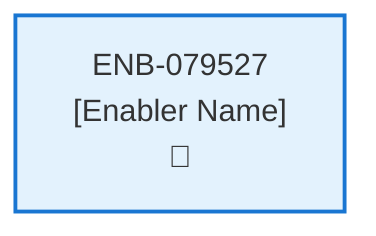
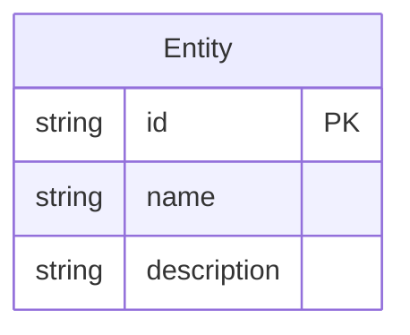
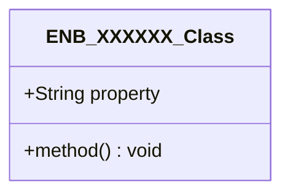
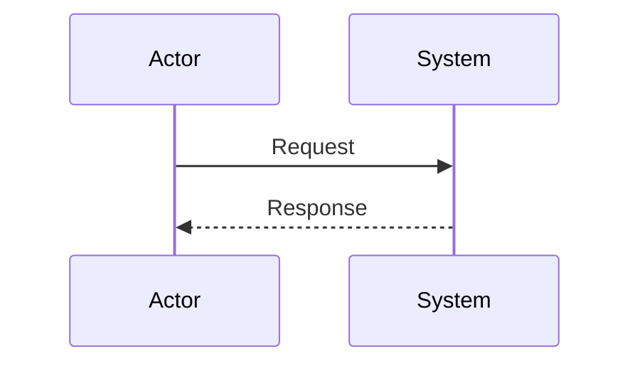
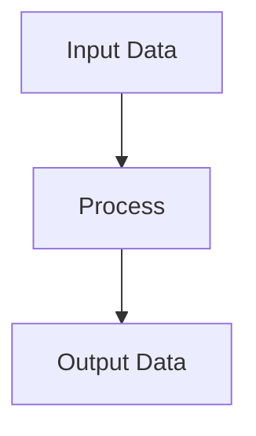
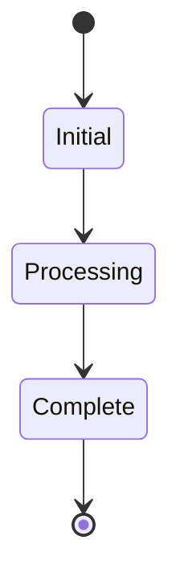

# Change Subscription Web Component

## Metadata

- **Name**: Change Subscription Web Component
- **Type**: Enabler
- **ID**: ENB-079527
- **Approval**: Not Approved
- **Capability ID**: CAP-919075
- **Owner**: Product Team
- **Status**: In Draft
- **Priority**: High
- **Analysis Review**: Required
- **Code Review**: Not Required

## Technical Overview
### Purpose
This web component enables the user to change their subscription:
- A selection of the the two subscription options: Starter or Pro
- A description of the options from the Universal Subscription Options
- A grid comparison of the options from the Universal Subscription Options
- Current subscription is selected

Current subscription is determined by calling the Get Subscription API
Changing the subscription selection enables the submit button
On submission, a dialogue pops up confirming the change and that it will impact their monthly billing statement.
On acceptance, the Change Subscription API is called with the new subscription type

## Functional Requirements

| ID | Name | Requirement | Priority | Status | Approval |
|----|------|-------------|----------|--------|----------|
| FR-079527-01 |  | Display subscription options: Starter and Pro | High | Draft | Not Approved |
| FR-079527-02 |  | Show descriptions for each subscription option from Universal Subscription Options | High | Draft | Not Approved |
| FR-079527-03 |  | Provide grid comparison of subscription features | High | Draft | Not Approved |
| FR-079527-04 |  | Call Get Subscription API to determine current subscription | High | Draft | Not Approved |
| FR-079527-05 |  | Pre-select current subscription option | High | Draft | Not Approved |
| FR-079527-06 |  | Enable submit button when subscription selection changes | High | Draft | Not Approved |
| FR-079527-07 |  | Show confirmation dialog on submission with billing impact warning | High | Draft | Not Approved |
| FR-079527-08 |  | Call Change Subscription API on confirmation | High | Draft | Not Approved |
| FR-079527-09 |  | Handle API success/error responses | High | Draft | Not Approved |
| FR-079527-10 |  | Update UI to reflect new subscription status | Medium | Draft | Not Approved |

## Non-Functional Requirements

| ID | Name | Type | Requirement | Priority | Status | Approval |
|----|------|------|-------------|----------|--------|----------|
| NFR-079527-01 |  |  | Responsive design for mobile and desktop | High | Draft | Not Approved |
| NFR-079527-02 |  |  | Accessible form controls and navigation | High | Draft | Not Approved |
| NFR-079527-03 |  |  | Fast loading of subscription data | High | Draft | Not Approved |
| NFR-079527-04 |  |  | Clear visual indication of current vs new subscription | High | Draft | Not Approved |
| NFR-079527-05 |  |  | Intuitive confirmation dialog design | High | Draft | Not Approved |
| NFR-079527-06 |  |  | Secure handling of subscription change requests | High | Draft | Not Approved |
| NFR-079527-07 |  |  | Compatible with modern browsers | Medium | Draft | Not Approved |

## Dependencies

### Internal Upstream Dependency

| Enabler ID | Description |
|------------|-------------|
| | |

### Internal Downstream Impact

| Enabler ID | Description |
|------------|-------------|
| | |

### External Dependencies

**External Upstream Dependencies**: None identified.

**External Downstream Impact**: None identified.

## Technical Specifications (Template)

### Enabler Dependency Flow Diagram

### API Technical Specifications (if applicable)

| API Type | Operation | Channel / Endpoint | Description | Request / Publish Payload | Response / Subscribe Data |
|----------|-----------|---------------------|-------------|----------------------------|----------------------------|
| | | | | | |

### Data Models

### Class Diagrams

### Sequence Diagrams

### Dataflow Diagrams

### State Diagrams

