# Delete Contract API

## Metadata

- **Name**: Delete Contract API
- **Type**: Enabler
- **ID**: ENB-277705
- **Approval**: Not Approved
- **Capability ID**: CAP-944944
- **Owner**: Product Team
- **Status**: In Draft
- **Priority**: High
- **Analysis Review**: Required
- **Code Review**: Not Required

## Technical Overview
### Purpose
A webservice API that deletes all the contract information by the contract's id
- DELETE method
- /contract path
- Accepts a contract id

Deletes the contract document from the contract container in cosmos db by its contract id
Deletes the analysis document from the analysis container in cosmos db by its contract id
Deletes the blob storage file based on the blob file location in the contract document

The contract is deleted by a webservice API DELETE (/contract) that deletes the contract by id and deletes the associated blob storage file

## Functional Requirements

| ID | Requirement | Status | Priority |
|----|------------|--------|----------|
| FR-277705-01 | Implement DELETE /contract endpoint | Draft | High |
| FR-277705-02 | Accept contract id in request | Draft | High |
| FR-277705-03 | Delete contract document from cosmos contracts container | Draft | High |
| FR-277705-04 | Delete analysis document from cosmos analysis container | Draft | High |
| FR-277705-05 | Delete blob storage file using location from contract | Draft | High |
| FR-277705-06 | Validate contract ownership by user | Draft | High |
| FR-277705-07 | Return success/error responses | Draft | High |
| FR-277705-08 | Handle partial deletion failures | Draft | Medium |

## Non-Functional Requirements

| ID | Requirement | Status | Priority |
|----|------------|--------|----------|
| NFR-277705-01 | Atomic deletion operations | Draft | High |
| NFR-277705-02 | Secure access control | Draft | High |
| NFR-277705-03 | Response time under 3 seconds | Draft | High |
| NFR-277705-04 | Comprehensive error logging | Draft | Medium |
| NFR-277705-05 | Handle concurrent deletions | Draft | Medium |

## Dependencies

### Internal Upstream Dependency

| Enabler ID | Description |
|------------|-------------|
| | |

### Internal Downstream Impact

| Enabler ID | Description |
|------------|-------------|
| | |

### External Dependencies

**External Upstream Dependencies**: None identified.

**External Downstream Impact**: None identified.

## Technical Specifications (Template)

### Enabler Dependency Flow Diagram

```mermaid
flowchart TD
    ENB_XXXXXX["ENB-277705<br/>[Enabler Name]<br/>📡"]

    %% Add your dependency flows here

    classDef enabler fill:#e3f2fd,stroke:#1976d2,stroke-width:2px
    class ENB_XXXXXX enabler
```

### API Technical Specifications (if applicable)

| API Type | Operation | Channel / Endpoint | Description | Request / Publish Payload | Response / Subscribe Data |
|----------|-----------|---------------------|-------------|----------------------------|----------------------------|
| | | | | | |

### Data Models

### Class Diagrams

### Sequence Diagrams

### Dataflow Diagrams

### State Diagrams

