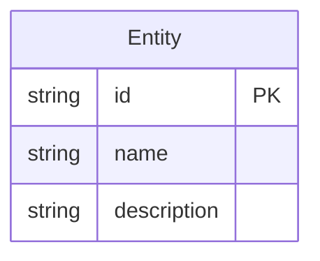
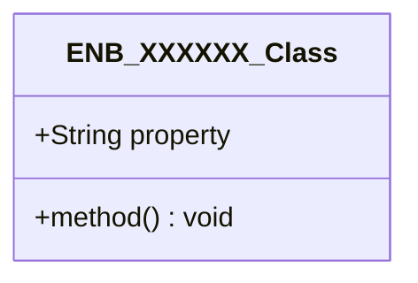
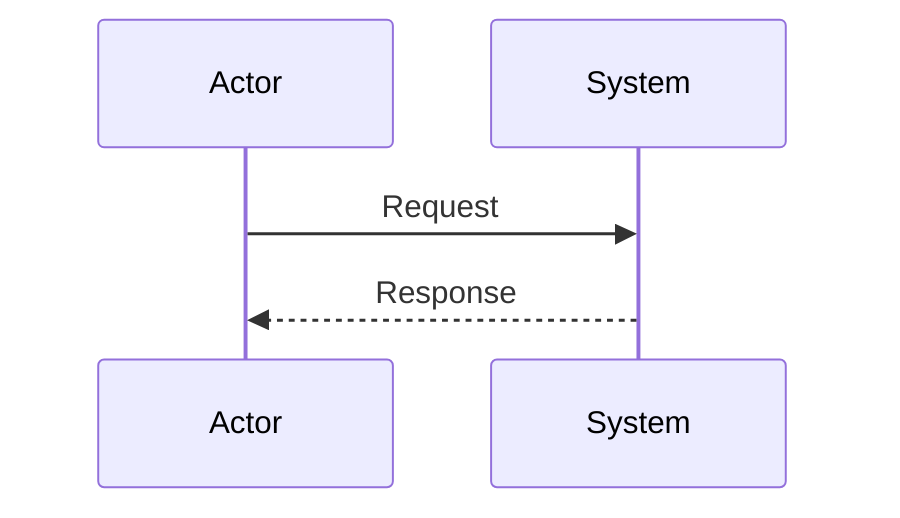
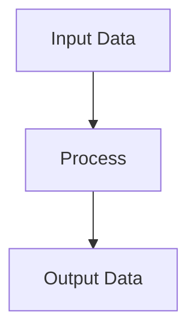
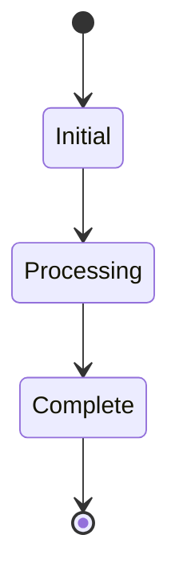

# Review Web Component

## Metadata

- **Name**: Review Web Component
- **Type**: Enabler
- **ID**: ENB-307768
- **Approval**: Not Approved
- **Capability ID**: CAP-615262
- **Owner**: Product Team
- **Status**: In Draft
- **Priority**: High
- **Analysis Review**: Required
- **Code Review**: Not Required

## Technical Overview
### Purpose
[What is the purpose?]

## Functional Requirements

| ID | Requirement | Status | Priority |
|----|------------|--------|----------|
| FR-307768-01 | Display pop-up dialog for review submission | Draft | High |
| FR-307768-02 | Provide star rating selection (1-5) | Draft | High |
| FR-307768-03 | Provide text area for detailed comment | Draft | High |
| FR-307768-04 | Pre-populate email field if user email available | Draft | Medium |
| FR-307768-05 | Validate rating and comment inputs | Draft | High |
| FR-307768-06 | Submit review data to /review API | Draft | High |
| FR-307768-07 | Handle API success and close dialog | Draft | High |
| FR-307768-08 | Handle API errors and display messages | Draft | High |
| FR-307768-09 | Allow dialog dismissal without submission | Draft | Medium |

## Non-Functional Requirements

| ID | Requirement | Status | Priority |
|----|------------|--------|----------|
| NFR-307768-01 | Responsive dialog design | Draft | High |
| NFR-307768-02 | Accessible rating and form controls | Draft | High |
| NFR-307768-03 | Secure form submission | Draft | High |
| NFR-307768-04 | Fast dialog loading | Draft | High |
| NFR-307768-05 | Intuitive user interface | Draft | Medium |
| NFR-307768-06 | Compatible with modern browsers | Draft | Medium |

## Dependencies

### Internal Upstream Dependency

| Enabler ID | Description |
|------------|-------------|
| | |

### Internal Downstream Impact

| Enabler ID | Description |
|------------|-------------|
| | |

### External Dependencies

**External Upstream Dependencies**: None identified.

**External Downstream Impact**: None identified.

## Technical Specifications (Template)

### Enabler Dependency Flow Diagram

```mermaid
flowchart TD
    ENB_XXXXXX["ENB-307768<br/>[Enabler Name]<br/>📡"]

    %% Add your dependency flows here

    classDef enabler fill:#e3f2fd,stroke:#1976d2,stroke-width:2px
    class ENB_XXXXXX enabler
```

### API Technical Specifications (if applicable)

| API Type | Operation | Channel / Endpoint | Description | Request / Publish Payload | Response / Subscribe Data |
|----------|-----------|---------------------|-------------|----------------------------|----------------------------|
| | | | | | |

### Data Models

### Class Diagrams

### Sequence Diagrams

### Dataflow Diagrams

### State Diagrams

