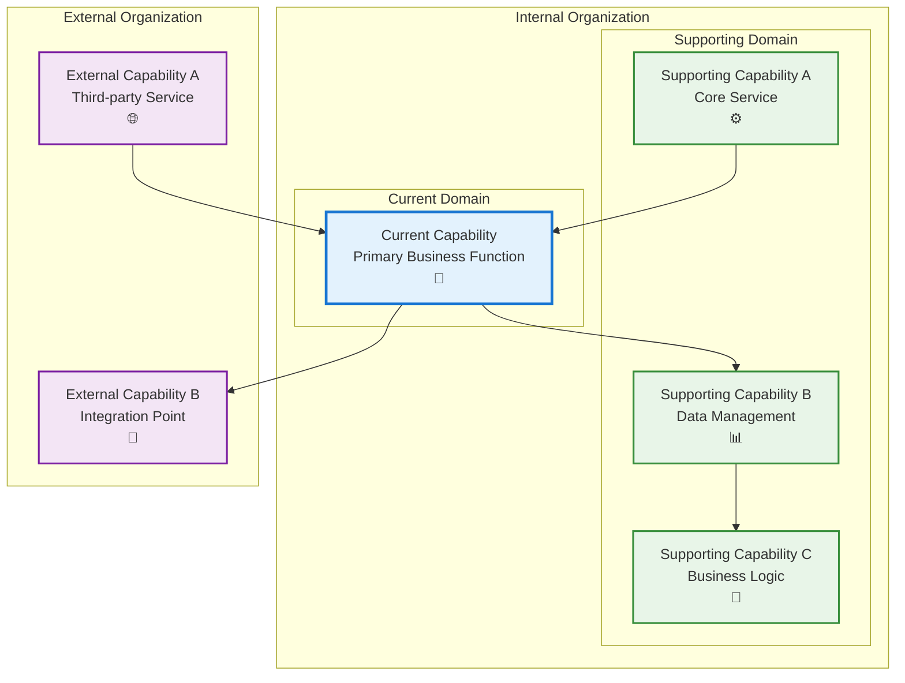

# New Profile - Step 4

## Metadata

- **Name**: New Profile - Step 4
- **Type**: Capability
- **System**: ls
- **Component**: new-subscription
- **ID**: CAP-329283
- **Approval**: Not Approved
- **Owner**: Product Team
- **Status**: In Draft
- **Priority**: High
- **Analysis Review**: Required

## Technical Overview
### Purpose
Step four of a multiple step wizard:
Adds the sessionid to the Account Info data.
Posts the account info data to the web-service api which:
- Validates the sessionid payment is completed with Stripe
- Removes the sessionid field from the Account Info
- Saves the account info document for the user
- returns a unique user id for later reference
The webcomponent enables the user to enter in:
- First name
- Last name
- Email address (pre-populates with any email address from the login)
- State from a drop down of the 50 u.s. states
This step is independently  navigable by a unique url (/newprofile).
On submission, the profile information is posted to the web-service and stored in the "profile" container by unique user id and the user is navigated to the document library

## Enablers

| Enabler ID |
|------------|
| ENB-XXXXXX |

## Dependencies

### Internal Upstream Dependency

| Capability ID | Description |
|---------------|-------------|
| | |

### Internal Downstream Impact

| Capability ID | Description |
|---------------|-------------|
| | |

### External Dependencies

**External Upstream Dependencies**: None identified.

**External Downstream Impact**: None identified.

## Technical Specifications (Template)

### Capability Dependency Flow Diagram
> **Note for AI**: When designing this section, show the direct relationships and dependencies between capabilities (NOT enablers). Focus on capability-to-capability interactions, business value flows, and how capabilities work together to deliver end-to-end business outcomes. Include:
> - **Current Capability**: The capability being defined and its role in the business value chain
> - **Internal Dependencies**: Dependencies on other capabilities within the same organizational boundary/domain
> - **External Dependencies**: Dependencies on capabilities across organizational boundaries.
> - **Business Flow**: How business value and data flows between capabilities
> - **Exclude**: Enabler-level details, technical implementation specifics, infrastructure components

