# Support Web Component

## Metadata

- **Name**: Support Web Component
- **Type**: Enabler
- **ID**: ENB-376918
- **Approval**: Not Approved
- **Capability ID**: CAP-827120
- **Owner**: Product Team
- **Status**: In Draft
- **Priority**: High
- **Analysis Review**: Required
- **Code Review**: Not Required

## Technical Overview
### Purpose
Implement a pop-up support dialog component with greeting, subject dropdown, comment field, email input, and submission to the support API.

## Functional Requirements

| ID | Requirement | Status | Priority |
|----|------------|--------|----------|
| FR-376918-01 | Display pop-up support dialog | Draft | High |
| FR-376918-02 | Show helpful greeting with response commitment | Draft | High |
| FR-376918-03 | Provide subject dropdown with options: Billing Question, Technical Issue, General Question/Comment | Draft | High |
| FR-376918-04 | Include comment text box | Draft | High |
| FR-376918-05 | Include email input field | Draft | High |
| FR-376918-06 | Pre-populate email if user is authenticated | Draft | High |
| FR-376918-07 | Validate required fields before submission | Draft | High |
| FR-376918-08 | Submit support request to API | Draft | High |
| FR-376918-09 | Show success/error feedback | Draft | High |
| FR-376918-10 | Handle dialog open/close functionality | Draft | Medium |

## Non-Functional Requirements

| ID | Requirement | Status | Priority |
|----|------------|--------|----------|
| NFR-376918-01 | Responsive design for mobile and desktop | Draft | High |
| NFR-376918-02 | Accessible to screen readers and keyboard navigation | Draft | High |
| NFR-376918-03 | Fast dialog loading and rendering | Draft | Medium |
| NFR-376918-04 | Clear error messaging and validation feedback | Draft | High |
| NFR-376918-05 | Secure form data handling | Draft | High |
| NFR-376918-06 | Consistent UI styling with application theme | Draft | Medium |
| NFR-376918-07 | Intuitive user experience for support submission | Draft | Medium |

## Dependencies

### Internal Upstream Dependency

| Enabler ID | Description |
|------------|-------------|
| | |

### Internal Downstream Impact

| Enabler ID | Description |
|------------|-------------|
| | |

### External Dependencies

**External Upstream Dependencies**: None identified.

**External Downstream Impact**: None identified.

## Technical Specifications (Template)

### Enabler Dependency Flow Diagram

```mermaid
flowchart TD
    ENB_XXXXXX["ENB-376918<br/>[Enabler Name]<br/>📡"]

    %% Add your dependency flows here

    classDef enabler fill:#e3f2fd,stroke:#1976d2,stroke-width:2px
    class ENB_XXXXXX enabler
```

### API Technical Specifications (if applicable)

| API Type | Operation | Channel / Endpoint | Description | Request / Publish Payload | Response / Subscribe Data |
|----------|-----------|---------------------|-------------|----------------------------|----------------------------|
| | | | | | |

### Data Models

### Class Diagrams

### Sequence Diagrams

### Dataflow Diagrams

### State Diagrams

