# Subscription API

## Metadata

- **Name**: Subscription API
- **Type**: Enabler
- **ID**: ENB-388018
- **Approval**: Not Approved
- **Capability ID**: CAP-329283
- **Owner**: Product Team
- **Status**: In Draft
- **Priority**: High
- **Analysis Review**: Required
- **Code Review**: Not Required

## Technical Overview
### Purpose
A webservice API that creates a new subscription
- POST method
- /subscription path
- Accepts a subscription request
- Accepts a profile request

Validates the session id is valid and payment is complete with Stripe
Create an account document:
- Set user id from the user id in the bearer token
- Set the subscription type
Saves the account in the "account" container in cosmos db
Set the user id from the user id in the bearer token on the profile document
Saves the profile document in the "profile" container in cosmos db

## Functional Requirements

| ID | Requirement | Status | Priority |
|----|------------|--------|----------|
| FR-388018-01 | Implement POST /subscription endpoint | Draft | High |
| FR-388018-02 | Accept subscription request in payload | Draft | High |
| FR-388018-03 | Accept profile request in payload | Draft | High |
| FR-388018-04 | Validate session id with Stripe for payment completion | Draft | High |
| FR-388018-05 | Extract user id from bearer token | Draft | High |
| FR-388018-06 | Create account document in accounts container | Draft | High |
| FR-388018-07 | Set subscription type in account document | Draft | High |
| FR-388018-08 | Save profile document in profiles container | Draft | High |
| FR-388018-09 | Set user id on profile document | Draft | High |
| FR-388018-10 | Handle validation errors and return appropriate responses | Draft | High |

## Non-Functional Requirements

| ID | Requirement | Status | Priority |
|----|------------|--------|----------|
| NFR-388018-01 | Secure handling of bearer tokens | Draft | High |
| NFR-388018-02 | Validate all inputs against data schema | Draft | High |
| NFR-388018-03 | Response time under 5 seconds | Draft | High |
| NFR-388018-04 | Atomic operations for account and profile creation | Draft | High |
| NFR-388018-05 | Comprehensive error logging | Draft | Medium |
| NFR-388018-06 | PCI compliance for payment validation | Draft | High |

## Dependencies

### Internal Upstream Dependency

| Enabler ID | Description |
|------------|-------------|
| | |

### Internal Downstream Impact

| Enabler ID | Description |
|------------|-------------|
| | |

### External Dependencies

**External Upstream Dependencies**: None identified.

**External Downstream Impact**: None identified.

## Technical Specifications (Template)

### Enabler Dependency Flow Diagram

```mermaid
flowchart TD
    ENB_XXXXXX["ENB-388018<br/>[Enabler Name]<br/>📡"]

    %% Add your dependency flows here

    classDef enabler fill:#e3f2fd,stroke:#1976d2,stroke-width:2px
    class ENB_XXXXXX enabler
```

### API Technical Specifications (if applicable)

| API Type | Operation | Channel / Endpoint | Description | Request / Publish Payload | Response / Subscribe Data |
|----------|-----------|---------------------|-------------|----------------------------|----------------------------|
| | | | | | |

### Data Models

### Class Diagrams

### Sequence Diagrams

### Dataflow Diagrams

### State Diagrams

