# Change Subscription API

## Metadata

- **Name**: Change Subscription API
- **Type**: Enabler
- **ID**: ENB-551364
- **Approval**: Not Approved
- **Capability ID**: CAP-919075
- **Owner**: Product Team
- **Status**: In Draft
- **Priority**: High
- **Analysis Review**: Required
- **Code Review**: Not Required

## Technical Overview
### Purpose
A webservice API that updates an existing subscription
- PUT method
- /subscription path
- Accepts a subscription request

Retrieves the account document for the user id in the bearer token from "account" container in cosmos db
Updates the Stripe subscription using the price id of the new subscription type with the subscription id and subscription item id from the account document
Updates and save the account document with the new subscription item id and subscription type (starter or pro)

## Functional Requirements

| ID | Requirement | Status | Priority |
|----|------------|--------|----------|
| FR-551364-01 | Implement PUT /subscription endpoint | Draft | High |
| FR-551364-02 | Accept subscription request in payload | Draft | High |
| FR-551364-03 | Extract user id from bearer token | Draft | High |
| FR-551364-04 | Retrieve account document from accounts container using user id | Draft | High |
| FR-551364-05 | Update Stripe subscription with new price id using subscription id and item id | Draft | High |
| FR-551364-06 | Update account document with new subscription item id and type | Draft | High |
| FR-551364-07 | Save updated account document to accounts container | Draft | High |
| FR-551364-08 | Validate subscription type (starter or pro) | Draft | High |
| FR-551364-09 | Handle Stripe API errors gracefully | Draft | High |
| FR-551364-10 | Return success/error responses | Draft | High |

## Non-Functional Requirements

| ID | Requirement | Status | Priority |
|----|------------|--------|----------|
| NFR-551364-01 | Secure handling of bearer tokens and account data | Draft | High |
| NFR-551364-02 | Validate all inputs against data schema | Draft | High |
| NFR-551364-03 | Response time under 5 seconds | Draft | High |
| NFR-551364-04 | Atomic account document updates | Draft | High |
| NFR-551364-05 | Comprehensive error logging | Draft | Medium |
| NFR-551364-06 | Stripe API rate limit handling | Draft | High |
| NFR-551364-07 | Idempotent subscription changes | Draft | Medium |

## Dependencies

### Internal Upstream Dependency

| Enabler ID | Description |
|------------|-------------|
| | |

### Internal Downstream Impact

| Enabler ID | Description |
|------------|-------------|
| | |

### External Dependencies

**External Upstream Dependencies**: None identified.

**External Downstream Impact**: None identified.

## Technical Specifications (Template)

### Enabler Dependency Flow Diagram

```mermaid
flowchart TD
    ENB_XXXXXX["ENB-551364<br/>[Enabler Name]<br/>📡"]

    %% Add your dependency flows here

    classDef enabler fill:#e3f2fd,stroke:#1976d2,stroke-width:2px
    class ENB_XXXXXX enabler
```

### API Technical Specifications (if applicable)

| API Type | Operation | Channel / Endpoint | Description | Request / Publish Payload | Response / Subscribe Data |
|----------|-----------|---------------------|-------------|----------------------------|----------------------------|
| | | | | | |

### Data Models

### Class Diagrams

### Sequence Diagrams

### Dataflow Diagrams

### State Diagrams

