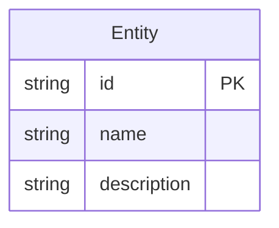
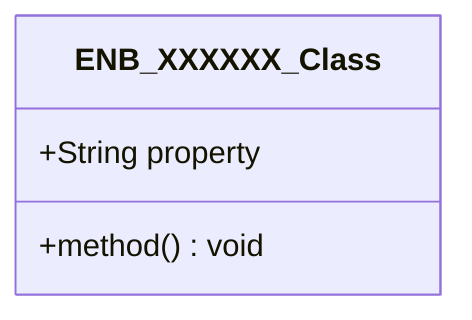
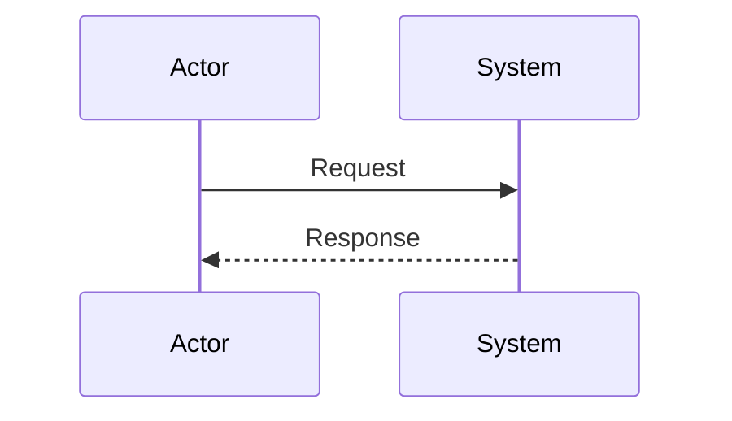
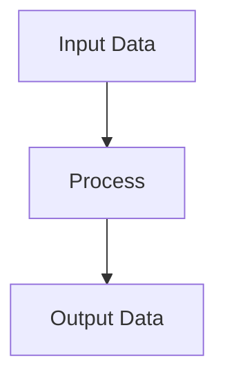
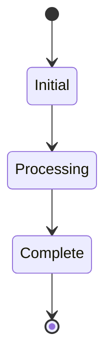

# Payment Web Component

## Metadata

- **Name**: Payment Web Component
- **Type**: Enabler
- **ID**: ENB-572526
- **Approval**: Not Approved
- **Capability ID**: CAP-480705
- **Owner**: Product Team
- **Status**: In Draft
- **Priority**: High
- **Analysis Review**: Required
- **Code Review**: Not Required

## Technical Overview
### Purpose
Step three of a multi-step wizard:
- This step is independently navigable by a unique url (/payment)
- Integrates with Stipe embedded forms for payment defined here: https://docs.stripe.com/checkout/embedded/quickstart?lang=node
- Uses a configurable public key and priceid from Strip

Creates a Stripe payment session through the Checkout Session API
On success, adds the selected session id to the subscription document

## Functional Requirements

| ID | Requirement | Status | Priority |
|----|------------|--------|----------|
| FR-572526-01 | Display payment page at /payment | Draft | High |
| FR-572526-02 | Integrate Stripe embedded forms for payment | Draft | High |
| FR-572526-03 | Use configurable Stripe public key | Draft | High |
| FR-572526-04 | Use configurable Stripe price ID | Draft | High |
| FR-572526-05 | Create Stripe payment session via Checkout Session API | Draft | High |
| FR-572526-06 | Handle payment success and update subscription document | Draft | High |
| FR-572526-07 | Add session id to subscription on successful payment | Draft | High |
| FR-572526-08 | Follow Stripe embedded checkout quickstart for Node.js | Draft | High |
| FR-572526-09 | Ensure page is independently navigable | Draft | Medium |

## Non-Functional Requirements

| ID | Requirement | Status | Priority |
|----|------------|--------|----------|
| NFR-572526-01 | Secure handling of Stripe public key | Draft | High |
| NFR-572526-02 | Responsive design for payment forms | Draft | High |
| NFR-572526-03 | Accessible payment interface | Draft | High |
| NFR-572526-04 | Page loads within 2 seconds | Draft | High |
| NFR-572526-05 | PCI compliance for payment forms | Draft | High |
| NFR-572526-06 | Error handling for payment failures | Draft | High |
| NFR-572526-07 | Compatible with modern browsers | Draft | Medium |

## Dependencies

### Internal Upstream Dependency

| Enabler ID | Description |
|------------|-------------|
| | |

### Internal Downstream Impact

| Enabler ID | Description |
|------------|-------------|
| | |

### External Dependencies

**External Upstream Dependencies**: None identified.

**External Downstream Impact**: None identified.

## Technical Specifications (Template)

### Enabler Dependency Flow Diagram

```mermaid
flowchart TD
    ENB_XXXXXX["ENB-572526<br/>[Enabler Name]<br/>📡"]

    %% Add your dependency flows here

    classDef enabler fill:#e3f2fd,stroke:#1976d2,stroke-width:2px
    class ENB_XXXXXX enabler
```

### API Technical Specifications (if applicable)

| API Type | Operation | Channel / Endpoint | Description | Request / Publish Payload | Response / Subscribe Data |
|----------|-----------|---------------------|-------------|----------------------------|----------------------------|
| | | | | | |

### Data Models

### Class Diagrams

### Sequence Diagrams

### Dataflow Diagrams

### State Diagrams

