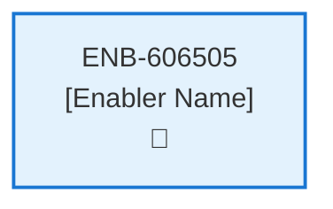
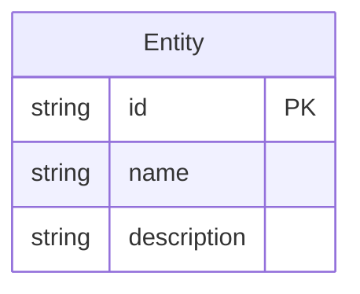
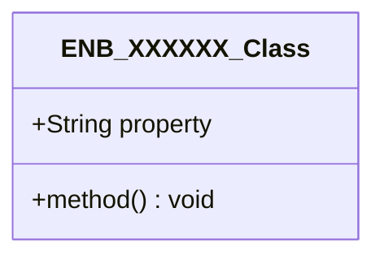
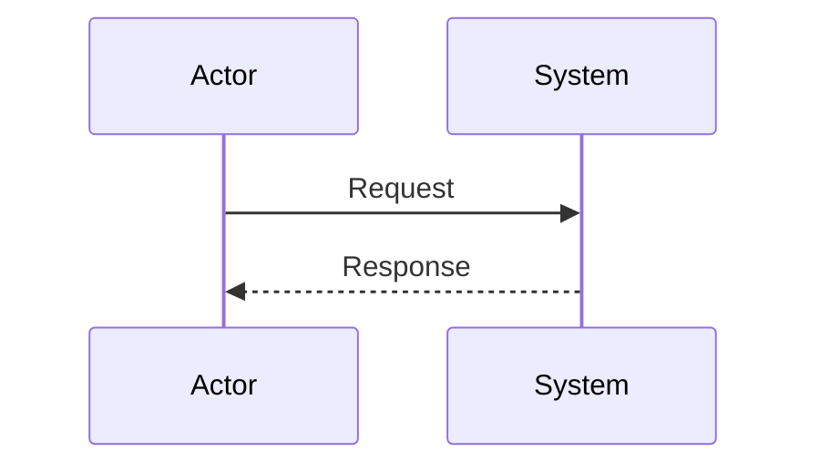
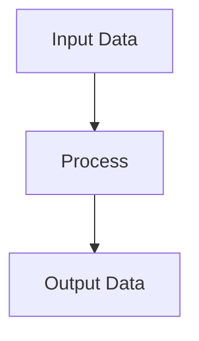
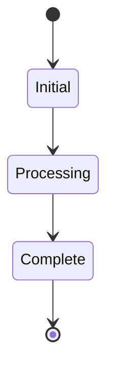

# Support API

## Metadata

- **Name**: Support API
- **Type**: Enabler
- **ID**: ENB-606505
- **Approval**: Not Approved
- **Capability ID**: CAP-827120
- **Owner**: Product Team
- **Status**: In Draft
- **Priority**: High
- **Analysis Review**: Required
- **Code Review**: Not Required

## Technical Overview
### Purpose
Implement POST /support endpoint to receive support requests, store them in the support container in Cosmos DB, and send notification emails via configurable SMTP service.

## Functional Requirements

| ID | Requirement | Status | Priority |
|----|------------|--------|----------|
| FR-606505-01 | Implement POST /support endpoint | Draft | High |
| FR-606505-02 | Accept support data: subject, comment, email | Draft | High |
| FR-606505-03 | Validate subject options: Billing Question, Technical Issue, General Question/Comment | Draft | High |
| FR-606505-04 | Validate required fields: email, subject, comment | Draft | High |
| FR-606505-05 | Extract user id from bearer token if authenticated | Draft | High |
| FR-606505-06 | Include user details in stored support request when authenticated | Draft | High |
| FR-606505-07 | Support anonymous support requests without user authentication | Draft | Medium |
| FR-606505-08 | Save support request to support container in Cosmos DB | Draft | High |
| FR-606505-09 | Send notification email via configurable SMTP service | Draft | High |
| FR-606505-10 | Include support request details in notification email | Draft | Medium |
| FR-606505-11 | Return success/error responses with appropriate HTTP status codes | Draft | High |

## Non-Functional Requirements

| ID | Requirement | Status | Priority |
|----|------------|--------|----------|
| NFR-606505-01 | Secure handling of user data and email addresses | Draft | High |
| NFR-606505-02 | Validate all inputs including email format and field lengths | Draft | High |
| NFR-606505-03 | Response time under 2 seconds | Draft | High |
| NFR-606505-04 | Atomic support request storage and email sending | Draft | High |
| NFR-606505-05 | Comprehensive error logging for debugging and monitoring | Draft | Medium |
| NFR-606505-06 | Configurable SMTP settings with secure credential management | Draft | Medium |
| NFR-606505-07 | Email delivery reliability with retry mechanisms | Draft | Medium |
| NFR-606505-08 | Protection against email injection attacks | Draft | High |

## Dependencies

### Internal Upstream Dependency

| Enabler ID | Description |
|------------|-------------|
| | |

### Internal Downstream Impact

| Enabler ID | Description |
|------------|-------------|
| | |

### External Dependencies

**External Upstream Dependencies**: None identified.

**External Downstream Impact**: None identified.

## Technical Specifications (Template)

### Enabler Dependency Flow Diagram

### API Technical Specifications (if applicable)

| API Type | Operation | Channel / Endpoint | Description | Request / Publish Payload | Response / Subscribe Data |
|----------|-----------|---------------------|-------------|----------------------------|----------------------------|
| | | | | | |

### Data Models

### Class Diagrams

### Sequence Diagrams

### Dataflow Diagrams

### State Diagrams

