# Review API

## Metadata

- **Name**: Review API
- **Type**: Enabler
- **ID**: ENB-633557
- **Approval**: Not Approved
- **Capability ID**: CAP-615262
- **Owner**: Product Team
- **Status**: In Draft
- **Priority**: High
- **Analysis Review**: Required
- **Code Review**: Not Required

## Technical Overview
### Purpose
[What is the purpose?]

## Functional Requirements

| ID | Requirement | Status | Priority |
|----|------------|--------|----------|
| FR-633557-01 | Implement POST /review endpoint | Draft | High |
| FR-633557-02 | Accept review data: rating, comment, email | Draft | High |
| FR-633557-03 | Extract user id from bearer token if authenticated | Draft | High |
| FR-633557-04 | Include user first name, last name, user id, email in stored data | Draft | High |
| FR-633557-05 | Save review to reviews container in cosmos | Draft | High |
| FR-633557-06 | Validate rating (1-5) and comment length | Draft | High |
| FR-633557-07 | Handle anonymous reviews (no user id) | Draft | Medium |
| FR-633557-08 | Return success/error responses | Draft | High |

## Non-Functional Requirements

| ID | Requirement | Status | Priority |
|----|------------|--------|----------|
| NFR-633557-01 | Secure handling of user data | Draft | High |
| NFR-633557-02 | Validate all inputs | Draft | High |
| NFR-633557-03 | Response time under 2 seconds | Draft | High |
| NFR-633557-04 | Atomic review storage | Draft | High |
| NFR-633557-05 | Comprehensive error logging | Draft | Medium |
| NFR-633557-06 | Support high volume of reviews | Draft | Medium |

## Dependencies

### Internal Upstream Dependency

| Enabler ID | Description |
|------------|-------------|
| | |

### Internal Downstream Impact

| Enabler ID | Description |
|------------|-------------|
| | |

### External Dependencies

**External Upstream Dependencies**: None identified.

**External Downstream Impact**: None identified.

## Technical Specifications (Template)

### Enabler Dependency Flow Diagram

```mermaid
flowchart TD
    ENB_XXXXXX["ENB-633557<br/>[Enabler Name]<br/>📡"]

    %% Add your dependency flows here

    classDef enabler fill:#e3f2fd,stroke:#1976d2,stroke-width:2px
    class ENB_XXXXXX enabler
```

### API Technical Specifications (if applicable)

| API Type | Operation | Channel / Endpoint | Description | Request / Publish Payload | Response / Subscribe Data |
|----------|-----------|---------------------|-------------|----------------------------|----------------------------|
| | | | | | |

### Data Models

### Class Diagrams

### Sequence Diagrams

### Dataflow Diagrams

### State Diagrams

