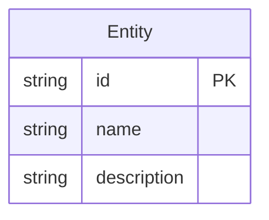
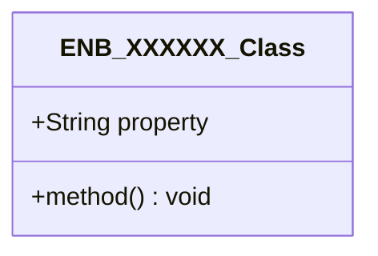
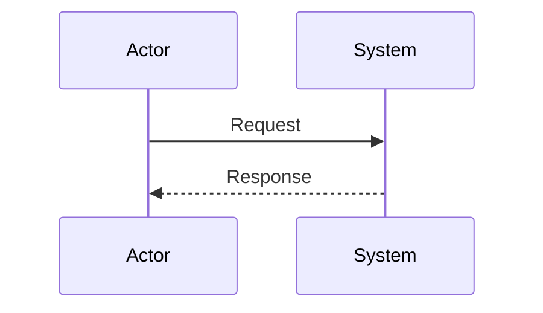
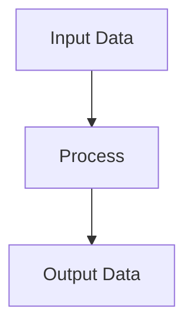
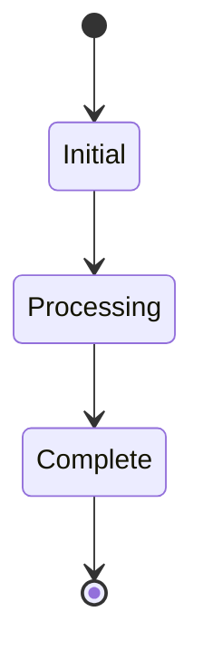

# Profile Web Component

## Metadata

- **Name**: Profile Web Component
- **Type**: Enabler
- **ID**: ENB-682199
- **Approval**: Not Approved
- **Capability ID**: CAP-537783
- **Owner**: Product Team
- **Status**: In Draft
- **Priority**: High
- **Analysis Review**: Required
- **Code Review**: Not Required

## Technical Overview
### Purpose
This web component enables the user to view and edit the user's profile. Profile information contains:
-user first name
-user last name
-email address
-U.S. state selection for (Default) state specific analysis

Gets information from the Get Profile API
On submission, submits changes to the Update Profile API

## Functional Requirements

| ID | Requirement | Status | Priority |
|----|------------|--------|----------|
| FR-682199-01 | Display profile form with first name, last name, email, state fields | Draft | High |
| FR-682199-02 | Populate form using Get Profile API | Draft | High |
| FR-682199-03 | Allow editing of first name, last name, email, state | Draft | High |
| FR-682199-04 | Provide dropdown for US state selection | Draft | High |
| FR-682199-05 | Validate form inputs (email format, required fields) | Draft | High |
| FR-682199-06 | Submit changes to Update Profile API | Draft | High |
| FR-682199-07 | Handle API success and display confirmation | Draft | High |
| FR-682199-08 | Handle API errors and display messages | Draft | High |
| FR-682199-09 | Refresh form data after successful update | Draft | Medium |

## Non-Functional Requirements

| ID | Requirement | Status | Priority |
|----|------------|--------|----------|
| NFR-682199-01 | Responsive form layout | Draft | High |
| NFR-682199-02 | Accessible form controls | Draft | High |
| NFR-682199-03 | Client-side validation for better UX | Draft | Medium |
| NFR-682199-04 | Secure form submission | Draft | High |
| NFR-682199-05 | Fast form loading and updates | Draft | High |
| NFR-682199-06 | Compatible with modern browsers | Draft | Medium |

## Dependencies

### Internal Upstream Dependency

| Enabler ID | Description |
|------------|-------------|
| | |

### Internal Downstream Impact

| Enabler ID | Description |
|------------|-------------|
| | |

### External Dependencies

**External Upstream Dependencies**: None identified.

**External Downstream Impact**: None identified.

## Technical Specifications (Template)

### Enabler Dependency Flow Diagram

```mermaid
flowchart TD
    ENB_XXXXXX["ENB-682199<br/>[Enabler Name]<br/>📡"]

    %% Add your dependency flows here

    classDef enabler fill:#e3f2fd,stroke:#1976d2,stroke-width:2px
    class ENB_XXXXXX enabler
```

### API Technical Specifications (if applicable)

| API Type | Operation | Channel / Endpoint | Description | Request / Publish Payload | Response / Subscribe Data |
|----------|-----------|---------------------|-------------|----------------------------|----------------------------|
| | | | | | |

### Data Models

### Class Diagrams

### Sequence Diagrams

### Dataflow Diagrams

### State Diagrams

