# Contract Upload

## Metadata

- **Name**: Contract Upload
- **Type**: Capability
- **System**: ls
- **Component**: contracts
- **ID**: CAP-773285
- **Approval**: Not Approved
- **Owner**: Product Team
- **Status**: In Draft
- **Priority**: High
- **Analysis Review**: Required

## Technical Overview
### Purpose
This web component and API call will:
- Provide a web component for a user to upload their contract (PDF, DOCX, PNG, JPG)
- Post that contract through the webservice API 
- The API will save the document to blob storage
- The API will save a contract json document to cosmos db in the container "contract" which has a reference to the file location in blob storage, the unique user id, the current upload time stamp, and the status of "processing". It will retrieve the unique id of the contract after saving
- Publish the contract json document to the event grid for further processing

## Enablers

| Enabler ID |
|------------|
| ENB-XXXXXX |
| ENB-000886 | Upload Contract API |
| ENB-603922 | Upload Contract Web Component |

## Dependencies

### Internal Upstream Dependency

| Capability ID | Description |
|---------------|-------------|
| | |

### Internal Downstream Impact

| Capability ID | Description |
|---------------|-------------|
| | |

### External Dependencies

**External Upstream Dependencies**: None identified.

**External Downstream Impact**: None identified.

## Technical Specifications (Template)

### Capability Dependency Flow Diagram
> **Note for AI**: When designing this section, show the direct relationships and dependencies between capabilities (NOT enablers). Focus on capability-to-capability interactions, business value flows, and how capabilities work together to deliver end-to-end business outcomes. Include:
> - **Current Capability**: The capability being defined and its role in the business value chain
> - **Internal Dependencies**: Dependencies on other capabilities within the same organizational boundary/domain
> - **External Dependencies**: Dependencies on capabilities across organizational boundaries.
> - **Business Flow**: How business value and data flows between capabilities
> - **Exclude**: Enabler-level details, technical implementation specifics, infrastructure components

```mermaid
flowchart TD
    %% Current Capability
    CURRENT["Current Capability<br/>Primary Business Function<br/>🎯"]

    %% Internal Capabilities (Same Organization)
    INT1["Supporting Capability A<br/>Core Service<br/>⚙️"]
    INT2["Supporting Capability B<br/>Data Management<br/>📊"]
    INT3["Supporting Capability C<br/>Business Logic<br/>🔧"]

    %% External Capabilities (Different Organization)
    EXT1["External Capability A<br/>Third-party Service<br/>🌐"]
    EXT2["External Capability B<br/>Integration Point<br/>🔗"]

    %% Internal Dependencies Flow
    INT1 --> CURRENT
    CURRENT --> INT2
    INT2 --> INT3

    %% External Dependencies Flow
    EXT1 --> CURRENT
    CURRENT --> EXT2

    %% Styling
    classDef current fill:#e3f2fd,stroke:#1976d2,stroke-width:3px
    classDef internal fill:#e8f5e8,stroke:#388e3c,stroke-width:2px
    classDef external fill:#f3e5f5,stroke:#7b1fa2,stroke-width:2px

    class CURRENT current
    class INT1,INT2,INT3 internal
    class EXT1,EXT2 external

    %% Capability Grouping
    subgraph ORG1 ["Internal Organization"]
        subgraph DOMAIN1 ["Current Domain"]
            CURRENT
        end
        subgraph DOMAIN2 ["Supporting Domain"]
            INT1
            INT2
            INT3
        end
    end

    subgraph ORG2 ["External Organization"]
        EXT1
        EXT2
    end
```

