# Recent Contracts Web Component

## Metadata

- **Name**: Recent Contracts Web Component
- **Type**: Enabler
- **ID**: ENB-823280
- **Approval**: Not Approved
- **Capability ID**: CAP-574476
- **Owner**: Product Team
- **Status**: In Draft
- **Priority**: High
- **Analysis Review**: Required
- **Code Review**: Not Required

## Technical Overview
### Purpose
A web component that:
- Displays rotating tile carousel with 5 tiles visible
- Contains 10 of the most recent contracts 
- Tile displays: thumbnail image, title, score, upload date time, and status icon (processing or processed)
- There is a clickable view icon in the bottom of the tile
- There is a clickable delete icon at the bottom of the tile

Carousel is populated by the Recent Contracts API
Each tile has a clickable delete icon to delete the contract by calling the Delete Contract API after confirmation

## Functional Requirements

| ID | Name | Requirement | Priority | Status | Approval |
|----|------|-------------|----------|--------|----------|
| FR-823280-01 |  | Display rotating tile carousel with 5 tiles visible | High | Draft | Not Approved |
| FR-823280-02 |  | Show 10 most recent contracts | High | Draft | Not Approved |
| FR-823280-03 |  | Populate carousel using Recent Contracts API | High | Draft | Not Approved |
| FR-823280-04 |  | Display thumbnail, title, score, upload datetime, status icon on each tile | High | Draft | Not Approved |
| FR-823280-05 |  | Include clickable view icon on each tile | High | Draft | Not Approved |
| FR-823280-06 |  | Include clickable delete icon on each tile | High | Draft | Not Approved |
| FR-823280-07 |  | Navigate to contract analysis on view click | High | Draft | Not Approved |
| FR-823280-08 |  | Show confirmation dialog on delete click | High | Draft | Not Approved |
| FR-823280-09 |  | Call Delete Contract API on confirmed delete | High | Draft | Not Approved |
| FR-823280-10 |  | Update carousel after delete operations | Medium | Draft | Not Approved |

## Non-Functional Requirements

| ID | Name | Type | Requirement | Priority | Status | Approval |
|----|------|------|-------------|----------|--------|----------|
| NFR-823280-01 |  |  | Smooth carousel rotation | Medium | Draft | Not Approved |
| NFR-823280-02 |  |  | Responsive tile layout | High | Draft | Not Approved |
| NFR-823280-03 |  |  | Accessible icons and interactions | High | Draft | Not Approved |
| NFR-823280-04 |  |  | Fast carousel loading | High | Draft | Not Approved |
| NFR-823280-05 |  |  | Intuitive navigation controls | Medium | Draft | Not Approved |
| NFR-823280-06 |  |  | Compatible with modern browsers | Medium | Draft | Not Approved |

## Dependencies

### Internal Upstream Dependency

| Enabler ID | Description |
|------------|-------------|
| | |

### Internal Downstream Impact

| Enabler ID | Description |
|------------|-------------|
| | |

### External Dependencies

**External Upstream Dependencies**: None identified.

**External Downstream Impact**: None identified.

## Technical Specifications (Template)

### Enabler Dependency Flow Diagram

```mermaid
flowchart TD
    ENB_XXXXXX["ENB-823280<br/>[Enabler Name]<br/>📡"]

    %% Add your dependency flows here

    classDef enabler fill:#e3f2fd,stroke:#1976d2,stroke-width:2px
    class ENB_XXXXXX enabler
```

### API Technical Specifications (if applicable)

| API Type | Operation | Channel / Endpoint | Description | Request / Publish Payload | Response / Subscribe Data |
|----------|-----------|---------------------|-------------|----------------------------|----------------------------|
| | | | | | |

### Data Models

### Class Diagrams

### Sequence Diagrams

### Dataflow Diagrams

### State Diagrams

