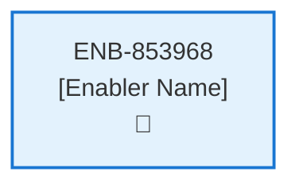
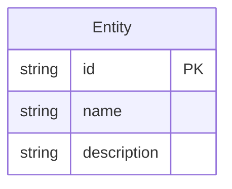
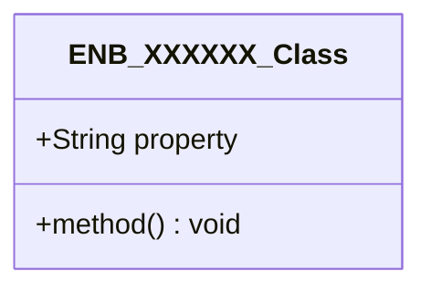
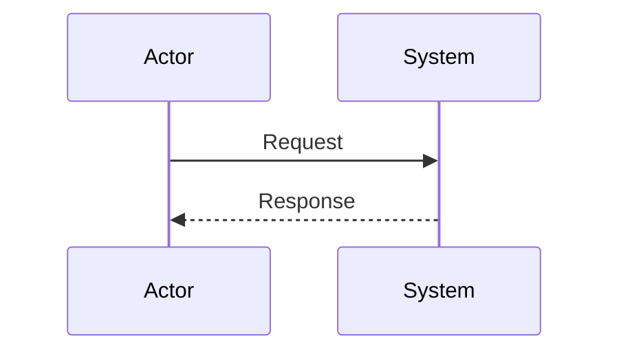
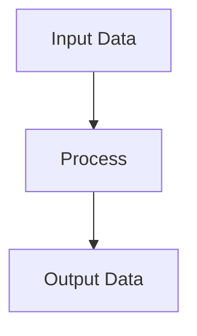
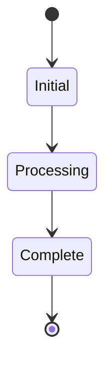

# Contract Library Web Component

## Metadata

- **Name**: Contract Library Web Component
- **Type**: Enabler
- **ID**: ENB-853968
- **Approval**: Not Approved
- **Capability ID**: CAP-944944
- **Owner**: Product Team
- **Status**: In Draft
- **Priority**: High
- **Analysis Review**: Required
- **Code Review**: Not Required

## Technical Overview
### Purpose
A web component that consists of:
- A defined section with a description of the contract library contents
- A grid with the columns: title, score, upload datetime, delete icon, view icon
- Supports sorting by column
- Supports filtering by title, score, upload datetime
- Supports paging 20 at a time

Grid is populated by the List Contracts API
Each contract line has a clickable delete icon to delete the contract by calling the Delete Contract API after confirmation
Each contract line has a clickable view icon to navigate to the contract analysis page (/analysis) by contract id

## Functional Requirements

| ID | Name | Requirement | Priority | Status | Approval |
|----|------|-------------|----------|--------|----------|
| FR-853968-01 |  | Display contract library description section | Medium | Draft | Not Approved |
| FR-853968-02 |  | Render grid with columns: title, score, upload datetime, delete icon, view icon | High | Draft | Not Approved |
| FR-853968-03 |  | Populate grid using List Contracts API | High | Draft | Not Approved |
| FR-853968-04 |  | Implement sorting by column | High | Draft | Not Approved |
| FR-853968-05 |  | Implement filtering by title, score, upload datetime | High | Draft | Not Approved |
| FR-853968-06 |  | Implement paging (20 at a time) | High | Draft | Not Approved |
| FR-853968-07 |  | Handle delete icon click with confirmation | High | Draft | Not Approved |
| FR-853968-08 |  | Call Delete Contract API on confirmed delete | High | Draft | Not Approved |
| FR-853968-09 |  | Navigate to /analysis on view icon click | High | Draft | Not Approved |
| FR-853968-10 |  | Update grid after delete operations | Medium | Draft | Not Approved |

## Non-Functional Requirements

| ID | Name | Type | Requirement | Priority | Status | Approval |
|----|------|------|-------------|----------|--------|----------|
| NFR-853968-01 |  |  | Responsive grid design | High | Draft | Not Approved |
| NFR-853968-02 |  |  | Fast grid loading and updates | High | Draft | Not Approved |
| NFR-853968-03 |  |  | Accessible icons and interactions | High | Draft | Not Approved |
| NFR-853968-04 |  |  | Intuitive sorting and filtering UI | Medium | Draft | Not Approved |
| NFR-853968-05 |  |  | Handle large datasets efficiently | Medium | Draft | Not Approved |
| NFR-853968-06 |  |  | Compatible with modern browsers | Medium | Draft | Not Approved |

## Dependencies

### Internal Upstream Dependency

| Enabler ID | Description |
|------------|-------------|
| | |

### Internal Downstream Impact

| Enabler ID | Description |
|------------|-------------|
| | |

### External Dependencies

**External Upstream Dependencies**: None identified.

**External Downstream Impact**: None identified.

## Technical Specifications (Template)

### Enabler Dependency Flow Diagram

### API Technical Specifications (if applicable)

| API Type | Operation | Channel / Endpoint | Description | Request / Publish Payload | Response / Subscribe Data |
|----------|-----------|---------------------|-------------|----------------------------|----------------------------|
| | | | | | |

### Data Models

### Class Diagrams

### Sequence Diagrams

### Dataflow Diagrams

### State Diagrams

