# Upload Contract API

## Metadata

- **Name**: Upload Contract API
- **Type**: Enabler
- **ID**: ENB-000886
- **Approval**: Approved
- **Capability ID**: CAP-773285
- **Owner**: Product Team
- **Status**: Ready for Implementation
- **Priority**: High
- **Analysis Review**: Required
- **Code Review**: Not Required

## Technical Overview
### Purpose
A webservice API that creates a new contract 
- POST method
- /contract path
- Accepts a contract binary document
- Returns the contract id created by cosmos db

Only accept files of type: PDF, DOCX, PNG, JPG
Save the file to blob storage
Save a thumbnail picture of the file to blob storage
Create a contract document:
- Set the storage to the file location from blob storage
- Set the thumbnail to the file location from blob storage
- Set the upload datetime to now
- Set the user id to the user id in the JWT
- Set the status to "processing"
Save the contract request to cosmos db in the container "contract" 
Create an analyze bus message with the contract id, the user id, and the request id
Publish the analyze bus message to the event grid for further processing

## Functional Requirements

| ID | Name | Requirement | Priority | Status | Approval |
|----|------|-------------|----------|--------|----------|
| FR-000886-01 |  | Implement POST /contract endpoint | High | Draft | Not Approved |
| FR-000886-02 |  | Accept binary document upload | High | Draft | Not Approved |
| FR-000886-03 |  | Validate file types: PDF, DOCX, PNG, JPG | High | Draft | Not Approved |
| FR-000886-04 |  | Save file to blob storage | High | Draft | Not Approved |
| FR-000886-05 |  | Create and save thumbnail to blob storage | High | Draft | Not Approved |
| FR-000886-06 |  | Create contract document in cosmos | High | Draft | Not Approved |
| FR-000886-07 |  | Set storage and thumbnail locations in document | High | Draft | Not Approved |
| FR-000886-08 |  | Set upload datetime and status to processing | High | Draft | Not Approved |
| FR-000886-09 |  | Publish analyze document to event grid | High | Draft | Not Approved |
| FR-000886-10 |  | Return created contract id | High | Draft | Not Approved |
| FR-000886-11 |  | Extract user id from JWT | High | Draft | Not Approved |

## Non-Functional Requirements

| ID | Name | Type | Requirement | Priority | Status | Approval |
|----|------|------|-------------|----------|--------|----------|
| NFR-000886-01 |  |  | Secure file upload handling | High | Draft | Not Approved |
| NFR-000886-02 |  |  | File size limits (e.g., 10MB) | High | Draft | Not Approved |
| NFR-000886-03 |  |  | Thumbnail generation quality | Medium | Draft | Not Approved |
| NFR-000886-04 |  |  | Response time under 10 seconds | High | Draft | Not Approved |
| NFR-000886-05 |  |  |  | High | Draft | Not Approved |
| NFR-000886-06 |  |  |  | Medium | Draft | Not Approved |
| NFR-000886-07 |  |  |  | High | Draft | Not Approved |

## Dependencies

### Internal Upstream Dependency

| Enabler ID | Description |
|------------|-------------|
| | |

### Internal Downstream Impact

| Enabler ID | Description |
|------------|-------------|
| | |

### External Dependencies

**External Upstream Dependencies**: None identified.

**External Downstream Impact**: None identified.

## Technical Specifications (Template)

### Enabler Dependency Flow Diagram

```mermaid
flowchart TD
    ENB_XXXXXX["ENB-000886<br/>[Enabler Name]<br/>📡"]

    %% Add your dependency flows here

    classDef enabler fill:#e3f2fd,stroke:#1976d2,stroke-width:2px
    class ENB_XXXXXX enabler
```

### API Technical Specifications (if applicable)

| API Type | Operation | Channel / Endpoint | Description | Request / Publish Payload | Response / Subscribe Data |
|----------|-----------|---------------------|-------------|----------------------------|----------------------------|
| | | | | | |

### Data Models

### Class Diagrams

### Sequence Diagrams

### Dataflow Diagrams

### State Diagrams

