# Upload Contract API

## Metadata

- **Name**: Upload Contract API
- **Type**: Enabler
- **ID**: ENB-000886
- **Approval**: Approved
- **Capability ID**: CAP-773285
- **Owner**: Product Team
- **Status**: Ready for Implementation
- **Priority**: High
- **Analysis Review**: Required
- **Code Review**: Not Required

## Technical Overview
### Purpose
A webservice API that creates a new contract 
- POST method
- /contract path
- Accepts a contract binary document
- Returns the contract id created by cosmos db

Only accept files of type: PDF, DOCX, PNG, JPG
Save the file to blob storage
Save a thumbnail picture of the file to blob storage
Create a contract document:
- Set the title to the name of the file
- Set the storage to the file location from blob storage
- Set the thumbnail to the file location from blob storage
- Set the upload datetime to now
- Set the user id to the user id in the JWT
- Set the status to "processing"
Save the contract request to cosmos db in the container "contract" 
Get the notification from the "notification" container in cosmos db by the user id of the user id in the JWT
Append a new item to the top of the notifications array with type of "contract", a status of "processing", and a "contractId" set to the id contract document
Update the notification in the "notification" container in cosmos db by the user id of the user id in the JWT
Create an analyze bus message with the contract id, the user id, and the request id
Publish the analyze bus message to the event grid for further processing

## Functional Requirements

| ID | Name | Requirement | Priority | Status | Approval |
|----|------|-------------|----------|--------|----------|
| FR-000886-01 | Contract Upload Endpoint | Implement POST /contract endpoint for contract document upload | Must Have | Ready for Implementation | Approved |
| FR-000886-02 | Binary Document Acceptance | Accept binary document upload via multipart/form-data | Must Have | Ready for Implementation | Approved |
| FR-000886-03 | File Type Validation | Validate uploaded files are of accepted types: PDF, DOCX, PNG, JPG | Must Have | Ready for Implementation | Approved |
| FR-000886-04 | Blob Storage Upload | Save original contract file to Azure Blob Storage | Must Have | Ready for Implementation | Approved |
| FR-000886-05 | Thumbnail Generation | Create and save thumbnail image of contract file to Blob Storage | Must Have | Ready for Implementation | Approved |
| FR-000886-06 | Contract Document Creation | Create contract document in Cosmos DB contracts container | Must Have | Ready for Implementation | Approved |
| FR-000886-07 | Document Metadata | Set contract document fields: title, storage location, thumbnail location | Must Have | Ready for Implementation | Approved |
| FR-000886-08 | Document Status | Set upload datetime, user ID from JWT, and status to "processing" | Must Have | Ready for Implementation | Approved |
| FR-000886-09 | Notification Retrieval | Get user notifications document from Cosmos DB notifications container | Must Have | Ready for Implementation | Approved |
| FR-000886-10 | Notification Update | Add new notification item with contract type, processing status, and contract ID | Must Have | Ready for Implementation | Approved |
| FR-000886-11 | JWT User Extraction | Extract user ID from JWT token for document association | Must Have | Ready for Implementation | Approved |
| FR-000886-12 | Analysis Message Creation | Create analyze bus message with contract ID, user ID, and request ID | Must Have | Ready for Implementation | Approved |
| FR-000886-13 | Event Grid Publishing | Publish analyze message to Azure Event Grid for processing | Must Have | Ready for Implementation | Approved |
| FR-000886-14 | Contract ID Response | Return created contract ID in API response | Must Have | Ready for Implementation | Approved |

## Non-Functional Requirements

| ID | Name | Type | Requirement | Priority | Status | Approval |
|----|------|------|-------------|----------|--------|----------|
| NFR-000886-01 | File Upload Security | Security | Secure file upload handling with virus scanning and validation | Must Have | Ready for Implementation | Approved |
| NFR-000886-02 | File Size Limits | Reliability | Enforce file size limits (maximum 10MB per contract) | Must Have | Ready for Implementation | Approved |
| NFR-000886-03 | Thumbnail Quality | Usability | Generate high-quality thumbnails for different document types | Should Have | Ready for Implementation | Approved |
| NFR-000886-04 | Upload Response Time | Performance | Complete upload and processing within 10 seconds | Must Have | Ready for Implementation | Approved |
| NFR-000886-05 | Atomic Operations | Reliability | Ensure file storage, database updates, and notifications are atomic | Must Have | Ready for Implementation | Approved |
| NFR-000886-06 | Error Handling | Reliability | Comprehensive error handling with rollback for failed operations | Must Have | Ready for Implementation | Approved |
| NFR-000886-07 | Audit Logging | Observability | Log all contract uploads with user ID and timestamps | Should Have | Ready for Implementation | Approved |

## Dependencies

### Internal Upstream Dependency

| Enabler ID | Description |
|------------|-------------|
| | |

### Internal Downstream Impact

| Enabler ID | Description |
|------------|-------------|
| | |

### External Dependencies

**External Upstream Dependencies**: None identified.

**External Downstream Impact**: None identified.

## Technical Specifications (Template)

### Enabler Dependency Flow Diagram

```mermaid
flowchart TD
    ENB_XXXXXX["ENB-000886<br/>[Enabler Name]<br/>📡"]

    %% Add your dependency flows here

    classDef enabler fill:#e3f2fd,stroke:#1976d2,stroke-width:2px
    class ENB_XXXXXX enabler
```

### API Technical Specifications (if applicable)

| API Type | Operation | Channel / Endpoint | Description | Request / Publish Payload | Response / Subscribe Data |
|----------|-----------|---------------------|-------------|----------------------------|----------------------------|
| | | | | | |

### Data Models

### Class Diagrams

### Sequence Diagrams

### Dataflow Diagrams

### State Diagrams

