# Delete Contract API

## Metadata

- **Name**: Delete Contract API
- **Type**: Enabler
- **ID**: ENB-277705
- **Approval**: Approved
- **Capability ID**: CAP-944944
- **Owner**: Product Team
- **Status**: Ready for Implementation
- **Priority**: High
- **Analysis Review**: Required
- **Code Review**: Not Required

## Technical Overview
### Purpose
A webservice API that deletes all the contract information by the contract's id
- DELETE method
- /contract path
- Accepts a contract id

Deletes the contract document from the contract container in cosmos db by its contract id
Deletes the analysis document from the analysis container in cosmos db by its contract id
Deletes the blob storage file based on the blob file location in the contract document

The contract is deleted by a webservice API DELETE (/contract) that deletes the contract by id and deletes the associated blob storage file

## Functional Requirements

| ID | Name | Requirement | Priority | Status | Approval |
|----|------|-------------|----------|--------|----------|
| FR-277705-01 | Delete Contract Endpoint | Implement DELETE /contract endpoint | Must Have | Ready for Implementation | Approved |
| FR-277705-02 | Contract ID Parameter | Accept contract id in request path or body | Must Have | Ready for Implementation | Approved |
| FR-277705-03 | Contract Document Deletion | Delete contract document from cosmos contracts container | Must Have | Ready for Implementation | Approved |
| FR-277705-04 | Analysis Document Deletion | Delete analysis document from cosmos analysis container | Must Have | Ready for Implementation | Approved |
| FR-277705-05 | Blob File Deletion | Delete blob storage file using location from contract document | Must Have | Ready for Implementation | Approved |
| FR-277705-06 | Ownership Validation | Validate contract ownership by user ID from JWT | Must Have | Ready for Implementation | Approved |
| FR-277705-07 | Response Handling | Return appropriate success/error HTTP responses | Must Have | Ready for Implementation | Approved |
| FR-277705-08 | Partial Failure Handling | Handle partial deletion failures with rollback or cleanup | Should Have | Ready for Implementation | Approved |

## Non-Functional Requirements

| ID | Name | Type | Requirement | Priority | Status | Approval |
|----|------|------|-------------|----------|--------|----------|
| NFR-277705-01 | Atomic Operations | Reliability | Ensure atomic deletion operations across all data stores | Must Have | Ready for Implementation | Approved |
| NFR-277705-02 | Access Security | Security | Secure access control with JWT validation | Must Have | Ready for Implementation | Approved |
| NFR-277705-03 | Response Performance | Performance | Response time under 3 seconds for complete deletion | Must Have | Ready for Implementation | Approved |
| NFR-277705-04 | Audit Logging | Observability | Comprehensive error and success logging | Should Have | Ready for Implementation | Approved |
| NFR-277705-05 | Data Consistency | Reliability | Maintain data consistency during partial failures | Must Have | Ready for Implementation | Approved |
| NFR-277705-05 |  |  | Handle concurrent deletions | Medium | Draft | Not Approved |

## Dependencies

### Internal Upstream Dependency

| Enabler ID | Description |
|------------|-------------|
| | |

### Internal Downstream Impact

| Enabler ID | Description |
|------------|-------------|
| | |

### External Dependencies

**External Upstream Dependencies**: None identified.

**External Downstream Impact**: None identified.

## Technical Specifications (Template)

### Enabler Dependency Flow Diagram

```mermaid
flowchart TD
    ENB_XXXXXX["ENB-277705<br/>[Enabler Name]<br/>📡"]

    %% Add your dependency flows here

    classDef enabler fill:#e3f2fd,stroke:#1976d2,stroke-width:2px
    class ENB_XXXXXX enabler
```

### API Technical Specifications (if applicable)

| API Type | Operation | Channel / Endpoint | Description | Request / Publish Payload | Response / Subscribe Data |
|----------|-----------|---------------------|-------------|----------------------------|----------------------------|
| | | | | | |

### Data Models

### Class Diagrams

### Sequence Diagrams

### Dataflow Diagrams

### State Diagrams

