# Recent Contracts API

## Metadata

- **Name**: Recent Contracts API
- **Type**: Enabler
- **ID**: ENB-349820
- **Approval**: Approved
- **Capability ID**: CAP-574476
- **Owner**: Product Team
- **Status**: Ready for Implementation
- **Priority**: High
- **Analysis Review**: Required
- **Code Review**: Not Required

## Technical Overview
### Purpose
A webservice API that gets a list of the top 10 most recent contracts
- GET method
- /contract/recent path
- Returns an array of contract documents

Gets the top 10 most recent contracts from the "contract" container in cosmos db
Orders the list by upload datetime descending

## Functional Requirements

| ID | Requirement | Status | Priority |
|----|------------|--------|----------|
| FR-349820-01 | Implement GET /contract/recent endpoint | Ready for Implementation | High |
| FR-349820-02 | Query top 10 contracts by upload datetime descending | Ready for Implementation | High |
| FR-349820-03 | Return array of contract documents | Ready for Implementation | High |
| FR-349820-04 | Extract user id from JWT | Ready for Implementation | High |
| FR-349820-05 | Filter contracts by user id | Ready for Implementation | High |
| FR-349820-06 | Handle cases with less than 10 contracts | Ready for Implementation | Medium |
| FR-349820-07 | Return appropriate response format | Ready for Implementation | High |

## Non-Functional Requirements

| ID | Requirement | Status | Priority |
|----|------------|--------|----------|
| NFR-349820-01 | Response time under 1 second | Ready for Implementation | High |
| NFR-349820-02 | Secure token handling | Ready for Implementation | High |
| NFR-349820-03 | Efficient cosmos query | Ready for Implementation | High |
| NFR-349820-04 | Handle high request volume | Ready for Implementation | Medium |
| NFR-349820-05 | Comprehensive error logging | Ready for Implementation | Medium |

## Dependencies

### Internal Upstream Dependency

| Enabler ID | Description |
|------------|-------------|
| | |

### Internal Downstream Impact

| Enabler ID | Description |
|------------|-------------|
| | |

### External Dependencies

**External Upstream Dependencies**: None identified.

**External Downstream Impact**: None identified.

## Technical Specifications (Template)

### Enabler Dependency Flow Diagram

```mermaid
flowchart TD
    ENB_XXXXXX["ENB-349820<br/>[Enabler Name]<br/>📡"]

    %% Add your dependency flows here

    classDef enabler fill:#e3f2fd,stroke:#1976d2,stroke-width:2px
    class ENB_XXXXXX enabler
```

### API Technical Specifications (if applicable)

| API Type | Operation | Channel / Endpoint | Description | Request / Publish Payload | Response / Subscribe Data |
|----------|-----------|---------------------|-------------|----------------------------|----------------------------|
| | | | | | |

### Data Models

### Class Diagrams

### Sequence Diagrams

### Dataflow Diagrams

### State Diagrams

