# Upload Contract Web Component

## Metadata

- **Name**: Upload Contract Web Component
- **Type**: Enabler
- **ID**: ENB-603922
- **Approval**: Approved
- **Capability ID**: CAP-773285
- **Owner**: Product Team
- **Status**: Ready for Implementation
- **Priority**: High
- **Analysis Review**: Required
- **Code Review**: Not Required

## Technical Overview
### Purpose
A web component that consists of:
- A defined section with a description of the contract upload function to start the contract analysis
- Ability to upload a contract (PDF, DOCX, PNG, JPG) from the browser

Once a document is selected:
- Display a progress dialog while the file is being uploaded. Processing can take several seconds.
- Call the Upload Contract API with the uploaded file
- Refresh the Contract Library and Recent Contracts web components on the same page

## Functional Requirements

| ID | Requirement | Status | Priority |
|----|------------|--------|----------|
| FR-603922-01 | Display upload section with description | Ready for Implementation | High |
| FR-603922-02 | Provide file upload interface for PDF, DOCX, PNG, JPG | Ready for Implementation | High |
| FR-603922-03 | Validate selected file type | Ready for Implementation | High |
| FR-603922-04 | Show progress dialog during upload | Ready for Implementation | High |
| FR-603922-05 | Call Upload Contract API with selected file | Ready for Implementation | High |
| FR-603922-06 | Handle upload success and display confirmation | Ready for Implementation | High |
| FR-603922-07 | Handle upload errors and display messages | Ready for Implementation | High |
| FR-603922-08 | Refresh Contract Library component after upload | Ready for Implementation | High |
| FR-603922-09 | Refresh Recent Contracts component after upload | Ready for Implementation | High |
| FR-603922-10 | Ensure component integration with page | Ready for Implementation | Medium |

## Non-Functional Requirements

| ID | Name | Type | Requirement | Priority | Status | Approval |
|----|------|------|-------------|----------|--------|----------|
| NFR-603922-01 | Responsive Design | Usability | Responsive upload interface | High | Ready for Implementation | Approved |
| NFR-603922-02 | Accessibility | Usability | Accessible file selection and upload | High | Ready for Implementation | Approved |
| NFR-603922-03 | User Experience | Usability | Progress dialog provides real-time feedback | Medium | Ready for Implementation | Approved |
| NFR-603922-04 | Security | Security | Secure file handling in browser | High | Ready for Implementation | Approved |
| NFR-603922-05 | Performance | Performance | Fast component refresh after upload | High | Ready for Implementation | Approved |
| NFR-603922-06 | Compatibility | Compatibility | Compatible with modern browsers | Medium | Ready for Implementation | Approved |
| NFR-603922-07 | Scalability | Performance | Handle large file uploads gracefully | Medium | Ready for Implementation | Approved |

## Dependencies

### Internal Upstream Dependency

| Enabler ID | Description |
|------------|-------------|
| | |

### Internal Downstream Impact

| Enabler ID | Description |
|------------|-------------|
| | |

### External Dependencies

**External Upstream Dependencies**: None identified.

**External Downstream Impact**: None identified.

## Technical Specifications (Template)

### Enabler Dependency Flow Diagram

```mermaid
flowchart TD
    ENB_XXXXXX["ENB-603922<br/>[Enabler Name]<br/>📡"]

    %% Add your dependency flows here

    classDef enabler fill:#e3f2fd,stroke:#1976d2,stroke-width:2px
    class ENB_XXXXXX enabler
```

### API Technical Specifications (if applicable)

| API Type | Operation | Channel / Endpoint | Description | Request / Publish Payload | Response / Subscribe Data |
|----------|-----------|---------------------|-------------|----------------------------|----------------------------|
| | | | | | |

### Data Models

### Class Diagrams

### Sequence Diagrams

### Dataflow Diagrams

### State Diagrams

