# Recent Contracts Web Component

## Metadata

- **Name**: Recent Contracts Web Component
- **Type**: Enabler
- **ID**: ENB-823280
- **Approval**: Approved
- **Capability ID**: CAP-574476
- **Owner**: Product Team
- **Status**: Ready for Implementation
- **Priority**: High
- **Analysis Review**: Required
- **Code Review**: Not Required

## Technical Overview
### Purpose
A web component that:
- Displays rotating tile carousel with 5 tiles visible
- Contains 10 of the most recent contracts 
- Tile displays: thumbnail image, title, score, upload date time, and status icon (processing or processed)
- There is a clickable view icon in the bottom of the tile
- There is a clickable delete icon at the bottom of the tile

Carousel is populated by the Recent Contracts API
Each tile has a clickable delete icon to delete the contract by calling the Delete Contract API after confirmation

## Functional Requirements

| ID | Requirement | Status | Priority |
|----|------------|--------|----------|
| FR-823280-01 | Display rotating tile carousel with 5 tiles visible | Ready for Implementation | High |
| FR-823280-02 | Show 10 most recent contracts | Ready for Implementation | High |
| FR-823280-03 | Populate carousel using Recent Contracts API | Ready for Implementation | High |
| FR-823280-04 | Display thumbnail, title, score, upload datetime, status icon on each tile | Ready for Implementation | High |
| FR-823280-05 | Include clickable view icon on each tile | Ready for Implementation | High |
| FR-823280-06 | Include clickable delete icon on each tile | Ready for Implementation | High |
| FR-823280-07 | Navigate to contract analysis on view click | Ready for Implementation | High |
| FR-823280-08 | Show confirmation dialog on delete click | Ready for Implementation | High |
| FR-823280-09 | Call Delete Contract API on confirmed delete | Ready for Implementation | High |
| FR-823280-10 | Update carousel after delete operations | Ready for Implementation | Medium |

## Non-Functional Requirements

| ID | Name | Type | Requirement | Priority | Status | Approval |
|----|------|------|-------------|----------|--------|----------|
| NFR-823280-01 | Smooth Rotation | Usability | Smooth carousel rotation | Medium | Ready for Implementation | Approved |
| NFR-823280-02 | Responsive Design | Usability | Responsive tile layout | High | Ready for Implementation | Approved |
| NFR-823280-03 | Accessibility | Usability | Accessible icons and interactions | High | Ready for Implementation | Approved |
| NFR-823280-04 | Performance | Performance | Fast carousel loading | High | Ready for Implementation | Approved |
| NFR-823280-05 | User Experience | Usability | Intuitive navigation controls | Medium | Ready for Implementation | Approved |
| NFR-823280-06 | Compatibility | Compatibility | Compatible with modern browsers | Medium | Ready for Implementation | Approved |

## Dependencies

### Internal Upstream Dependency

| Enabler ID | Description |
|------------|-------------|
| | |

### Internal Downstream Impact

| Enabler ID | Description |
|------------|-------------|
| | |

### External Dependencies

**External Upstream Dependencies**: None identified.

**External Downstream Impact**: None identified.

## Technical Specifications (Template)

### Enabler Dependency Flow Diagram

```mermaid
flowchart TD
    ENB_XXXXXX["ENB-823280<br/>[Enabler Name]<br/>📡"]

    %% Add your dependency flows here

    classDef enabler fill:#e3f2fd,stroke:#1976d2,stroke-width:2px
    class ENB_XXXXXX enabler
```

### API Technical Specifications (if applicable)

| API Type | Operation | Channel / Endpoint | Description | Request / Publish Payload | Response / Subscribe Data |
|----------|-----------|---------------------|-------------|----------------------------|----------------------------|
| | | | | | |

### Data Models

### Class Diagrams

### Sequence Diagrams

### Dataflow Diagrams

### State Diagrams

