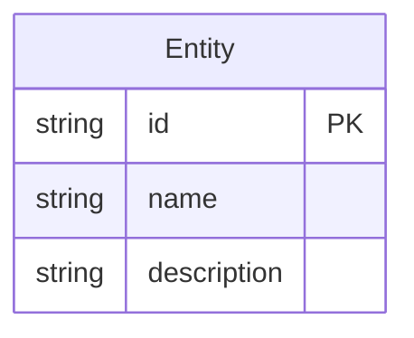
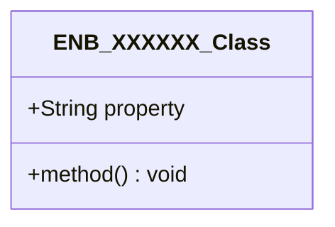
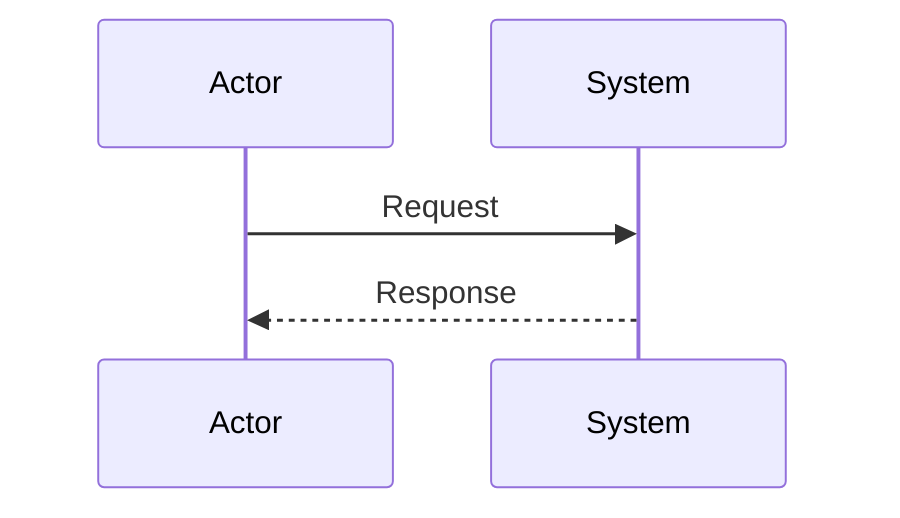
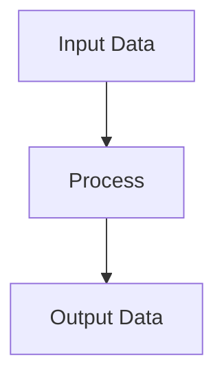
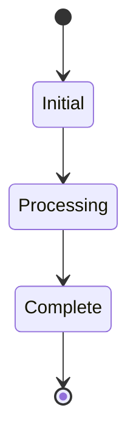

# Contract Library Web Component

## Metadata

- **Name**: Contract Library Web Component
- **Type**: Enabler
- **ID**: ENB-853968
- **Approval**: Approved
- **Capability ID**: CAP-944944
- **Owner**: Product Team
- **Status**: Ready for Implementation
- **Priority**: High
- **Analysis Review**: Required
- **Code Review**: Not Required

## Technical Overview
### Purpose
A web component that consists of:
- A defined section with a description of the contract library contents
- A grid with the columns: title, score, upload datetime, delete icon, view icon
- Supports sorting by column
- Supports filtering by title, score, upload datetime
- Supports paging 20 at a time

Grid is populated by the List Contracts API
Each contract line has a clickable delete icon to delete the contract by calling the Delete Contract API after confirmation
Each contract line has a clickable view icon to navigate to the contract analysis page (/analysis) by contract id

## Functional Requirements

| ID | Requirement | Status | Priority |
|----|------------|--------|----------|
| FR-853968-01 | Display contract library description section | Ready for Implementation | Medium |
| FR-853968-02 | Render grid with columns: title, score, upload datetime, delete icon, view icon | Ready for Implementation | High |
| FR-853968-03 | Populate grid using List Contracts API | Ready for Implementation | High |
| FR-853968-04 | Implement sorting by column | Ready for Implementation | High |
| FR-853968-05 | Implement filtering by title, score, upload datetime | Ready for Implementation | High |
| FR-853968-06 | Implement paging (20 at a time) | Ready for Implementation | High |
| FR-853968-07 | Handle delete icon click with confirmation | Ready for Implementation | High |
| FR-853968-08 | Call Delete Contract API on confirmed delete | Ready for Implementation | High |
| FR-853968-09 | Navigate to /analysis on view icon click | Ready for Implementation | High |
| FR-853968-10 | Update grid after delete operations | Ready for Implementation | Medium |

## Non-Functional Requirements

| ID | Name | Type | Requirement | Priority | Status | Approval |
|----|------|------|-------------|----------|--------|----------|
| NFR-853968-01 | Responsive Design | Usability | Responsive grid design | High | Ready for Implementation | Approved |
| NFR-853968-02 | Performance | Performance | Fast grid loading and updates | High | Ready for Implementation | Approved |
| NFR-853968-03 | Accessibility | Usability | Accessible icons and interactions | High | Ready for Implementation | Approved |
| NFR-853968-04 | User Experience | Usability | Intuitive sorting and filtering UI | Medium | Ready for Implementation | Approved |
| NFR-853968-05 | Scalability | Performance | Handle large datasets efficiently | Medium | Ready for Implementation | Approved |
| NFR-853968-06 | Compatibility | Compatibility | Compatible with modern browsers | Medium | Ready for Implementation | Approved |

## Dependencies

### Internal Upstream Dependency

| Enabler ID | Description |
|------------|-------------|
| | |

### Internal Downstream Impact

| Enabler ID | Description |
|------------|-------------|
| | |

### External Dependencies

**External Upstream Dependencies**: None identified.

**External Downstream Impact**: None identified.

## Technical Specifications (Template)

### Enabler Dependency Flow Diagram

```mermaid
flowchart TD
    ENB_XXXXXX["ENB-853968<br/>[Enabler Name]<br/>📡"]

    %% Add your dependency flows here

    classDef enabler fill:#e3f2fd,stroke:#1976d2,stroke-width:2px
    class ENB_XXXXXX enabler
```

### API Technical Specifications (if applicable)

| API Type | Operation | Channel / Endpoint | Description | Request / Publish Payload | Response / Subscribe Data |
|----------|-----------|---------------------|-------------|----------------------------|----------------------------|
| | | | | | |

### Data Models

### Class Diagrams

### Sequence Diagrams

### Dataflow Diagrams

### State Diagrams

