# List Contracts API

## Metadata

- **Name**: List Contracts API
- **Type**: Enabler
- **ID**: ENB-857384
- **Approval**: Approved
- **Capability ID**: CAP-944944
- **Owner**: Product Team
- **Status**: Ready for Implementation
- **Priority**: High
- **Analysis Review**: Required
- **Code Review**: Not Required

## Technical Overview
### Purpose
A webservice API that lists of all the contracts owned by the user id
- GET method
- /contract path
- Supports sorting, filtering, and paging
- Requires the user id from the JWT

Returns a list of contract documents from the contract container in cosmos db by its user id

## Functional Requirements

| ID | Requirement | Status | Priority |
|----|------------|--------|----------|
| FR-857384-01 | Implement GET /contract endpoint | Ready for Implementation | High |
| FR-857384-02 | Extract user id from JWT | Ready for Implementation | High |
| FR-857384-03 | Query contracts from cosmos db by user id | Ready for Implementation | High |
| FR-857384-04 | Support sorting by parameters | Ready for Implementation | High |
| FR-857384-05 | Support filtering by parameters | Ready for Implementation | High |
| FR-857384-06 | Support paging (e.g., 20 at a time) | Ready for Implementation | High |
| FR-857384-07 | Return list of contract documents | Ready for Implementation | High |
| FR-857384-08 | Handle authentication errors | Ready for Implementation | High |

## Non-Functional Requirements

| ID | Requirement | Status | Priority |
|----|------------|--------|----------|
| NFR-857384-01 | Response time under 2 seconds | Ready for Implementation | High |
| NFR-857384-02 | Secure token handling | Ready for Implementation | High |
| NFR-857384-03 | Efficient cosmos db queries | Ready for Implementation | High |
| NFR-857384-04 | Handle large result sets | Ready for Implementation | Medium |
| NFR-857384-05 | Comprehensive error logging | Ready for Implementation | Medium |

## Dependencies

### Internal Upstream Dependency

| Enabler ID | Description |
|------------|-------------|
| | |

### Internal Downstream Impact

| Enabler ID | Description |
|------------|-------------|
| | |

### External Dependencies

**External Upstream Dependencies**: None identified.

**External Downstream Impact**: None identified.

## Technical Specifications (Template)

### Enabler Dependency Flow Diagram

```mermaid
flowchart TD
    ENB_XXXXXX["ENB-857384<br/>[Enabler Name]<br/>📡"]

    %% Add your dependency flows here

    classDef enabler fill:#e3f2fd,stroke:#1976d2,stroke-width:2px
    class ENB_XXXXXX enabler
```

### API Technical Specifications (if applicable)

| API Type | Operation | Channel / Endpoint | Description | Request / Publish Payload | Response / Subscribe Data |
|----------|-----------|---------------------|-------------|----------------------------|----------------------------|
| | | | | | |

### Data Models

### Class Diagrams

### Sequence Diagrams

### Dataflow Diagrams

### State Diagrams

