# Contracts Web Page

## Metadata

- **Name**: Contracts Web Page
- **Type**: Enabler
- **ID**: ENB-908856
- **Approval**: Approved
- **Capability ID**: CAP-735713
- **Owner**: Product Team
- **Status**: Ready for Implementation
- **Priority**: High
- **Analysis Review**: Required
- **Code Review**: Not Required

## Technical Overview
### Purpose
This web page:
- Unique, navigable url (/contracts)
- Only accessible if the user is logged in

The page has three sections:
- Top section: Recent Contracts web component
- Middle section: Contract Upload web component
- Bottom section: Contract Library web component
- Bottom section is only viewable if the user has the Pro subscription

## Functional Requirements

| ID | Requirement | Status | Priority |
|----|------------|--------|----------|
| FR-908856-01 | Display page at /contracts URL | Draft | High |
| FR-908856-02 | Require user login for access | Draft | High |
| FR-908856-03 | Show Recent Contracts component in top section | Draft | High |
| FR-908856-04 | Show Contract Upload component in middle section | Draft | High |
| FR-908856-05 | Show Contract Library component in bottom section only for Pro users | Draft | High |
| FR-908856-06 | Check user subscription level | Draft | High |
| FR-908856-07 | Hide Contract Library for non-Pro users | Draft | High |
| FR-908856-08 | Ensure independent navigation | Draft | Medium |
| FR-908856-09 | Handle authentication redirects | Draft | Medium |

## Non-Functional Requirements

| ID | Requirement | Status | Priority |
|----|------------|--------|----------|
| NFR-908856-01 | Secure authentication check | Draft | High |
| NFR-908856-02 | Page loads within 2 seconds | Draft | High |
| NFR-908856-03 | Responsive layout for all sections | Draft | High |
| NFR-908856-04 | Accessible navigation and content | Draft | High |
| NFR-908856-05 | Subscription check performance | Draft | Medium |
| NFR-908856-06 | Compatible with modern browsers | Draft | Medium |

## Dependencies

### Internal Upstream Dependency

| Enabler ID | Description |
|------------|-------------|
| | |

### Internal Downstream Impact

| Enabler ID | Description |
|------------|-------------|
| | |

### External Dependencies

**External Upstream Dependencies**: None identified.

**External Downstream Impact**: None identified.

## Technical Specifications (Template)

### Enabler Dependency Flow Diagram

```mermaid
flowchart TD
    ENB_XXXXXX["ENB-908856<br/>[Enabler Name]<br/>📡"]

    %% Add your dependency flows here

    classDef enabler fill:#e3f2fd,stroke:#1976d2,stroke-width:2px
    class ENB_XXXXXX enabler
```

### API Technical Specifications (if applicable)

| API Type | Operation | Channel / Endpoint | Description | Request / Publish Payload | Response / Subscribe Data |
|----------|-----------|---------------------|-------------|----------------------------|----------------------------|
| | | | | | |

### Data Models

### Class Diagrams

### Sequence Diagrams

### Dataflow Diagrams

### State Diagrams

