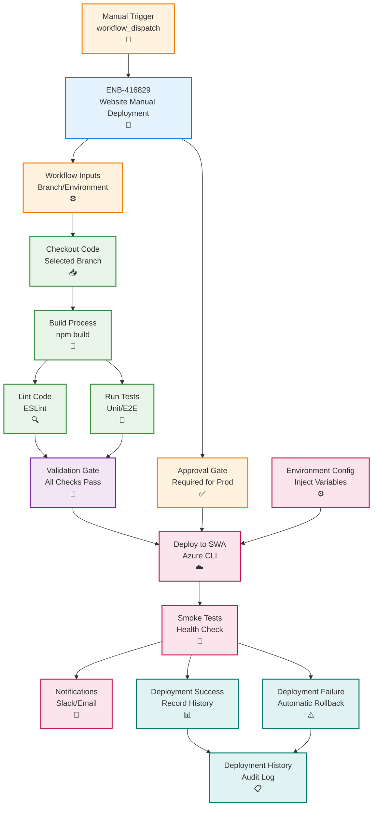

# Website GitHub Actions Manual Deployment

## Metadata

- **Name**: Website GitHub Actions Manual Deployment
- **Type**: Enabler
- **ID**: ENB-416829
- **Approval**: Approved
- **Capability ID**: CAP-416828
- **Owner**: DevOps Team
- **Status**: Ready for Implementation
- **Priority**: High
- **Analysis Review**: Not Required
- **Code Review**: Not Required

## Technical Overview
### Purpose
Implement manual-triggered GitHub Actions workflow for Static Web App deployment with branch-based deployments, approval gates, environment promotion, and rollback capabilities. Ensure deployments are never triggered automatically on code submission and require explicit manual approval.

## Functional Requirements

| ID | Name | Requirement | Priority | Status | Approval |
|----|------|-------------|----------|--------|----------|
| FR-416830 | Manual Trigger Only | Configure workflow to trigger only via workflow_dispatch, never on push or pull_request | Must Have | Ready for Implementation | Approved |
| FR-416831 | Branch Selection | Allow selection of any branch for deployment via workflow input | Must Have | Ready for Implementation | Approved |
| FR-416832 | Environment Selection | Support deployment to dev, staging, or production environments | Must Have | Ready for Implementation | Approved |
| FR-416833 | Approval Gates | Require manual approval for staging and production deployments | Must Have | Ready for Implementation | Approved |
| FR-416834 | Build Validation | Run build, lint, and test before deployment | Must Have | Ready for Implementation | Approved |
| FR-416835 | Deployment Status | Report deployment status in GitHub Actions UI and notifications | Must Have | Ready for Implementation | Approved |
| FR-416836 | Rollback Support | Provide ability to redeploy previous successful build | Must Have | Ready for Implementation | Approved |
| FR-416837 | Deployment History | Track deployment history with commit SHA, timestamp, and deployer | Must Have | Ready for Implementation | Approved |
| FR-416838 | Environment Variables | Inject environment-specific configuration during deployment | Must Have | Ready for Implementation | Approved |
| FR-416839 | Deployment Verification | Run smoke tests post-deployment to verify success | Must Have | Ready for Implementation | Approved |

## Non-Functional Requirements

| ID | Name | Type | Requirement | Priority | Status | Approval |
|----|------|------|-------------|----------|--------|----------|
| NFR-416840 | Deployment Time | Complete deployment in under 5 minutes from approval | Must Have | Ready for Implementation | Approved |
| NFR-416841 | Reliability | Achieve 99% deployment success rate with automatic rollback on failure | Must Have | Ready for Implementation | Approved |
| NFR-416842 | Auditability | Log all deployment actions with user identity and timestamp | Must Have | Ready for Implementation | Approved |
| NFR-416843 | Security | Use OIDC authentication, no long-lived secrets in workflow | Must Have | Ready for Implementation | Approved |
| NFR-416844 | Visibility | Provide clear feedback on deployment progress and errors | High | Ready for Implementation | Approved |
| NFR-416845 | Idempotency | Ensure deployments can be safely retried without side effects | High | Ready for Implementation | Approved |

## Dependencies

### Internal Upstream Dependency

| Enabler ID | Description |
|------------|-------------|
| ENB-716494 | Static Web App infrastructure must be provisioned |

### Internal Downstream Impact

| Enabler ID | Description |
|------------|-------------|
| | Website deployment enables end-user access |

### External Dependencies

**External Upstream Dependencies**: GitHub Actions, Azure Static Web Apps CLI

**External Downstream Impact**: Website availability for end users

## Technical Specifications

### Enabler Dependency Flow Diagram


### Configuration Examples

#### GitHub Actions Workflow
```yaml
name: Deploy Website (Manual)

on:
  workflow_dispatch:
    inputs:
      branch:
        description: 'Branch to deploy'
        required: true
        default: 'main'
        type: string
      environment:
        description: 'Target environment'
        required: true
        default: 'dev'
        type: choice
        options:
          - dev
          - staging
          - production
      skip-tests:
        description: 'Skip tests (not recommended)'
        required: false
        default: false
        type: boolean

permissions:
  id-token: write
  contents: read
  deployments: write

jobs:
  validate:
    name: Validate Deployment
    runs-on: ubuntu-latest
    environment: ${{ inputs.environment }}
    outputs:
      deployment-id: ${{ steps.create-deployment.outputs.deployment_id }}
    
    steps:
      - name: Create deployment
        id: create-deployment
        uses: actions/github-script@v7
        with:
          script: |
            const deployment = await github.rest.repos.createDeployment({
              owner: context.repo.owner,
              repo: context.repo.repo,
              ref: '${{ inputs.branch }}',
              environment: '${{ inputs.environment }}',
              required_contexts: [],
              auto_merge: false,
              description: 'Manual deployment by ${{ github.actor }}'
            });
            return deployment.data.id;
      
      - name: Checkout code
        uses: actions/checkout@v4
        with:
          ref: ${{ inputs.branch }}
      
      - name: Setup Node.js
        uses: actions/setup-node@v4
        with:
          node-version: '20.x'
          cache: 'npm'
          cache-dependency-path: website/package-lock.json
      
      - name: Install dependencies
        run: |
          cd website
          npm ci
      
      - name: Run linter
        run: |
          cd website
          npm run lint
      
      - name: Run tests
        if: ${{ !inputs.skip-tests }}
        run: |
          cd website
          npm test
      
      - name: Build application
        run: |
          cd website
          npm run build
        env:
          NODE_ENV: production
          VITE_API_URL: ${{ secrets[format('API_URL_{0}', inputs.environment)] }}
          VITE_APP_INSIGHTS_KEY: ${{ secrets[format('APP_INSIGHTS_KEY_{0}', inputs.environment)] }}
      
      - name: Upload build artifacts
        uses: actions/upload-artifact@v4
        with:
          name: website-build-${{ inputs.environment }}
          path: website/dist
          retention-days: 30

  deploy:
    name: Deploy to ${{ inputs.environment }}
    runs-on: ubuntu-latest
    needs: validate
    environment: 
      name: ${{ inputs.environment }}
      url: ${{ steps.deploy-swa.outputs.static-web-app-url }}
    
    steps:
      - name: Download build artifacts
        uses: actions/download-artifact@v4
        with:
          name: website-build-${{ inputs.environment }}
          path: dist
      
      - name: Azure Login (OIDC)
        uses: azure/login@v1
        with:
          client-id: ${{ secrets.AZURE_CLIENT_ID }}
          tenant-id: ${{ secrets.AZURE_TENANT_ID }}
          subscription-id: ${{ secrets.AZURE_SUBSCRIPTION_ID }}
      
      - name: Deploy to Static Web App
        id: deploy-swa
        run: |
          DEPLOYMENT_TOKEN=$(az staticwebapp secrets list \
            --name lease-sentry-website-${{ inputs.environment }} \
            --query "properties.apiKey" -o tsv)
          
          npx @azure/static-web-apps-cli deploy \
            --app-location dist \
            --deployment-token $DEPLOYMENT_TOKEN \
            --env ${{ inputs.environment }}
          
          SWA_URL=$(az staticwebapp show \
            --name lease-sentry-website-${{ inputs.environment }} \
            --query "defaultHostname" -o tsv)
          
          echo "static-web-app-url=https://$SWA_URL" >> $GITHUB_OUTPUT
      
      - name: Run smoke tests
        run: |
          sleep 30
          response=$(curl -s -o /dev/null -w "%{http_code}" ${{ steps.deploy-swa.outputs.static-web-app-url }})
          if [ $response -ne 200 ]; then
            echo "Smoke test failed: HTTP $response"
            exit 1
          fi
          echo "Smoke test passed: HTTP $response"
      
      - name: Update deployment status (success)
        if: success()
        uses: actions/github-script@v7
        with:
          script: |
            await github.rest.repos.createDeploymentStatus({
              owner: context.repo.owner,
              repo: context.repo.repo,
              deployment_id: '${{ needs.validate.outputs.deployment-id }}',
              state: 'success',
              environment_url: '${{ steps.deploy-swa.outputs.static-web-app-url }}',
              description: 'Deployment completed successfully'
            });
      
      - name: Update deployment status (failure)
        if: failure()
        uses: actions/github-script@v7
        with:
          script: |
            await github.rest.repos.createDeploymentStatus({
              owner: context.repo.owner,
              repo: context.repo.repo,
              deployment_id: '${{ needs.validate.outputs.deployment-id }}',
              state: 'failure',
              description: 'Deployment failed'
            });
      
      - name: Send notification
        if: always()
        uses: slackapi/slack-github-action@v1
        with:
          channel-id: 'deployments'
          payload: |
            {
              "text": "Website Deployment ${{ job.status }}",
              "blocks": [
                {
                  "type": "section",
                  "text": {
                    "type": "mrkdwn",
                    "text": "*Website Deployment ${{ job.status }}*\n*Environment:* ${{ inputs.environment }}\n*Branch:* ${{ inputs.branch }}\n*Deployed by:* ${{ github.actor }}\n*Commit:* ${{ github.sha }}\n*URL:* ${{ steps.deploy-swa.outputs.static-web-app-url }}"
                  }
                }
              ]
            }
        env:
          SLACK_BOT_TOKEN: ${{ secrets.SLACK_BOT_TOKEN }}

  rollback:
    name: Rollback on Failure
    runs-on: ubuntu-latest
    needs: [validate, deploy]
    if: failure()
    environment: ${{ inputs.environment }}
    
    steps:
      - name: Get previous successful deployment
        id: get-previous
        uses: actions/github-script@v7
        with:
          script: |
            const deployments = await github.rest.repos.listDeployments({
              owner: context.repo.owner,
              repo: context.repo.repo,
              environment: '${{ inputs.environment }}',
              per_page: 10
            });
            
            for (const deployment of deployments.data) {
              const statuses = await github.rest.repos.listDeploymentStatuses({
                owner: context.repo.owner,
                repo: context.repo.repo,
                deployment_id: deployment.id
              });
              
              if (statuses.data[0]?.state === 'success' && deployment.id !== '${{ needs.validate.outputs.deployment-id }}') {
                return deployment.sha;
              }
            }
            return null;
      
      - name: Trigger rollback deployment
        if: steps.get-previous.outputs.result != 'null'
        uses: actions/github-script@v7
        with:
          script: |
            await github.rest.actions.createWorkflowDispatch({
              owner: context.repo.owner,
              repo: context.repo.repo,
              workflow_id: 'deploy-website.yml',
              ref: 'main',
              inputs: {
                branch: '${{ steps.get-previous.outputs.result }}',
                environment: '${{ inputs.environment }}',
                skip_tests: 'true'
              }
            });
```

#### Environment Configuration (.github/workflows/environments)
```yaml
# .github/environments/dev.yml
name: dev
url: https://lease-sentry-website-dev.azurestaticapps.net
reviewers: []
deployment_branch_policy:
  protected_branches: false
  custom_branch_policies: true

# .github/environments/staging.yml
name: staging
url: https://lease-sentry-website-staging.azurestaticapps.net
reviewers:
  - devops-team
deployment_branch_policy:
  protected_branches: false
  custom_branch_policies: true

# .github/environments/production.yml
name: production
url: https://lease-sentry.com
reviewers:
  - devops-team
  - product-team
deployment_branch_policy:
  protected_branches: false
  custom_branch_policies: true
```

#### Deployment History Tracking
```typescript
// scripts/track-deployment.ts
import { Octokit } from '@octokit/rest';

interface DeploymentRecord {
  id: string;
  environment: string;
  branch: string;
  commit: string;
  deployer: string;
  timestamp: Date;
  status: 'success' | 'failure';
  url: string;
}

export class DeploymentTracker {
  private octokit: Octokit;
  private owner: string;
  private repo: string;

  constructor(token: string, owner: string, repo: string) {
    this.octokit = new Octokit({ auth: token });
    this.owner = owner;
    this.repo = repo;
  }

  async getDeploymentHistory(environment: string, limit: number = 10): Promise<DeploymentRecord[]> {
    const deployments = await this.octokit.repos.listDeployments({
      owner: this.owner,
      repo: this.repo,
      environment,
      per_page: limit
    });

    const records: DeploymentRecord[] = [];

    for (const deployment of deployments.data) {
      const statuses = await this.octokit.repos.listDeploymentStatuses({
        owner: this.owner,
        repo: this.repo,
        deployment_id: deployment.id
      });

      if (statuses.data.length > 0) {
        const latestStatus = statuses.data[0];
        records.push({
          id: deployment.id.toString(),
          environment: deployment.environment,
          branch: deployment.ref,
          commit: deployment.sha,
          deployer: deployment.creator?.login || 'unknown',
          timestamp: new Date(deployment.created_at),
          status: latestStatus.state === 'success' ? 'success' : 'failure',
          url: latestStatus.environment_url || ''
        });
      }
    }

    return records;
  }

  async getLastSuccessfulDeployment(environment: string): Promise<DeploymentRecord | null> {
    const history = await this.getDeploymentHistory(environment, 50);
    return history.find(record => record.status === 'success') || null;
  }
}
```
