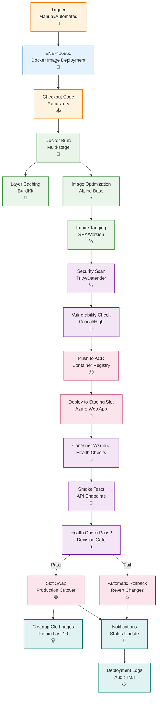

# Web Service Docker Image Deployment

## Metadata

- **Name**: Web Service Docker Image Deployment
- **Type**: Enabler
- **ID**: ENB-416850
- **Approval**: Approved
- **Capability ID**: CAP-416828
- **Owner**: DevOps Team
- **Status**: Ready for Implementation
- **Priority**: High
- **Analysis Review**: Not Required
- **Code Review**: Not Required

## Technical Overview
### Purpose
Implement automated Docker image build, push to Azure Container Registry (ACR), and deployment to Azure Web App with multi-stage builds, image scanning, version tagging, blue-green deployment support, and automated rollback capabilities.

## Functional Requirements

| ID | Name | Requirement | Priority | Status | Approval |
|----|------|-------------|----------|--------|----------|
| FR-416851 | Multi-Stage Build | Build Docker image using multi-stage Dockerfile for optimized size | Must Have | Ready for Implementation | Approved |
| FR-416852 | Image Tagging | Tag images with commit SHA, semantic version, and environment | Must Have | Ready for Implementation | Approved |
| FR-416853 | Container Registry | Push images to Azure Container Registry with authentication | Must Have | Ready for Implementation | Approved |
| FR-416854 | Image Scanning | Scan images for vulnerabilities using Azure Defender or Trivy | Must Have | Ready for Implementation | Approved |
| FR-416855 | Deployment Slots | Deploy to staging slot first, then swap to production | Must Have | Ready for Implementation | Approved |
| FR-416856 | Health Checks | Verify application health before slot swap | Must Have | Ready for Implementation | Approved |
| FR-416857 | Environment Variables | Inject environment-specific configuration via App Settings | Must Have | Ready for Implementation | Approved |
| FR-416858 | Rollback Mechanism | Automatically rollback on health check failure | Must Have | Ready for Implementation | Approved |
| FR-416859 | Image Retention | Maintain last 10 production images for rollback capability | Must Have | Ready for Implementation | Approved |
| FR-416860 | Deployment Logs | Capture and store deployment logs for troubleshooting | Must Have | Ready for Implementation | Approved |

## Non-Functional Requirements

| ID | Name | Type | Requirement | Priority | Status | Approval |
|----|------|------|-------------|----------|--------|----------|
| NFR-416861 | Build Time | Complete Docker build in under 3 minutes with layer caching | Must Have | Ready for Implementation | Approved |
| NFR-416862 | Image Size | Keep production image under 200MB using Alpine base | Must Have | Ready for Implementation | Approved |
| NFR-416863 | Deployment Time | Complete deployment and slot swap in under 5 minutes | Must Have | Ready for Implementation | Approved |
| NFR-416864 | Zero Downtime | Ensure zero downtime during deployment using slot swap | Must Have | Ready for Implementation | Approved |
| NFR-416865 | Security | No secrets in image, use managed identity for Azure resources | Must Have | Ready for Implementation | Approved |
| NFR-416866 | Reliability | Achieve 99% deployment success rate with automatic recovery | High | Ready for Implementation | Approved |

## Dependencies

### Internal Upstream Dependency

| Enabler ID | Description |
|------------|-------------|
| ENB-716518 | Azure Web App infrastructure must be provisioned |

### Internal Downstream Impact

| Enabler ID | Description |
|------------|-------------|
| | Web service deployment enables API availability |

### External Dependencies

**External Upstream Dependencies**: Azure Container Registry, Docker Hub (base images)

**External Downstream Impact**: API consumers (website, mobile apps, integrations)

## Technical Specifications

### Enabler Dependency Flow Diagram


### Configuration Examples

#### Multi-Stage Dockerfile
```dockerfile
# Build stage
FROM node:20-alpine AS builder

WORKDIR /app

# Copy package files
COPY package*.json ./

# Install dependencies (including devDependencies)
RUN npm ci

# Copy source code
COPY . .

# Build TypeScript
RUN npm run build

# Remove dev dependencies
RUN npm prune --production

# Production stage
FROM node:20-alpine AS production

# Install dumb-init for proper signal handling
RUN apk add --no-cache dumb-init

# Create non-root user
RUN addgroup -g 1001 -S nodejs && \
    adduser -S nodejs -u 1001

WORKDIR /app

# Copy package files
COPY package*.json ./

# Copy production dependencies from builder
COPY --from=builder /app/node_modules ./node_modules

# Copy built application
COPY --from=builder /app/dist ./dist

# Copy additional runtime files
COPY --from=builder /app/config ./config

# Set ownership
RUN chown -R nodejs:nodejs /app

# Switch to non-root user
USER nodejs

# Expose port
EXPOSE 3000

# Health check
HEALTHCHECK --interval=30s --timeout=3s --start-period=40s --retries=3 \
    CMD node -e "require('http').get('http://localhost:3000/health', (r) => {process.exit(r.statusCode === 200 ? 0 : 1)})"

# Use dumb-init to handle signals
ENTRYPOINT ["dumb-init", "--"]

# Start application
CMD ["node", "dist/index.js"]
```

#### GitHub Actions Workflow
```yaml
name: Deploy Web Service (Docker)

on:
  push:
    branches:
      - main
      - develop
    paths:
      - 'webservice/**'
  workflow_dispatch:
    inputs:
      environment:
        description: 'Target environment'
        required: true
        default: 'dev'
        type: choice
        options:
          - dev
          - staging
          - production

permissions:
  id-token: write
  contents: read
  security-events: write

env:
  ACR_NAME: leasesentry
  IMAGE_NAME: lease-sentry-api
  NODE_VERSION: '20.x'

jobs:
  build:
    name: Build Docker Image
    runs-on: ubuntu-latest
    outputs:
      image-tag: ${{ steps.meta.outputs.tags }}
      image-digest: ${{ steps.build.outputs.digest }}
    
    steps:
      - name: Checkout code
        uses: actions/checkout@v4
      
      - name: Set up Docker Buildx
        uses: docker/setup-buildx-action@v3
      
      - name: Azure Login (OIDC)
        uses: azure/login@v1
        with:
          client-id: ${{ secrets.AZURE_CLIENT_ID }}
          tenant-id: ${{ secrets.AZURE_TENANT_ID }}
          subscription-id: ${{ secrets.AZURE_SUBSCRIPTION_ID }}
      
      - name: Login to Azure Container Registry
        run: |
          az acr login --name ${{ env.ACR_NAME }}
      
      - name: Docker metadata
        id: meta
        uses: docker/metadata-action@v5
        with:
          images: ${{ env.ACR_NAME }}.azurecr.io/${{ env.IMAGE_NAME }}
          tags: |
            type=sha,prefix={{branch}}-
            type=semver,pattern={{version}}
            type=semver,pattern={{major}}.{{minor}}
            type=ref,event=branch
            type=raw,value=latest,enable={{is_default_branch}}
      
      - name: Build and push
        id: build
        uses: docker/build-push-action@v5
        with:
          context: ./webservice
          file: ./webservice/Dockerfile
          push: true
          tags: ${{ steps.meta.outputs.tags }}
          labels: ${{ steps.meta.outputs.labels }}
          cache-from: type=registry,ref=${{ env.ACR_NAME }}.azurecr.io/${{ env.IMAGE_NAME }}:buildcache
          cache-to: type=registry,ref=${{ env.ACR_NAME }}.azurecr.io/${{ env.IMAGE_NAME }}:buildcache,mode=max
          build-args: |
            NODE_ENV=production
            BUILD_DATE=${{ github.event.head_commit.timestamp }}
            GIT_SHA=${{ github.sha }}
      
      - name: Run Trivy vulnerability scanner
        uses: aquasecurity/trivy-action@master
        with:
          image-ref: ${{ env.ACR_NAME }}.azurecr.io/${{ env.IMAGE_NAME }}:${{ github.sha }}
          format: 'sarif'
          output: 'trivy-results.sarif'
          severity: 'CRITICAL,HIGH'
      
      - name: Upload Trivy results to GitHub Security
        uses: github/codeql-action/upload-sarif@v3
        with:
          sarif_file: 'trivy-results.sarif'
      
      - name: Check for critical vulnerabilities
        run: |
          CRITICAL=$(docker run --rm \
            -v /var/run/docker.sock:/var/run/docker.sock \
            aquasec/trivy image \
            --severity CRITICAL \
            --quiet \
            --format json \
            ${{ env.ACR_NAME }}.azurecr.io/${{ env.IMAGE_NAME }}:${{ github.sha }} | \
            jq '[.Results[].Vulnerabilities // [] | .[] | select(.Severity == "CRITICAL")] | length')
          
          if [ "$CRITICAL" -gt 0 ]; then
            echo "Found $CRITICAL critical vulnerabilities"
            exit 1
          fi

  deploy:
    name: Deploy to Azure Web App
    runs-on: ubuntu-latest
    needs: build
    environment: 
      name: ${{ inputs.environment || (github.ref == 'refs/heads/main' && 'production' || 'dev') }}
    
    steps:
      - name: Azure Login (OIDC)
        uses: azure/login@v1
        with:
          client-id: ${{ secrets.AZURE_CLIENT_ID }}
          tenant-id: ${{ secrets.AZURE_TENANT_ID }}
          subscription-id: ${{ secrets.AZURE_SUBSCRIPTION_ID }}
      
      - name: Set environment variables
        run: |
          ENV="${{ inputs.environment || (github.ref == 'refs/heads/main' && 'production' || 'dev') }}"
          echo "WEBAPP_NAME=lease-sentry-api-$ENV" >> $GITHUB_ENV
          echo "ENVIRONMENT=$ENV" >> $GITHUB_ENV
      
      - name: Deploy to staging slot
        uses: azure/webapps-deploy@v3
        with:
          app-name: ${{ env.WEBAPP_NAME }}
          slot-name: staging
          images: ${{ env.ACR_NAME }}.azurecr.io/${{ env.IMAGE_NAME }}:${{ github.sha }}
      
      - name: Wait for container warmup
        run: |
          echo "Waiting for container to warm up..."
          sleep 60
      
      - name: Run health checks
        id: health-check
        run: |
          STAGING_URL="https://${{ env.WEBAPP_NAME }}-staging.azurewebsites.net"
          MAX_ATTEMPTS=10
          ATTEMPT=0
          
          while [ $ATTEMPT -lt $MAX_ATTEMPTS ]; do
            RESPONSE=$(curl -s -o /dev/null -w "%{http_code}" "$STAGING_URL/health")
            
            if [ "$RESPONSE" -eq 200 ]; then
              echo "Health check passed"
              exit 0
            fi
            
            echo "Health check failed: HTTP $RESPONSE (attempt $((ATTEMPT+1))/$MAX_ATTEMPTS)"
            ATTEMPT=$((ATTEMPT+1))
            sleep 10
          done
          
          echo "Health check failed after $MAX_ATTEMPTS attempts"
          exit 1
      
      - name: Run smoke tests
        run: |
          STAGING_URL="https://${{ env.WEBAPP_NAME }}-staging.azurewebsites.net"
          
          # Test API endpoints
          curl -f "$STAGING_URL/api/version" || exit 1
          curl -f "$STAGING_URL/api/health" || exit 1
          
          echo "Smoke tests passed"
      
      - name: Swap to production
        if: success()
        run: |
          az webapp deployment slot swap \
            --name ${{ env.WEBAPP_NAME }} \
            --resource-group lease-sentry-rg \
            --slot staging \
            --target-slot production
      
      - name: Verify production health
        if: success()
        run: |
          PROD_URL="https://${{ env.WEBAPP_NAME }}.azurewebsites.net"
          sleep 30
          
          RESPONSE=$(curl -s -o /dev/null -w "%{http_code}" "$PROD_URL/health")
          
          if [ "$RESPONSE" -ne 200 ]; then
            echo "Production health check failed: HTTP $RESPONSE"
            exit 1
          fi
          
          echo "Production health check passed"
      
      - name: Rollback on failure
        if: failure()
        run: |
          echo "Deployment failed, rolling back..."
          az webapp deployment slot swap \
            --name ${{ env.WEBAPP_NAME }} \
            --resource-group lease-sentry-rg \
            --slot staging \
            --target-slot production
      
      - name: Cleanup old images
        if: success()
        run: |
          # Keep last 10 images
          az acr repository show-tags \
            --name ${{ env.ACR_NAME }} \
            --repository ${{ env.IMAGE_NAME }} \
            --orderby time_desc \
            --output tsv | \
          tail -n +11 | \
          xargs -I {} az acr repository delete \
            --name ${{ env.ACR_NAME }} \
            --image ${{ env.IMAGE_NAME }}:{} \
            --yes || true
      
      - name: Send notification
        if: always()
        uses: slackapi/slack-github-action@v1
        with:
          channel-id: 'deployments'
          payload: |
            {
              "text": "Web Service Deployment ${{ job.status }}",
              "blocks": [
                {
                  "type": "section",
                  "text": {
                    "type": "mrkdwn",
                    "text": "*Web Service Deployment ${{ job.status }}*\n*Environment:* ${{ env.ENVIRONMENT }}\n*Image:* ${{ env.ACR_NAME }}.azurecr.io/${{ env.IMAGE_NAME }}:${{ github.sha }}\n*Commit:* ${{ github.sha }}\n*Deployed by:* ${{ github.actor }}"
                  }
                }
              ]
            }
        env:
          SLACK_BOT_TOKEN: ${{ secrets.SLACK_BOT_TOKEN }}
```

#### .dockerignore
```
node_modules
npm-debug.log
dist
.git
.gitignore
.env
.env.local
.env.*.local
README.md
.vscode
.github
*.test.ts
*.spec.ts
coverage
.nyc_output
```
