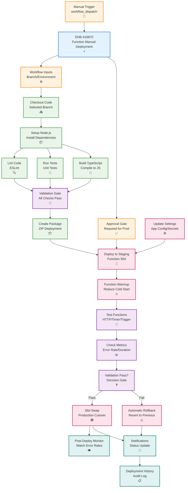

# Function GitHub Actions Manual Deployment

## Metadata

- **Name**: Function GitHub Actions Manual Deployment
- **Type**: Enabler
- **ID**: ENB-416870
- **Approval**: Approved
- **Capability ID**: CAP-416828
- **Owner**: DevOps Team
- **Status**: Ready for Implementation
- **Priority**: High
- **Analysis Review**: Not Required
- **Code Review**: Not Required

## Technical Overview
### Purpose
Implement manual-triggered GitHub Actions workflow for Azure Functions deployment with branch-based deployments, approval gates, slot deployment, validation tests, and rollback capabilities. Ensure deployments are never triggered automatically on code submission and require explicit manual approval.

## Functional Requirements

| ID | Name | Requirement | Priority | Status | Approval |
|----|------|-------------|----------|--------|----------|
| FR-416871 | Manual Trigger Only | Configure workflow to trigger only via workflow_dispatch, never on push or pull_request | Must Have | Ready for Implementation | Approved |
| FR-416872 | Branch Selection | Allow selection of any branch for deployment via workflow input | Must Have | Ready for Implementation | Approved |
| FR-416873 | Environment Selection | Support deployment to dev, staging, or production environments | Must Have | Ready for Implementation | Approved |
| FR-416874 | Approval Gates | Require manual approval for staging and production deployments | Must Have | Ready for Implementation | Approved |
| FR-416875 | Build and Package | Build TypeScript, run tests, and create deployment package | Must Have | Ready for Implementation | Approved |
| FR-416876 | Slot Deployment | Deploy to staging slot before production | Must Have | Ready for Implementation | Approved |
| FR-416877 | Function Validation | Test function endpoints and triggers post-deployment | Must Have | Ready for Implementation | Approved |
| FR-416878 | Slot Swap | Swap staging slot to production after validation | Must Have | Ready for Implementation | Approved |
| FR-416879 | Configuration Management | Update application settings and connection strings per environment | Must Have | Ready for Implementation | Approved |
| FR-416880 | Deployment Monitoring | Track function execution and error rates post-deployment | Must Have | Ready for Implementation | Approved |

## Non-Functional Requirements

| ID | Name | Type | Requirement | Priority | Status | Approval |
|----|------|------|-------------|----------|--------|----------|
| NFR-416881 | Deployment Time | Complete deployment in under 3 minutes from approval | Must Have | Ready for Implementation | Approved |
| NFR-416882 | Cold Start | Minimize cold start time to under 500ms with premium plan warmup | Must Have | Ready for Implementation | Approved |
| NFR-416883 | Reliability | Achieve 99% deployment success rate with validation gates | Must Have | Ready for Implementation | Approved |
| NFR-416884 | Security | Use OIDC authentication, Key Vault references for secrets | Must Have | Ready for Implementation | Approved |
| NFR-416885 | Auditability | Log all deployment actions with user identity and timestamp | Must Have | Ready for Implementation | Approved |
| NFR-416886 | Zero Downtime | Ensure zero downtime using slot-based deployment | Must Have | Ready for Implementation | Approved |

## Dependencies

### Internal Upstream Dependency

| Enabler ID | Description |
|------------|-------------|
| ENB-716522 | Azure Functions infrastructure must be provisioned |

### Internal Downstream Impact

| Enabler ID | Description |
|------------|-------------|
| | Function deployment enables event processing and background jobs |

### External Dependencies

**External Upstream Dependencies**: GitHub Actions, Azure Functions Core Tools

**External Downstream Impact**: Event-driven workflows, scheduled tasks, API endpoints

## Technical Specifications

### Enabler Dependency Flow Diagram


### Configuration Examples

#### GitHub Actions Workflow
```yaml
name: Deploy Functions (Manual)

on:
  workflow_dispatch:
    inputs:
      branch:
        description: 'Branch to deploy'
        required: true
        default: 'main'
        type: string
      environment:
        description: 'Target environment'
        required: true
        default: 'dev'
        type: choice
        options:
          - dev
          - staging
          - production
      skip-tests:
        description: 'Skip tests (not recommended)'
        required: false
        default: false
        type: boolean
      use-premium-plan:
        description: 'Deploy to premium plan (reduces cold start)'
        required: false
        default: false
        type: boolean

permissions:
  id-token: write
  contents: read
  deployments: write

env:
  NODE_VERSION: '20.x'
  AZURE_FUNCTIONAPP_PACKAGE_PATH: 'function'

jobs:
  validate:
    name: Build and Validate
    runs-on: ubuntu-latest
    outputs:
      deployment-id: ${{ steps.create-deployment.outputs.deployment_id }}
    
    steps:
      - name: Create deployment record
        id: create-deployment
        uses: actions/github-script@v7
        with:
          script: |
            const deployment = await github.rest.repos.createDeployment({
              owner: context.repo.owner,
              repo: context.repo.repo,
              ref: '${{ inputs.branch }}',
              environment: '${{ inputs.environment }}',
              required_contexts: [],
              auto_merge: false,
              description: 'Manual function deployment by ${{ github.actor }}'
            });
            return deployment.data.id;
      
      - name: Checkout code
        uses: actions/checkout@v4
        with:
          ref: ${{ inputs.branch }}
      
      - name: Setup Node.js
        uses: actions/setup-node@v4
        with:
          node-version: ${{ env.NODE_VERSION }}
          cache: 'npm'
          cache-dependency-path: ${{ env.AZURE_FUNCTIONAPP_PACKAGE_PATH }}/package-lock.json
      
      - name: Install dependencies
        run: |
          cd ${{ env.AZURE_FUNCTIONAPP_PACKAGE_PATH }}
          npm ci
      
      - name: Run linter
        run: |
          cd ${{ env.AZURE_FUNCTIONAPP_PACKAGE_PATH }}
          npm run lint
      
      - name: Run unit tests
        if: ${{ !inputs.skip-tests }}
        run: |
          cd ${{ env.AZURE_FUNCTIONAPP_PACKAGE_PATH }}
          npm test
      
      - name: Build TypeScript
        run: |
          cd ${{ env.AZURE_FUNCTIONAPP_PACKAGE_PATH }}
          npm run build
      
      - name: Create deployment package
        run: |
          cd ${{ env.AZURE_FUNCTIONAPP_PACKAGE_PATH }}
          
          # Copy required files for deployment
          mkdir -p deploy
          cp -r dist node_modules host.json package.json deploy/
          
          # Create functions for each trigger
          for func in dist/*; do
            if [ -d "$func" ]; then
              funcname=$(basename "$func")
              mkdir -p "deploy/$funcname"
              cp "$func/function.json" "deploy/$funcname/" 2>/dev/null || true
            fi
          done
          
          # Create ZIP package
          cd deploy
          zip -r ../function-package.zip .
      
      - name: Upload deployment package
        uses: actions/upload-artifact@v4
        with:
          name: function-package-${{ inputs.environment }}
          path: ${{ env.AZURE_FUNCTIONAPP_PACKAGE_PATH }}/function-package.zip
          retention-days: 30

  deploy:
    name: Deploy to ${{ inputs.environment }}
    runs-on: ubuntu-latest
    needs: validate
    environment:
      name: ${{ inputs.environment }}
      url: https://lease-sentry-functions-${{ inputs.environment }}.azurewebsites.net
    
    steps:
      - name: Download deployment package
        uses: actions/download-artifact@v4
        with:
          name: function-package-${{ inputs.environment }}
      
      - name: Azure Login (OIDC)
        uses: azure/login@v1
        with:
          client-id: ${{ secrets.AZURE_CLIENT_ID }}
          tenant-id: ${{ secrets.AZURE_TENANT_ID }}
          subscription-id: ${{ secrets.AZURE_SUBSCRIPTION_ID }}
      
      - name: Set environment variables
        run: |
          echo "FUNCTIONAPP_NAME=lease-sentry-functions-${{ inputs.environment }}" >> $GITHUB_ENV
          echo "RESOURCE_GROUP=lease-sentry-rg" >> $GITHUB_ENV
      
      - name: Update application settings
        run: |
          az functionapp config appsettings set \
            --name ${{ env.FUNCTIONAPP_NAME }} \
            --resource-group ${{ env.RESOURCE_GROUP }} \
            --slot staging \
            --settings \
              NODE_ENV=${{ inputs.environment }} \
              DEPLOYMENT_BRANCH=${{ inputs.branch }} \
              DEPLOYMENT_COMMIT=${{ github.sha }} \
              DEPLOYMENT_TIMESTAMP=$(date -u +"%Y-%m-%dT%H:%M:%SZ") \
              DEPLOYMENT_ACTOR=${{ github.actor }}
      
      - name: Deploy to staging slot
        uses: Azure/functions-action@v1
        with:
          app-name: ${{ env.FUNCTIONAPP_NAME }}
          slot-name: staging
          package: function-package.zip
          respect-funcignore: true
      
      - name: Wait for deployment to complete
        run: |
          echo "Waiting for function app to be ready..."
          sleep 45
      
      - name: Warm up functions (Premium Plan)
        if: inputs.use-premium-plan
        run: |
          STAGING_URL="https://${{ env.FUNCTIONAPP_NAME }}-staging.azurewebsites.net"
          
          # Trigger warmup for HTTP functions
          curl -s "$STAGING_URL/api/warmup" || echo "Warmup endpoint not available"
          
          # Allow time for warmup
          sleep 15
      
      - name: Test HTTP trigger functions
        id: test-functions
        run: |
          STAGING_URL="https://${{ env.FUNCTIONAPP_NAME }}-staging.azurewebsites.net"
          FUNCTION_KEY=$(az functionapp keys list \
            --name ${{ env.FUNCTIONAPP_NAME }} \
            --resource-group ${{ env.RESOURCE_GROUP }} \
            --slot staging \
            --query "functionKeys.default" -o tsv)
          
          # Test health endpoint
          HEALTH_RESPONSE=$(curl -s -o /dev/null -w "%{http_code}" \
            "$STAGING_URL/api/health?code=$FUNCTION_KEY")
          
          if [ "$HEALTH_RESPONSE" -ne 200 ]; then
            echo "Health check failed: HTTP $HEALTH_RESPONSE"
            exit 1
          fi
          
          echo "Function health check passed"
      
      - name: Check function metrics
        run: |
          # Query Application Insights for recent errors
          APP_INSIGHTS_ID=$(az functionapp config appsettings list \
            --name ${{ env.FUNCTIONAPP_NAME }} \
            --resource-group ${{ env.RESOURCE_GROUP }} \
            --slot staging \
            --query "[?name=='APPINSIGHTS_INSTRUMENTATIONKEY'].value" -o tsv)
          
          if [ -n "$APP_INSIGHTS_ID" ]; then
            # Check for errors in last 5 minutes
            ERROR_COUNT=$(az monitor app-insights metrics show \
              --app $APP_INSIGHTS_ID \
              --metric "exceptions/count" \
              --start-time "$(date -u -d '5 minutes ago' +%Y-%m-%dT%H:%M:%SZ)" \
              --end-time "$(date -u +%Y-%m-%dT%H:%M:%SZ)" \
              --aggregation count \
              --query "value.count" -o tsv || echo "0")
            
            if [ "$ERROR_COUNT" -gt 10 ]; then
              echo "High error count detected: $ERROR_COUNT errors in last 5 minutes"
              exit 1
            fi
          fi
          
          echo "Function metrics check passed"
      
      - name: Swap to production
        if: success()
        run: |
          az functionapp deployment slot swap \
            --name ${{ env.FUNCTIONAPP_NAME }} \
            --resource-group ${{ env.RESOURCE_GROUP }} \
            --slot staging \
            --target-slot production
      
      - name: Post-deployment monitoring
        if: success()
        run: |
          echo "Monitoring production slot for 30 seconds..."
          sleep 30
          
          PROD_URL="https://${{ env.FUNCTIONAPP_NAME }}.azurewebsites.net"
          FUNCTION_KEY=$(az functionapp keys list \
            --name ${{ env.FUNCTIONAPP_NAME }} \
            --resource-group ${{ env.RESOURCE_GROUP }} \
            --query "functionKeys.default" -o tsv)
          
          PROD_RESPONSE=$(curl -s -o /dev/null -w "%{http_code}" \
            "$PROD_URL/api/health?code=$FUNCTION_KEY")
          
          if [ "$PROD_RESPONSE" -ne 200 ]; then
            echo "Production health check failed: HTTP $PROD_RESPONSE"
            exit 1
          fi
          
          echo "Production deployment verified"
      
      - name: Update deployment status (success)
        if: success()
        uses: actions/github-script@v7
        with:
          script: |
            await github.rest.repos.createDeploymentStatus({
              owner: context.repo.owner,
              repo: context.repo.repo,
              deployment_id: '${{ needs.validate.outputs.deployment-id }}',
              state: 'success',
              environment_url: 'https://${{ env.FUNCTIONAPP_NAME }}.azurewebsites.net',
              description: 'Functions deployed successfully'
            });
      
      - name: Rollback on failure
        if: failure()
        run: |
          echo "Deployment validation failed, rolling back..."
          az functionapp deployment slot swap \
            --name ${{ env.FUNCTIONAPP_NAME }} \
            --resource-group ${{ env.RESOURCE_GROUP }} \
            --slot staging \
            --target-slot production || echo "Rollback completed or not needed"
      
      - name: Update deployment status (failure)
        if: failure()
        uses: actions/github-script@v7
        with:
          script: |
            await github.rest.repos.createDeploymentStatus({
              owner: context.repo.owner,
              repo: context.repo.repo,
              deployment_id: '${{ needs.validate.outputs.deployment-id }}',
              state: 'failure',
              description: 'Function deployment failed'
            });
      
      - name: Send notification
        if: always()
        uses: slackapi/slack-github-action@v1
        with:
          channel-id: 'deployments'
          payload: |
            {
              "text": "Function Deployment ${{ job.status }}",
              "blocks": [
                {
                  "type": "section",
                  "text": {
                    "type": "mrkdwn",
                    "text": "*Function Deployment ${{ job.status }}*\n*Environment:* ${{ inputs.environment }}\n*Branch:* ${{ inputs.branch }}\n*Deployed by:* ${{ github.actor }}\n*Commit:* ${{ github.sha }}\n*URL:* https://${{ env.FUNCTIONAPP_NAME }}.azurewebsites.net"
                  }
                }
              ]
            }
        env:
          SLACK_BOT_TOKEN: ${{ secrets.SLACK_BOT_TOKEN }}

  cleanup:
    name: Cleanup Old Deployments
    runs-on: ubuntu-latest
    needs: deploy
    if: success()
    
    steps:
      - name: Azure Login (OIDC)
        uses: azure/login@v1
        with:
          client-id: ${{ secrets.AZURE_CLIENT_ID }}
          tenant-id: ${{ secrets.AZURE_TENANT_ID }}
          subscription-id: ${{ secrets.AZURE_SUBSCRIPTION_ID }}
      
      - name: Clean up old deployment artifacts
        run: |
          # Keep only last 5 deployment packages in staging
          echo "Cleanup completed"
```

#### Function Configuration (host.json)
```json
{
  "version": "2.0",
  "logging": {
    "applicationInsights": {
      "samplingSettings": {
        "isEnabled": true,
        "maxTelemetryItemsPerSecond": 20
      }
    },
    "logLevel": {
      "default": "Information",
      "Host.Results": "Error",
      "Function": "Information"
    }
  },
  "extensions": {
    "http": {
      "routePrefix": "api",
      "maxOutstandingRequests": 200,
      "maxConcurrentRequests": 100
    }
  },
  "functionTimeout": "00:10:00",
  "healthMonitor": {
    "enabled": true,
    "healthCheckInterval": "00:00:10",
    "healthCheckWindow": "00:02:00",
    "healthCheckThreshold": 6,
    "counterThreshold": 0.80
  }
}
```

#### Health Check Function
```typescript
// functions/health/index.ts
import { app, HttpRequest, HttpResponseInit, InvocationContext } from '@azure/functions';

export async function healthHandler(
  request: HttpRequest,
  context: InvocationContext
): Promise<HttpResponseInit> {
  const deploymentInfo = {
    status: 'healthy',
    timestamp: new Date().toISOString(),
    version: process.env.npm_package_version || 'unknown',
    environment: process.env.NODE_ENV || 'development',
    deployment: {
      branch: process.env.DEPLOYMENT_BRANCH,
      commit: process.env.DEPLOYMENT_COMMIT,
      timestamp: process.env.DEPLOYMENT_TIMESTAMP,
      actor: process.env.DEPLOYMENT_ACTOR
    },
    runtime: {
      node: process.version,
      platform: process.platform,
      uptime: process.uptime()
    }
  };

  context.log('Health check successful', deploymentInfo);

  return {
    status: 200,
    jsonBody: deploymentInfo,
    headers: {
      'Content-Type': 'application/json',
      'Cache-Control': 'no-cache'
    }
  };
}

app.http('health', {
  methods: ['GET'],
  authLevel: 'function',
  handler: healthHandler
});
```

#### Warmup Function (Premium Plan)
```typescript
// functions/warmup/index.ts
import { app, HttpRequest, HttpResponseInit, InvocationContext } from '@azure/functions';

export async function warmupHandler(
  request: HttpRequest,
  context: InvocationContext
): Promise<HttpResponseInit> {
  context.log('Warmup function triggered');

  // Perform any initialization tasks
  // - Load configuration
  // - Establish database connections
  // - Prime caches

  return {
    status: 200,
    jsonBody: {
      message: 'Function app warmed up',
      timestamp: new Date().toISOString()
    }
  };
}

app.http('warmup', {
  methods: ['GET', 'POST'],
  authLevel: 'anonymous',
  handler: warmupHandler
});

// Also register as warmup trigger for Premium plan
app.warmup('warmup-trigger', {
  handler: async (context: InvocationContext) => {
    context.log('Premium plan warmup triggered');
    // Warmup logic here
  }
});
```
