# Azure Static Web App Deployment

## Metadata

- **Name**: Azure Static Web App Deployment
- **Type**: Enabler
- **ID**: ENB-716494
- **Approval**: Approved
- **Capability ID**: CAP-716493
- **Owner**: DevOps Team
- **Status**: Ready for Implementation
- **Priority**: High
- **Analysis Review**: Not Required
- **Code Review**: Not Required

## Technical Overview
### Purpose
Deploy and configure Azure Static Web Apps for the website component with custom domains, SSL certificates, routing rules, and environment-specific configurations. Support CI/CD integration, preview environments, and global CDN distribution for optimal performance.

## Functional Requirements

| ID | Name | Requirement | Priority | Status | Approval |
|----|------|-------------|----------|--------|----------|
| FR-716495 | Infrastructure as Code | Deploy Static Web App using Bicep, ARM templates, or Terraform | Must Have | Ready for Implementation | Approved |
| FR-716496 | GitHub Integration | Connect to GitHub repository for automatic builds and deployments | Must Have | Ready for Implementation | Approved |
| FR-716497 | Environment Configuration | Support multiple environments (dev, staging, production) with separate instances | Must Have | Ready for Implementation | Approved |
| FR-716498 | Custom Domain | Configure custom domains with automatic SSL certificate provisioning | Must Have | Ready for Implementation | Approved |
| FR-716499 | Routing Rules | Define routing rules for SPA fallback, redirects, and API proxy | Must Have | Ready for Implementation | Approved |
| FR-716500 | Build Configuration | Configure build settings for React/Vue/Angular frameworks with optimization | Must Have | Ready for Implementation | Approved |
| FR-716501 | Preview Environments | Automatically create preview environments for pull requests | Medium | Ready for Implementation | Approved |
| FR-716502 | Authentication Integration | Integrate with Azure AD, GitHub, or custom authentication providers | Must Have | Ready for Implementation | Approved |
| FR-716503 | CDN Configuration | Configure global CDN with cache policies and compression | Must Have | Ready for Implementation | Approved |
| FR-716504 | Environment Variables | Manage environment-specific configuration and API endpoints | Must Have | Ready for Implementation | Approved |

## Non-Functional Requirements

| ID | Name | Type | Requirement | Priority | Status | Approval |
|----|------|------|-------------|----------|--------|----------|
| NFR-716505 | Deployment Time | Complete deployment in under 5 minutes for code changes | Must Have | Ready for Implementation | Approved |
| NFR-716506 | Global Performance | Serve static assets with <100ms latency from CDN edge locations | Must Have | Ready for Implementation | Approved |
| NFR-716507 | Availability | Guarantee 99.95% uptime with automatic failover | Must Have | Ready for Implementation | Approved |
| NFR-716508 | Security | Enforce HTTPS, HSTS, and CSP headers for all requests | Must Have | Ready for Implementation | Approved |
| NFR-716509 | Cost Efficiency | Use free tier for dev/staging, standard tier for production | Medium | Ready for Implementation | Approved |
| NFR-716510 | Build Performance | Optimize build time to under 3 minutes with caching | High | Ready for Implementation | Approved |

## Dependencies

### Internal Upstream Dependency

| Enabler ID | Description |
|------------|-------------|
| | |

### Internal Downstream Impact

| Enabler ID | Description |
|------------|-------------|
| ENB-716518 | Web Service deployment provides API endpoints for Static Web App |
| ENB-716538 | Easy Auth provides authentication for Static Web App |

### External Dependencies

**External Upstream Dependencies**: GitHub Actions, Azure DevOps, Node.js build tools

**External Downstream Impact**: End users accessing the web application

## Technical Specifications

### Enabler Dependency Flow Diagram

```mermaid
flowchart TD
    ENB_716494["ENB-716494<br/>Static Web App Deployment<br/>🌐"]
    
    REPO["Source Code<br/>GitHub Repository<br/>📦"]
    CICD["CI/CD Pipeline<br/>GitHub Actions<br/>⚙️"]
    
    REPO --> CICD
    CICD --> ENB_716494
    
    BUILD["Build Process<br/>npm/webpack<br/>🔨"]
    OPTIMIZE["Asset Optimization<br/>Minify/Compress<br/>⚡"]
    
    ENB_716494 --> BUILD
    BUILD --> OPTIMIZE
    
    SWA["Static Web App<br/>Azure Resource<br/>☁️"]
    CDN["Global CDN<br/>Edge Locations<br/>🌍"]
    
    OPTIMIZE --> SWA
    SWA --> CDN
    
    DOMAIN["Custom Domain<br/>SSL Certificate<br/>🔒"]
    ROUTES["Routing Rules<br/>SPA Fallback<br/>🔀"]
    AUTH["Authentication<br/>Easy Auth<br/>🔐"]
    
    SWA --> DOMAIN
    SWA --> ROUTES
    SWA --> AUTH
    
    PREVIEW["Preview Environments<br/>Pull Request Staging<br/>👁️"]
    CONFIG["Environment Variables<br/>API Endpoints<br/>⚙️"]
    
    ENB_716494 --> PREVIEW
    ENB_716494 --> CONFIG
    
    MONITORING["Application Insights<br/>Performance Metrics<br/>📊"]
    SWA --> MONITORING

    classDef enabler fill:#e3f2fd,stroke:#1976d2,stroke-width:2px
    classDef source fill:#f3e5f5,stroke:#7b1fa2,stroke-width:2px
    classDef build fill:#fff3e0,stroke:#f57c00,stroke-width:2px
    classDef azure fill:#e8f5e8,stroke:#388e3c,stroke-width:2px
    
    class ENB_716494 enabler
    class REPO,CICD source
    class BUILD,OPTIMIZE,PREVIEW,CONFIG build
    class SWA,CDN,DOMAIN,ROUTES,AUTH,MONITORING azure
```


### API Technical Specifications

| API Type | Operation | Channel / Endpoint | Description | Request / Publish Payload | Response / Subscribe Data |
|----------|-----------|---------------------|-------------|----------------------------|----------------------------|
| CLI | Command | az staticwebapp create | Create Static Web App | Resource config | Resource details |
| CLI | Command | swa deploy | Deploy static assets | Build artifacts | Deployment status |
| IaC | Template | Bicep/ARM | Declarative resource definition | Template file | Deployment result |
| API | REST | Management API | Manage SWA configuration | Configuration JSON | Updated config |

### Data Models


### Configuration Examples

#### Bicep Deployment Template
```bicep
param name string
param location string = resourceGroup().location
param repositoryUrl string
param branch string
param sku string = 'Standard'

resource staticWebApp 'Microsoft.Web/staticSites@2023-01-01' = {
  name: name
  location: location
  sku: {
    name: sku
    tier: sku
  }
  properties: {
    repositoryUrl: repositoryUrl
    branch: branch
    buildProperties: {
      appLocation: '/'
      apiLocation: 'api'
      outputLocation: 'dist'
    }
    provider: 'GitHub'
  }
}

// Custom domain
resource customDomain 'Microsoft.Web/staticSites/customDomains@2023-01-01' = {
  parent: staticWebApp
  name: 'www.lease-sentry.com'
  properties: {}
}

output staticWebAppUrl string = staticWebApp.properties.defaultHostname
output staticWebAppId string = staticWebApp.id
```

#### staticwebapp.config.json
```json
{
  "routes": [
    {
      "route": "/api/*",
      "allowedRoles": ["authenticated"]
    },
    {
      "route": "/admin/*",
      "allowedRoles": ["admin"]
    },
    {
      "route": "/*",
      "rewrite": "/index.html"
    }
  ],
  "navigationFallback": {
    "rewrite": "/index.html",
    "exclude": ["/images/*.{png,jpg,gif}", "/css/*"]
  },
  "responseOverrides": {
    "404": {
      "rewrite": "/index.html",
      "statusCode": 200
    }
  },
  "globalHeaders": {
    "content-security-policy": "default-src 'self' https:; script-src 'self' 'unsafe-inline' 'unsafe-eval'; style-src 'self' 'unsafe-inline';",
    "X-Content-Type-Options": "nosniff",
    "X-Frame-Options": "DENY",
    "Referrer-Policy": "strict-origin-when-cross-origin"
  },
  "mimeTypes": {
    ".json": "application/json",
    ".webmanifest": "application/manifest+json"
  }
}
```

#### GitHub Actions Workflow
```yaml
name: Azure Static Web Apps CI/CD

on:
  push:
    branches:
      - main
  pull_request:
    types: [opened, synchronize, reopened, closed]
    branches:
      - main

jobs:
  build_and_deploy_job:
    if: github.event_name == 'push' || (github.event_name == 'pull_request' && github.event.action != 'closed')
    runs-on: ubuntu-latest
    name: Build and Deploy Job
    steps:
      - uses: actions/checkout@v3
        with:
          submodules: true
      
      - name: Build And Deploy
        id: builddeploy
        uses: Azure/static-web-apps-deploy@v1
        with:
          azure_static_web_apps_api_token: ${{ secrets.AZURE_STATIC_WEB_APPS_API_TOKEN }}
          repo_token: ${{ secrets.GITHUB_TOKEN }}
          action: "upload"
          app_location: "/website"
          api_location: ""
          output_location: "dist"
          
  close_pull_request_job:
    if: github.event_name == 'pull_request' && github.event.action == 'closed'
    runs-on: ubuntu-latest
    name: Close Pull Request Job
    steps:
      - name: Close Pull Request
        id: closepullrequest
        uses: Azure/static-web-apps-deploy@v1
        with:
          azure_static_web_apps_api_token: ${{ secrets.AZURE_STATIC_WEB_APPS_API_TOKEN }}
          action: "close"
```
