# Azure Web App Deployment

## Metadata

- **Name**: Azure Web App Deployment
- **Type**: Enabler
- **ID**: ENB-716518
- **Approval**: Approved
- **Capability ID**: CAP-716493
- **Owner**: DevOps Team
- **Status**: Ready for Implementation
- **Priority**: High
- **Analysis Review**: Not Required
- **Code Review**: Not Required

## Technical Overview
### Purpose
Deploy and configure Azure App Service Web Apps for the Node.js/Express webservice component with auto-scaling, deployment slots, continuous deployment, and environment-specific configurations. Support container-based deployment, health monitoring, and zero-downtime deployments.

## Functional Requirements

| ID | Name | Requirement | Priority | Status | Approval |
|----|------|-------------|----------|--------|----------|
| FR-716519 | Infrastructure as Code | Deploy Web App using Bicep, ARM templates, or Terraform | Must Have | Ready for Implementation | Approved |
| FR-716520 | App Service Plan | Configure App Service Plan with appropriate SKU for each environment | Must Have | Ready for Implementation | Approved |
| FR-716521 | Runtime Configuration | Configure Node.js runtime version and environment variables | Must Have | Ready for Implementation | Approved |
| FR-716522 | Deployment Slots | Create staging and production slots with slot swap capability | Must Have | Ready for Implementation | Approved |
| FR-716523 | Container Deployment | Support Docker container deployment for consistent environments | Must Have | Ready for Implementation | Approved |
| FR-716524 | Continuous Deployment | Integrate with GitHub Actions or Azure DevOps for CI/CD | Must Have | Ready for Implementation | Approved |
| FR-716525 | Auto-Scaling | Configure auto-scale rules based on CPU, memory, and HTTP queue metrics | Must Have | Ready for Implementation | Approved |
| FR-716526 | Connection Strings | Manage database and service connection strings securely | Must Have | Ready for Implementation | Approved |
| FR-716527 | Custom Domain | Configure custom domains with SSL certificates | Must Have | Ready for Implementation | Approved |
| FR-716528 | Health Probes | Configure health check endpoints for auto-healing and load balancing | Must Have | Ready for Implementation | Approved |

## Non-Functional Requirements

| ID | Name | Type | Requirement | Priority | Status | Approval |
|----|------|------|-------------|----------|--------|----------|
| NFR-716529 | Deployment Time | Complete slot swap deployment in under 2 minutes | Must Have | Ready for Implementation | Approved |
| NFR-716530 | Availability | Guarantee 99.95% uptime with multi-instance deployment | Must Have | Ready for Implementation | Approved |
| NFR-716531 | Performance | Support 1,000 concurrent requests with <500ms average response time | Must Have | Ready for Implementation | Approved |
| NFR-716532 | Scalability | Auto-scale from 2 to 10 instances based on load | Must Have | Ready for Implementation | Approved |
| NFR-716533 | Security | Enforce HTTPS, managed identity for Azure services, no hard-coded secrets | Must Have | Ready for Implementation | Approved |
| NFR-716534 | Rollback Capability | Support instant rollback via slot swap within 30 seconds | Must Have | Ready for Implementation | Approved |

## Dependencies

### Internal Upstream Dependency

| Enabler ID | Description |
|------------|-------------|
| | |

### Internal Downstream Impact

| Enabler ID | Description |
|------------|-------------|
| ENB-716526 | Cosmos DB deployment provides connection strings |
| ENB-716530 | Blob Storage deployment provides storage connection |
| ENB-716534 | AI Search deployment provides search endpoint |
| ENB-716542 | Event Grid deployment provides event grid endpoint |
| ENB-716538 | Easy Auth provides authentication |

### External Dependencies

**External Upstream Dependencies**: GitHub Actions, Docker Hub, Azure Container Registry

**External Downstream Impact**: API consumers (Static Web App, mobile apps, third-party integrations)

## Technical Specifications

### Enabler Dependency Flow Diagram

```mermaid
flowchart TD
    ENB_716518["ENB-716518<br/>Web App Deployment<br/>⚙️"]
    
    REPO["Source Code<br/>GitHub Repository<br/>📦"]
    CICD["CI/CD Pipeline<br/>GitHub Actions<br/>🔧"]
    
    REPO --> CICD
    CICD --> ENB_716518
    
    BUILD["Build Docker Image<br/>Multi-stage Build<br/>🐳"]
    REGISTRY["Container Registry<br/>ACR<br/>📦"]
    
    ENB_716518 --> BUILD
    BUILD --> REGISTRY
    
    APPPLAN["App Service Plan<br/>Linux Plan<br/>☁️"]
    WEBAPP["Web App<br/>Node.js Container<br/>⚡"]
    
    REGISTRY --> WEBAPP
    APPPLAN --> WEBAPP
    
    SLOTS["Deployment Slots<br/>Staging/Production<br/>🔄"]
    AUTOSCALE["Auto-Scaling<br/>2-10 Instances<br/>📈"]
    
    WEBAPP --> SLOTS
    WEBAPP --> AUTOSCALE
    
    DOMAIN["Custom Domain<br/>SSL Certificate<br/>🔒"]
    HEALTH["Health Probes<br/>Auto-Healing<br/>💚"]
    IDENTITY["Managed Identity<br/>Azure AD<br/>🔐"]
    
    WEBAPP --> DOMAIN
    WEBAPP --> HEALTH
    WEBAPP --> IDENTITY
    
    CONFIG["App Settings<br/>Connection Strings<br/>⚙️"]
    MONITORING["Application Insights<br/>Performance Metrics<br/>📊"]
    
    ENB_716518 --> CONFIG
    WEBAPP --> MONITORING

    classDef enabler fill:#e3f2fd,stroke:#1976d2,stroke-width:2px
    classDef source fill:#f3e5f5,stroke:#7b1fa2,stroke-width:2px
    classDef build fill:#fff3e0,stroke:#f57c00,stroke-width:2px
    classDef azure fill:#e8f5e8,stroke:#388e3c,stroke-width:2px
    
    class ENB_716518 enabler
    class REPO,CICD source
    class BUILD,REGISTRY build
    class APPPLAN,WEBAPP,SLOTS,AUTOSCALE,DOMAIN,HEALTH,IDENTITY,CONFIG,MONITORING azure
```


### Configuration Examples

#### Bicep Deployment Template
```bicep
param webAppName string
param location string = resourceGroup().location
param linuxFxVersion string = 'NODE|20-lts'
param sku string = 'P1v3'

// App Service Plan
resource appServicePlan 'Microsoft.Web/serverfarms@2023-01-01' = {
  name: '${webAppName}-plan'
  location: location
  sku: {
    name: sku
    tier: 'PremiumV3'
    capacity: 2
  }
  kind: 'linux'
  properties: {
    reserved: true
  }
}

// Web App
resource webApp 'Microsoft.Web/sites@2023-01-01' = {
  name: webAppName
  location: location
  identity: {
    type: 'SystemAssigned'
  }
  properties: {
    serverFarmId: appServicePlan.id
    httpsOnly: true
    siteConfig: {
      linuxFxVersion: linuxFxVersion
      alwaysOn: true
      minTlsVersion: '1.2'
      ftpsState: 'Disabled'
      healthCheckPath: '/health'
      appSettings: [
        {
          name: 'WEBSITES_ENABLE_APP_SERVICE_STORAGE'
          value: 'false'
        }
        {
          name: 'NODE_ENV'
          value: 'production'
        }
      ]
    }
  }
}

// Staging Slot
resource stagingSlot 'Microsoft.Web/sites/slots@2023-01-01' = {
  parent: webApp
  name: 'staging'
  location: location
  properties: {
    serverFarmId: appServicePlan.id
    siteConfig: {
      linuxFxVersion: linuxFxVersion
    }
  }
}

// Auto-scale settings
resource autoScaleSettings 'Microsoft.Insights/autoscalesettings@2022-10-01' = {
  name: '${webAppName}-autoscale'
  location: location
  properties: {
    profiles: [
      {
        name: 'Auto scale condition'
        capacity: {
          minimum: '2'
          maximum: '10'
          default: '2'
        }
        rules: [
          {
            metricTrigger: {
              metricName: 'CpuPercentage'
              metricResourceId: appServicePlan.id
              timeGrain: 'PT1M'
              statistic: 'Average'
              timeWindow: 'PT5M'
              timeAggregation: 'Average'
              operator: 'GreaterThan'
              threshold: 70
            }
            scaleAction: {
              direction: 'Increase'
              type: 'ChangeCount'
              value: '1'
              cooldown: 'PT5M'
            }
          }
          {
            metricTrigger: {
              metricName: 'CpuPercentage'
              metricResourceId: appServicePlan.id
              timeGrain: 'PT1M'
              statistic: 'Average'
              timeWindow: 'PT5M'
              timeAggregation: 'Average'
              operator: 'LessThan'
              threshold: 30
            }
            scaleAction: {
              direction: 'Decrease'
              type: 'ChangeCount'
              value: '1'
              cooldown: 'PT5M'
            }
          }
        ]
      }
    ]
    targetResourceId: appServicePlan.id
    enabled: true
  }
}

output webAppUrl string = 'https://${webApp.properties.defaultHostName}'
output webAppId string = webApp.id
output principalId string = webApp.identity.principalId
```

#### GitHub Actions Workflow
```yaml
name: Deploy Web Service

on:
  push:
    branches:
      - main
    paths:
      - 'webservice/**'

env:
  AZURE_WEBAPP_NAME: lease-sentry-api
  NODE_VERSION: '20.x'

jobs:
  build-and-deploy:
    runs-on: ubuntu-latest
    steps:
      - uses: actions/checkout@v3
      
      - name: Set up Node.js
        uses: actions/setup-node@v3
        with:
          node-version: ${{ env.NODE_VERSION }}
          cache: 'npm'
          cache-dependency-path: webservice/package-lock.json
      
      - name: Install dependencies
        run: |
          cd webservice
          npm ci --production
      
      - name: Run tests
        run: |
          cd webservice
          npm test
      
      - name: Build Docker image
        run: |
          cd webservice
          docker build -t ${{ secrets.ACR_LOGIN_SERVER }}/lease-sentry-api:${{ github.sha }} .
      
      - name: Log in to Azure Container Registry
        uses: azure/docker-login@v1
        with:
          login-server: ${{ secrets.ACR_LOGIN_SERVER }}
          username: ${{ secrets.ACR_USERNAME }}
          password: ${{ secrets.ACR_PASSWORD }}
      
      - name: Push image to ACR
        run: docker push ${{ secrets.ACR_LOGIN_SERVER }}/lease-sentry-api:${{ github.sha }}
      
      - name: Azure Login
        uses: azure/login@v1
        with:
          creds: ${{ secrets.AZURE_CREDENTIALS }}
      
      - name: Deploy to staging slot
        uses: azure/webapps-deploy@v2
        with:
          app-name: ${{ env.AZURE_WEBAPP_NAME }}
          slot-name: staging
          images: ${{ secrets.ACR_LOGIN_SERVER }}/lease-sentry-api:${{ github.sha }}
      
      - name: Run smoke tests on staging
        run: |
          curl -f https://${{ env.AZURE_WEBAPP_NAME }}-staging.azurewebsites.net/health || exit 1
      
      - name: Swap staging to production
        run: |
          az webapp deployment slot swap \
            --name ${{ env.AZURE_WEBAPP_NAME }} \
            --resource-group lease-sentry-rg \
            --slot staging \
            --target-slot production
```
