# Azure Functions Deployment

## Metadata

- **Name**: Azure Functions Deployment
- **Type**: Enabler
- **ID**: ENB-716522
- **Approval**: Approved
- **Capability ID**: CAP-716493
- **Owner**: DevOps Team
- **Status**: Ready for Implementation
- **Priority**: High
- **Analysis Review**: Not Required
- **Code Review**: Not Required

## Technical Overview
### Purpose
Deploy and configure Azure Functions for the serverless function component with consumption or premium plans, deployment slots, CI/CD integration, and environment-specific configurations. Support event-driven architectures with triggers from Event Grid, Blob Storage, HTTP, and Timer.

## Functional Requirements

| ID | Name | Requirement | Priority | Status | Approval |
|----|------|-------------|----------|--------|----------|
| FR-716523 | Infrastructure as Code | Deploy Function App using Bicep, ARM templates, or Terraform | Must Have | Ready for Implementation | Approved |
| FR-716524 | Hosting Plan | Configure Consumption Plan for dev/staging, Premium Plan for production | Must Have | Ready for Implementation | Approved |
| FR-716525 | Runtime Configuration | Configure Node.js 20 runtime with required extensions | Must Have | Ready for Implementation | Approved |
| FR-716526 | Storage Account | Provision dedicated storage account for function metadata and state | Must Have | Ready for Implementation | Approved |
| FR-716527 | Deployment Slots | Create staging slot for testing before production deployment | Must Have | Ready for Implementation | Approved |
| FR-716528 | Continuous Deployment | Integrate with GitHub Actions for automated deployments | Must Have | Ready for Implementation | Approved |
| FR-716529 | Trigger Configuration | Configure HTTP, Event Grid, Blob, Timer, and Cosmos DB triggers | Must Have | Ready for Implementation | Approved |
| FR-716530 | Application Settings | Manage environment variables and connection strings securely | Must Have | Ready for Implementation | Approved |
| FR-716531 | VNet Integration | Enable VNet integration for secure access to Azure resources | Medium | Ready for Implementation | Approved |
| FR-716532 | Custom Domain | Configure custom domain with SSL for HTTP triggers | Medium | Ready for Implementation | Approved |

## Non-Functional Requirements

| ID | Name | Type | Requirement | Priority | Status | Approval |
|----|------|------|-------------|----------|--------|----------|
| NFR-716533 | Cold Start Time | Minimize cold start to <500ms with Premium Plan for production | Must Have | Ready for Implementation | Approved |
| NFR-716534 | Execution Time | Support function execution up to 10 minutes for long-running operations | Must Have | Ready for Implementation | Approved |
| NFR-716535 | Scalability | Auto-scale to handle 1,000 concurrent executions in Consumption Plan | Must Have | Ready for Implementation | Approved |
| NFR-716536 | Availability | Guarantee 99.95% availability with zone redundancy in Premium Plan | Must Have | Ready for Implementation | Approved |
| NFR-716537 | Security | Use managed identity, Key Vault references, no hard-coded secrets | Must Have | Ready for Implementation | Approved |
| NFR-716538 | Cost Optimization | Optimize function execution time and memory allocation for cost efficiency | High | Ready for Implementation | Approved |

## Dependencies

### Internal Upstream Dependency

| Enabler ID | Description |
|------------|-------------|
| | |

### Internal Downstream Impact

| Enabler ID | Description |
|------------|-------------|
| ENB-716526 | Cosmos DB provides database triggers and bindings |
| ENB-716530 | Blob Storage provides blob triggers and bindings |
| ENB-716534 | AI Search provides search integration |
| ENB-716542 | Event Grid provides event triggers |

### External Dependencies

**External Upstream Dependencies**: GitHub Actions, Azure Storage, Application Insights

**External Downstream Impact**: Event processing, background jobs, scheduled tasks

## Technical Specifications

### Enabler Dependency Flow Diagram

```mermaid
flowchart TD
    ENB_716522["ENB-716522<br/>Functions Deployment<br/>⚡"]
    
    REPO["Source Code<br/>GitHub Repository<br/>📦"]
    CICD["CI/CD Pipeline<br/>GitHub Actions<br/>🔧"]
    
    REPO --> CICD
    CICD --> ENB_716522
    
    BUILD["Build Functions<br/>npm build<br/>🔨"]
    PACKAGE["Package Deployment<br/>ZIP Deploy<br/>📦"]
    
    ENB_716522 --> BUILD
    BUILD --> PACKAGE
    
    STORAGE["Storage Account<br/>Function Metadata<br/>💾"]
    PLAN["Hosting Plan<br/>Consumption/Premium<br/>☁️"]
    
    STORAGE --> PLAN
    
    FUNCAPP["Function App<br/>Node.js 20<br/>⚡"]
    
    PLAN --> FUNCAPP
    PACKAGE --> FUNCAPP
    
    HTTP["HTTP Triggers<br/>REST APIs<br/>🌐"]
    EVENT["Event Grid Triggers<br/>Event Processing<br/>📬"]
    BLOB["Blob Triggers<br/>File Processing<br/>📁"]
    TIMER["Timer Triggers<br/>Scheduled Jobs<br/>⏰"]
    COSMOS["Cosmos DB Triggers<br/>Change Feed<br/>📊"]
    
    FUNCAPP --> HTTP
    FUNCAPP --> EVENT
    FUNCAPP --> BLOB
    FUNCAPP --> TIMER
    FUNCAPP --> COSMOS
    
    SLOTS["Deployment Slots<br/>Staging/Production<br/>🔄"]
    VNET["VNet Integration<br/>Private Network<br/>🔒"]
    IDENTITY["Managed Identity<br/>Azure AD<br/>🔐"]
    
    FUNCAPP --> SLOTS
    FUNCAPP --> VNET
    FUNCAPP --> IDENTITY
    
    CONFIG["Application Settings<br/>Environment Variables<br/>⚙️"]
    MONITORING["Application Insights<br/>Performance Metrics<br/>📊"]
    
    ENB_716522 --> CONFIG
    FUNCAPP --> MONITORING

    classDef enabler fill:#e3f2fd,stroke:#1976d2,stroke-width:2px
    classDef source fill:#f3e5f5,stroke:#7b1fa2,stroke-width:2px
    classDef build fill:#fff3e0,stroke:#f57c00,stroke-width:2px
    classDef azure fill:#e8f5e8,stroke:#388e3c,stroke-width:2px
    classDef triggers fill:#fce4ec,stroke:#c2185b,stroke-width:2px
    
    class ENB_716522 enabler
    class REPO,CICD source
    class BUILD,PACKAGE build
    class STORAGE,PLAN,FUNCAPP,SLOTS,VNET,IDENTITY,CONFIG,MONITORING azure
    class HTTP,EVENT,BLOB,TIMER,COSMOS triggers
```


### Configuration Examples

#### Bicep Deployment Template
```bicep
param functionAppName string
param location string = resourceGroup().location
param environment string = 'prod'
param hostingPlan string = (environment == 'prod') ? 'Premium' : 'Consumption'

// Storage Account for Function App
resource storageAccount 'Microsoft.Storage/storageAccounts@2023-01-01' = {
  name: '${replace(functionAppName, '-', '')}sa'
  location: location
  sku: {
    name: 'Standard_LRS'
  }
  kind: 'StorageV2'
  properties: {
    supportsHttpsTrafficOnly: true
    minimumTlsVersion: 'TLS1_2'
  }
}

// App Service Plan (Premium or Consumption)
resource hostingPlanResource 'Microsoft.Web/serverfarms@2023-01-01' = {
  name: '${functionAppName}-plan'
  location: location
  sku: hostingPlan == 'Premium' ? {
    name: 'EP1'
    tier: 'ElasticPremium'
    family: 'EP'
    capacity: 1
  } : {
    name: 'Y1'
    tier: 'Dynamic'
  }
  kind: 'linux'
  properties: {
    reserved: true
    maximumElasticWorkerCount: hostingPlan == 'Premium' ? 20 : null
  }
}

// Application Insights
resource appInsights 'Microsoft.Insights/components@2020-02-02' = {
  name: '${functionAppName}-insights'
  location: location
  kind: 'web'
  properties: {
    Application_Type: 'web'
    Request_Source: 'rest'
  }
}

// Function App
resource functionApp 'Microsoft.Web/sites@2023-01-01' = {
  name: functionAppName
  location: location
  kind: 'functionapp,linux'
  identity: {
    type: 'SystemAssigned'
  }
  properties: {
    serverFarmId: hostingPlanResource.id
    httpsOnly: true
    siteConfig: {
      linuxFxVersion: 'NODE|20'
      appSettings: [
        {
          name: 'AzureWebJobsStorage'
          value: 'DefaultEndpointsProtocol=https;AccountName=${storageAccount.name};EndpointSuffix=${az.environment().suffixes.storage};AccountKey=${storageAccount.listKeys().keys[0].value}'
        }
        {
          name: 'WEBSITE_CONTENTAZUREFILECONNECTIONSTRING'
          value: 'DefaultEndpointsProtocol=https;AccountName=${storageAccount.name};EndpointSuffix=${az.environment().suffixes.storage};AccountKey=${storageAccount.listKeys().keys[0].value}'
        }
        {
          name: 'WEBSITE_CONTENTSHARE'
          value: toLower(functionAppName)
        }
        {
          name: 'FUNCTIONS_EXTENSION_VERSION'
          value: '~4'
        }
        {
          name: 'FUNCTIONS_WORKER_RUNTIME'
          value: 'node'
        }
        {
          name: 'WEBSITE_NODE_DEFAULT_VERSION'
          value: '~20'
        }
        {
          name: 'APPINSIGHTS_INSTRUMENTATIONKEY'
          value: appInsights.properties.InstrumentationKey
        }
        {
          name: 'APPLICATIONINSIGHTS_CONNECTION_STRING'
          value: appInsights.properties.ConnectionString
        }
        {
          name: 'NODE_ENV'
          value: environment
        }
      ]
      ftpsState: 'Disabled'
      minTlsVersion: '1.2'
    }
  }
}

// Staging Slot (for Premium plan only)
resource stagingSlot 'Microsoft.Web/sites/slots@2023-01-01' = if (hostingPlan == 'Premium') {
  parent: functionApp
  name: 'staging'
  location: location
  kind: 'functionapp,linux'
  properties: {
    serverFarmId: hostingPlanResource.id
    siteConfig: {
      linuxFxVersion: 'NODE|20'
    }
  }
}

output functionAppUrl string = 'https://${functionApp.properties.defaultHostName}'
output functionAppId string = functionApp.id
output principalId string = functionApp.identity.principalId
```

#### host.json Configuration
```json
{
  "version": "2.0",
  "logging": {
    "applicationInsights": {
      "samplingSettings": {
        "isEnabled": true,
        "maxTelemetryItemsPerSecond": 20,
        "excludedTypes": "Request"
      }
    },
    "logLevel": {
      "default": "Information",
      "Host.Results": "Error",
      "Function": "Information",
      "Host.Aggregator": "Trace"
    }
  },
  "extensions": {
    "http": {
      "routePrefix": "api",
      "maxOutstandingRequests": 200,
      "maxConcurrentRequests": 100,
      "dynamicThrottlesEnabled": true
    },
    "eventGrid": {
      "maxEventsPerBatch": 10,
      "preferredBatchSizeInKilobytes": 64
    }
  },
  "functionTimeout": "00:10:00",
  "healthMonitor": {
    "enabled": true,
    "healthCheckInterval": "00:00:10",
    "healthCheckWindow": "00:02:00",
    "healthCheckThreshold": 6,
    "counterThreshold": 0.80
  },
  "retry": {
    "strategy": "exponentialBackoff",
    "maxRetryCount": 3,
    "minimumInterval": "00:00:05",
    "maximumInterval": "00:05:00"
  }
}
```

#### GitHub Actions Workflow
```yaml
name: Deploy Azure Functions

on:
  push:
    branches:
      - main
    paths:
      - 'function/**'

env:
  AZURE_FUNCTIONAPP_NAME: lease-sentry-functions
  AZURE_FUNCTIONAPP_PACKAGE_PATH: 'function'
  NODE_VERSION: '20.x'

jobs:
  build-and-deploy:
    runs-on: ubuntu-latest
    steps:
      - name: Checkout code
        uses: actions/checkout@v3
      
      - name: Setup Node.js
        uses: actions/setup-node@v3
        with:
          node-version: ${{ env.NODE_VERSION }}
          cache: 'npm'
          cache-dependency-path: ${{ env.AZURE_FUNCTIONAPP_PACKAGE_PATH }}/package-lock.json
      
      - name: Install dependencies
        run: |
          cd ${{ env.AZURE_FUNCTIONAPP_PACKAGE_PATH }}
          npm ci
      
      - name: Build
        run: |
          cd ${{ env.AZURE_FUNCTIONAPP_PACKAGE_PATH }}
          npm run build --if-present
      
      - name: Run tests
        run: |
          cd ${{ env.AZURE_FUNCTIONAPP_PACKAGE_PATH }}
          npm test
      
      - name: Azure Login
        uses: azure/login@v1
        with:
          creds: ${{ secrets.AZURE_CREDENTIALS }}
      
      - name: Deploy to staging slot
        uses: Azure/functions-action@v1
        with:
          app-name: ${{ env.AZURE_FUNCTIONAPP_NAME }}
          slot-name: staging
          package: ${{ env.AZURE_FUNCTIONAPP_PACKAGE_PATH }}
          publish-profile: ${{ secrets.AZURE_FUNCTIONAPP_PUBLISH_PROFILE_STAGING }}
      
      - name: Run smoke tests
        run: |
          sleep 30
          curl -f https://${{ env.AZURE_FUNCTIONAPP_NAME }}-staging.azurewebsites.net/api/health || exit 1
      
      - name: Swap to production
        run: |
          az functionapp deployment slot swap \
            --name ${{ env.AZURE_FUNCTIONAPP_NAME }} \
            --resource-group lease-sentry-rg \
            --slot staging \
            --target-slot production
```
