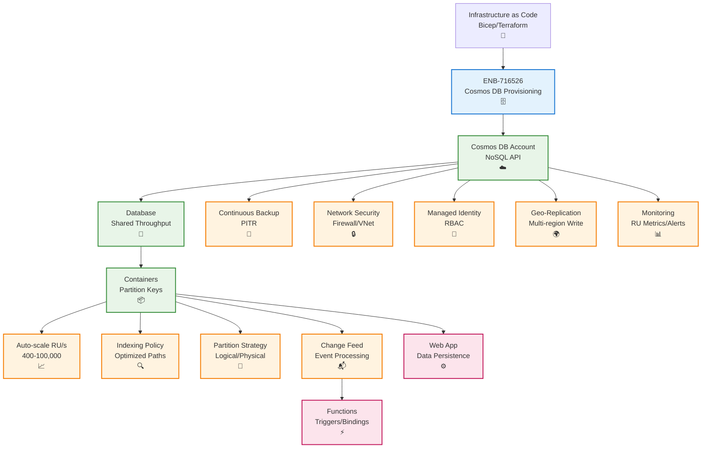

# Azure Cosmos DB Provisioning

## Metadata

- **Name**: Azure Cosmos DB Provisioning
- **Type**: Enabler
- **ID**: ENB-716526
- **Approval**: Approved
- **Capability ID**: CAP-716493
- **Owner**: DevOps Team
- **Status**: Ready for Implementation
- **Priority**: High
- **Analysis Review**: Not Required
- **Code Review**: Not Required

## Technical Overview
### Purpose
Provision and configure Azure Cosmos DB for NoSQL document storage with automatic scaling, global distribution, backup/restore, consistency levels, and performance tuning. Support partitioning strategies, indexing policies, and change feed capabilities for event-driven architectures.

## Functional Requirements

| ID | Name | Requirement | Priority | Status | Approval |
|----|------|-------------|----------|--------|----------|
| FR-716527 | Infrastructure as Code | Deploy Cosmos DB account using Bicep, ARM templates, or Terraform | Must Have | Ready for Implementation | Approved |
| FR-716528 | Account Configuration | Configure Cosmos DB account with NoSQL API and appropriate consistency level | Must Have | Ready for Implementation | Approved |
| FR-716529 | Database Creation | Create databases with shared or dedicated throughput | Must Have | Ready for Implementation | Approved |
| FR-716530 | Container Provisioning | Provision containers with partition keys and indexing policies | Must Have | Ready for Implementation | Approved |
| FR-716531 | Throughput Management | Configure autoscale throughput (400-100,000 RU/s) based on environment | Must Have | Ready for Implementation | Approved |
| FR-716532 | Backup Configuration | Enable continuous backup with point-in-time restore capability | Must Have | Ready for Implementation | Approved |
| FR-716533 | Change Feed | Enable change feed for event-driven processing and synchronization | Must Have | Ready for Implementation | Approved |
| FR-716534 | Network Security | Configure firewall rules, VNet integration, and private endpoints | Must Have | Ready for Implementation | Approved |
| FR-716535 | Geo-Replication | Configure multi-region write for production environments | Medium | Ready for Implementation | Approved |
| FR-716536 | Monitoring | Enable diagnostics and alerts for RU consumption and latency | Must Have | Ready for Implementation | Approved |

## Non-Functional Requirements

| ID | Name | Type | Requirement | Priority | Status | Approval |
|----|------|------|-------------|----------|--------|----------|
| NFR-716537 | Latency | Provide single-digit millisecond read/write latency at p99 | Must Have | Ready for Implementation | Approved |
| NFR-716538 | Availability | Guarantee 99.99% availability SLA for single-region, 99.999% for multi-region | Must Have | Ready for Implementation | Approved |
| NFR-716539 | Scalability | Auto-scale from 400 to 100,000 RU/s based on demand | Must Have | Ready for Implementation | Approved |
| NFR-716540 | Data Durability | Ensure 99.999999999% durability with automatic replication | Must Have | Ready for Implementation | Approved |
| NFR-716541 | Cost Optimization | Optimize RU consumption through efficient queries and indexing | High | Ready for Implementation | Approved |
| NFR-716542 | Consistency | Support configurable consistency levels (Strong, Bounded Staleness, Session, Consistent Prefix, Eventual) | Must Have | Ready for Implementation | Approved |

## Dependencies

### Internal Upstream Dependency

| Enabler ID | Description |
|------------|-------------|
| | |

### Internal Downstream Impact

| Enabler ID | Description |
|------------|-------------|
| ENB-716518 | Web App uses Cosmos DB for data persistence |
| ENB-716522 | Functions use Cosmos DB triggers and bindings |

### External Dependencies

**External Upstream Dependencies**: Azure Resource Manager, Azure Monitor

**External Downstream Impact**: Application data storage, change feed consumers

## Technical Specifications

### Enabler Dependency Flow Diagram


### Configuration Examples

#### Bicep Deployment Template
```bicep
param accountName string
param location string = resourceGroup().location
param environment string = 'prod'
param enableMultiRegion bool = (environment == 'prod')

// Cosmos DB Account
resource cosmosAccount 'Microsoft.DocumentDB/databaseAccounts@2023-11-15' = {
  name: accountName
  location: location
  kind: 'GlobalDocumentDB'
  properties: {
    databaseAccountOfferType: 'Standard'
    consistencyPolicy: {
      defaultConsistencyLevel: 'Session'
      maxIntervalInSeconds: 5
      maxStalenessPrefix: 100
    }
    locations: enableMultiRegion ? [
      {
        locationName: location
        failoverPriority: 0
        isZoneRedundant: true
      }
      {
        locationName: 'East US'
        failoverPriority: 1
        isZoneRedundant: true
      }
    ] : [
      {
        locationName: location
        failoverPriority: 0
        isZoneRedundant: false
      }
    ]
    enableAutomaticFailover: enableMultiRegion
    enableMultipleWriteLocations: enableMultiRegion
    backupPolicy: {
      type: 'Continuous'
      continuousModeProperties: {
        tier: 'Continuous30Days'
      }
    }
    isVirtualNetworkFilterEnabled: true
    virtualNetworkRules: []
    ipRules: []
    capabilities: [
      {
        name: 'EnableServerless'
      }
    ]
  }
}

// Database
resource database 'Microsoft.DocumentDB/databaseAccounts/sqlDatabases@2023-11-15' = {
  parent: cosmosAccount
  name: 'lease-sentry-db'
  properties: {
    resource: {
      id: 'lease-sentry-db'
    }
    options: {
      autoscaleSettings: {
        maxThroughput: environment == 'prod' ? 10000 : 4000
      }
    }
  }
}

// Leases Container
resource leasesContainer 'Microsoft.DocumentDB/databaseAccounts/sqlDatabases/containers@2023-11-15' = {
  parent: database
  name: 'leases'
  properties: {
    resource: {
      id: 'leases'
      partitionKey: {
        paths: ['/tenantId']
        kind: 'Hash'
      }
      indexingPolicy: {
        indexingMode: 'consistent'
        automatic: true
        includedPaths: [
          {
            path: '/*'
          }
        ]
        excludedPaths: [
          {
            path: '/_etag/?'
          }
          {
            path: '/attachments/*'
          }
        ]
        compositeIndexes: [
          [
            {
              path: '/tenantId'
              order: 'ascending'
            }
            {
              path: '/startDate'
              order: 'ascending'
            }
          ]
        ]
      }
      uniqueKeyPolicy: {
        uniqueKeys: [
          {
            paths: ['/leaseNumber', '/tenantId']
          }
        ]
      }
    }
    options: {}
  }
}

// Documents Container
resource documentsContainer 'Microsoft.DocumentDB/databaseAccounts/sqlDatabases/containers@2023-11-15' = {
  parent: database
  name: 'documents'
  properties: {
    resource: {
      id: 'documents'
      partitionKey: {
        paths: ['/leaseId']
        kind: 'Hash'
      }
      indexingPolicy: {
        indexingMode: 'consistent'
        automatic: true
        includedPaths: [
          {
            path: '/*'
          }
        ]
        excludedPaths: [
          {
            path: '/_etag/?'
          }
          {
            path: '/content/*'
          }
        ]
      }
    }
    options: {}
  }
}

// Enable diagnostics
resource diagnostics 'Microsoft.Insights/diagnosticSettings@2021-05-01-preview' = {
  name: '${accountName}-diagnostics'
  scope: cosmosAccount
  properties: {
    workspaceId: resourceId('Microsoft.OperationalInsights/workspaces', '${accountName}-workspace')
    logs: [
      {
        category: 'DataPlaneRequests'
        enabled: true
        retentionPolicy: {
          enabled: true
          days: 30
        }
      }
      {
        category: 'QueryRuntimeStatistics'
        enabled: true
        retentionPolicy: {
          enabled: true
          days: 30
        }
      }
      {
        category: 'PartitionKeyStatistics'
        enabled: true
        retentionPolicy: {
          enabled: true
          days: 30
        }
      }
    ]
    metrics: [
      {
        category: 'Requests'
        enabled: true
        retentionPolicy: {
          enabled: true
          days: 30
        }
      }
    ]
  }
}

output cosmosEndpoint string = cosmosAccount.properties.documentEndpoint
output cosmosPrimaryKey string = cosmosAccount.listKeys().primaryMasterKey
output databaseName string = database.name
```

#### Connection Configuration
```typescript
// cosmos-client.ts
import { CosmosClient } from '@azure/cosmos';
import { DefaultAzureCredential } from '@azure/identity';

interface CosmosConfig {
  endpoint: string;
  databaseName: string;
  useManagedIdentity: boolean;
  key?: string;
}

export class CosmosService {
  private client: CosmosClient;
  private databaseName: string;

  constructor(config: CosmosConfig) {
    this.databaseName = config.databaseName;

    if (config.useManagedIdentity) {
      // Use Managed Identity for authentication
      const credential = new DefaultAzureCredential();
      this.client = new CosmosClient({
        endpoint: config.endpoint,
        aadCredentials: credential
      });
    } else {
      // Use connection string for local development
      this.client = new CosmosClient({
        endpoint: config.endpoint,
        key: config.key
      });
    }
  }

  async getContainer(containerName: string) {
    const database = this.client.database(this.databaseName);
    return database.container(containerName);
  }

  async query<T>(containerName: string, query: string, parameters?: any[]) {
    const container = await this.getContainer(containerName);
    const { resources } = await container.items
      .query<T>({
        query,
        parameters
      })
      .fetchAll();
    return resources;
  }

  async create<T>(containerName: string, item: T) {
    const container = await this.getContainer(containerName);
    const { resource } = await container.items.create(item);
    return resource;
  }

  async upsert<T>(containerName: string, item: T) {
    const container = await this.getContainer(containerName);
    const { resource } = await container.items.upsert(item);
    return resource;
  }
}
```
