# Azure Blob Storage Provisioning

## Metadata

- **Name**: Azure Blob Storage Provisioning
- **Type**: Enabler
- **ID**: ENB-716530
- **Approval**: Approved
- **Capability ID**: CAP-716493
- **Owner**: DevOps Team
- **Status**: Ready for Implementation
- **Priority**: High
- **Analysis Review**: Not Required
- **Code Review**: Not Required

## Technical Overview
### Purpose
Provision and configure Azure Blob Storage for file storage with containers, access tiers, lifecycle management, blob versioning, and security controls. Support document uploads, image storage, backup archives, and event-driven blob processing with triggers.

## Functional Requirements

| ID | Name | Requirement | Priority | Status | Approval |
|----|------|-------------|----------|--------|----------|
| FR-716531 | Infrastructure as Code | Deploy Storage Account using Bicep, ARM templates, or Terraform | Must Have | Ready for Implementation | Approved |
| FR-716532 | Account Configuration | Configure Storage Account with blob service and appropriate SKU | Must Have | Ready for Implementation | Approved |
| FR-716533 | Container Creation | Create blob containers for documents, images, and archives | Must Have | Ready for Implementation | Approved |
| FR-716534 | Access Tiers | Configure Hot, Cool, and Archive tiers based on data access patterns | Must Have | Ready for Implementation | Approved |
| FR-716535 | Lifecycle Management | Define lifecycle policies for automatic tier transition and deletion | Must Have | Ready for Implementation | Approved |
| FR-716536 | Blob Versioning | Enable blob versioning and soft delete for data protection | Must Have | Ready for Implementation | Approved |
| FR-716537 | SAS Tokens | Generate Shared Access Signatures for time-limited access | Must Have | Ready for Implementation | Approved |
| FR-716538 | Network Security | Configure firewall, VNet integration, and private endpoints | Must Have | Ready for Implementation | Approved |
| FR-716539 | Event Integration | Enable Event Grid integration for blob creation/deletion events | Must Have | Ready for Implementation | Approved |
| FR-716540 | Monitoring | Configure diagnostics, metrics, and alerts for storage operations | Must Have | Ready for Implementation | Approved |

## Non-Functional Requirements

| ID | Name | Type | Requirement | Priority | Status | Approval |
|----|------|------|-------------|----------|--------|----------|
| NFR-716541 | Performance | Support 20,000 requests per second for hot tier | Must Have | Ready for Implementation | Approved |
| NFR-716542 | Availability | Guarantee 99.9% availability with LRS, 99.99% with ZRS/GRS | Must Have | Ready for Implementation | Approved |
| NFR-716543 | Durability | Ensure 99.999999999% durability with appropriate redundancy | Must Have | Ready for Implementation | Approved |
| NFR-716544 | Scalability | Support storage from GB to PB with automatic scaling | Must Have | Ready for Implementation | Approved |
| NFR-716545 | Cost Optimization | Optimize storage costs through tiering and lifecycle policies | High | Ready for Implementation | Approved |
| NFR-716546 | Security | Enforce HTTPS, encryption at rest, managed identity access | Must Have | Ready for Implementation | Approved |

## Dependencies

### Internal Upstream Dependency

| Enabler ID | Description |
|------------|-------------|
| | |

### Internal Downstream Impact

| Enabler ID | Description |
|------------|-------------|
| ENB-716518 | Web App uses Blob Storage for file uploads |
| ENB-716522 | Functions use blob triggers for processing |
| ENB-716542 | Event Grid receives blob events |

### External Dependencies

**External Upstream Dependencies**: Azure Resource Manager, Azure Event Grid

**External Downstream Impact**: File storage, document management, backup storage

## Technical Specifications

### Enabler Dependency Flow Diagram

```mermaid
flowchart TD
    ENB_716530["ENB-716530<br/>Blob Storage Provisioning<br/>📦"]
    
    IAC["Infrastructure as Code<br/>Bicep/Terraform<br/>📝"]
    
    IAC --> ENB_716530
    
    ACCOUNT["Storage Account<br/>General Purpose v2<br/>☁️"]
    
    ENB_716530 --> ACCOUNT
    
    BLOBSERVICE["Blob Service<br/>REST API<br/>🌐"]
    
    ACCOUNT --> BLOBSERVICE
    
    DOCUMENTS["Documents Container<br/>Hot Tier<br/>📄"]
    IMAGES["Images Container<br/>Hot Tier<br/>🖼️"]
    ARCHIVES["Archives Container<br/>Cool/Archive Tier<br/>📦"]
    
    BLOBSERVICE --> DOCUMENTS
    BLOBSERVICE --> IMAGES
    BLOBSERVICE --> ARCHIVES
    
    TIERS["Access Tiers<br/>Hot/Cool/Archive<br/>🌡️"]
    LIFECYCLE["Lifecycle Policies<br/>Auto-transition<br/>⏰"]
    VERSIONING["Blob Versioning<br/>Soft Delete<br/>🔄"]
    
    DOCUMENTS --> TIERS
    IMAGES --> TIERS
    ARCHIVES --> TIERS
    
    BLOBSERVICE --> LIFECYCLE
    BLOBSERVICE --> VERSIONING
    
    SAS["SAS Tokens<br/>Time-limited Access<br/>🔑"]
    NETWORK["Network Security<br/>Firewall/VNet<br/>🔒"]
    IDENTITY["Managed Identity<br/>RBAC<br/>🔐"]
    
    BLOBSERVICE --> SAS
    ACCOUNT --> NETWORK
    ACCOUNT --> IDENTITY
    
    EVENTS["Event Grid Integration<br/>Blob Events<br/>📬"]
    MONITORING["Monitoring<br/>Storage Metrics<br/>📊"]
    
    BLOBSERVICE --> EVENTS
    ACCOUNT --> MONITORING
    
    WEBAPP["Web App<br/>File Uploads<br/>⚙️"]
    FUNCTIONS["Functions<br/>Blob Triggers<br/>⚡"]
    
    DOCUMENTS --> WEBAPP
    IMAGES --> WEBAPP
    DOCUMENTS --> FUNCTIONS
    EVENTS --> FUNCTIONS

    classDef enabler fill:#e3f2fd,stroke:#1976d2,stroke-width:2px
    classDef azure fill:#e8f5e8,stroke:#388e3c,stroke-width:2px
    classDef containers fill:#fff3e0,stroke:#f57c00,stroke-width:2px
    classDef config fill:#fce4ec,stroke:#c2185b,stroke-width:2px
    classDef consumer fill:#f3e5f5,stroke:#7b1fa2,stroke-width:2px
    
    class ENB_716530 enabler
    class ACCOUNT,BLOBSERVICE azure
    class DOCUMENTS,IMAGES,ARCHIVES containers
    class TIERS,LIFECYCLE,VERSIONING,SAS,NETWORK,IDENTITY,EVENTS,MONITORING config
    class WEBAPP,FUNCTIONS consumer
```


### Configuration Examples

#### Bicep Deployment Template
```bicep
param storageAccountName string
param location string = resourceGroup().location
param environment string = 'prod'
param redundancy string = (environment == 'prod') ? 'Standard_ZRS' : 'Standard_LRS'

// Storage Account
resource storageAccount 'Microsoft.Storage/storageAccounts@2023-01-01' = {
  name: storageAccountName
  location: location
  sku: {
    name: redundancy
  }
  kind: 'StorageV2'
  properties: {
    accessTier: 'Hot'
    supportsHttpsTrafficOnly: true
    minimumTlsVersion: 'TLS1_2'
    allowBlobPublicAccess: false
    allowSharedKeyAccess: true
    networkAcls: {
      bypass: 'AzureServices'
      defaultAction: 'Deny'
      ipRules: []
      virtualNetworkRules: []
    }
    encryption: {
      services: {
        blob: {
          enabled: true
          keyType: 'Account'
        }
        file: {
          enabled: true
          keyType: 'Account'
        }
      }
      keySource: 'Microsoft.Storage'
    }
  }
}

// Blob Service with versioning and soft delete
resource blobService 'Microsoft.Storage/storageAccounts/blobServices@2023-01-01' = {
  parent: storageAccount
  name: 'default'
  properties: {
    deleteRetentionPolicy: {
      enabled: true
      days: 7
    }
    containerDeleteRetentionPolicy: {
      enabled: true
      days: 7
    }
    isVersioningEnabled: true
    changeFeed: {
      enabled: true
      retentionInDays: 7
    }
  }
}

// Documents Container
resource documentsContainer 'Microsoft.Storage/storageAccounts/blobServices/containers@2023-01-01' = {
  parent: blobService
  name: 'documents'
  properties: {
    publicAccess: 'None'
    metadata: {
      purpose: 'lease-documents'
      environment: environment
    }
  }
}

// Images Container
resource imagesContainer 'Microsoft.Storage/storageAccounts/blobServices/containers@2023-01-01' = {
  parent: blobService
  name: 'images'
  properties: {
    publicAccess: 'None'
    metadata: {
      purpose: 'property-images'
      environment: environment
    }
  }
}

// Archives Container
resource archivesContainer 'Microsoft.Storage/storageAccounts/blobServices/containers@2023-01-01' = {
  parent: blobService
  name: 'archives'
  properties: {
    publicAccess: 'None'
    metadata: {
      purpose: 'historical-data'
      environment: environment
    }
  }
}

// Lifecycle Management Policy
resource lifecyclePolicy 'Microsoft.Storage/storageAccounts/managementPolicies@2023-01-01' = {
  parent: storageAccount
  name: 'default'
  properties: {
    policy: {
      rules: [
        {
          name: 'move-to-cool-after-30-days'
          enabled: true
          type: 'Lifecycle'
          definition: {
            filters: {
              blobTypes: ['blockBlob']
              prefixMatch: ['documents/', 'images/']
            }
            actions: {
              baseBlob: {
                tierToCool: {
                  daysAfterModificationGreaterThan: 30
                }
                tierToArchive: {
                  daysAfterModificationGreaterThan: 90
                }
                delete: {
                  daysAfterModificationGreaterThan: 365
                }
              }
              snapshot: {
                delete: {
                  daysAfterCreationGreaterThan: 90
                }
              }
            }
          }
        }
        {
          name: 'archive-old-data'
          enabled: true
          type: 'Lifecycle'
          definition: {
            filters: {
              blobTypes: ['blockBlob']
              prefixMatch: ['archives/']
            }
            actions: {
              baseBlob: {
                tierToArchive: {
                  daysAfterModificationGreaterThan: 0
                }
              }
            }
          }
        }
      ]
    }
  }
}

// Enable diagnostics
resource diagnostics 'Microsoft.Insights/diagnosticSettings@2021-05-01-preview' = {
  name: '${storageAccountName}-diagnostics'
  scope: storageAccount
  properties: {
    workspaceId: resourceId('Microsoft.OperationalInsights/workspaces', '${storageAccountName}-workspace')
    metrics: [
      {
        category: 'Transaction'
        enabled: true
        retentionPolicy: {
          enabled: true
          days: 30
        }
      }
      {
        category: 'Capacity'
        enabled: true
        retentionPolicy: {
          enabled: true
          days: 30
        }
      }
    ]
  }
}

output storageAccountName string = storageAccount.name
output blobEndpoint string = storageAccount.properties.primaryEndpoints.blob
output storageAccountId string = storageAccount.id
```

#### Blob Storage Client
```typescript
// blob-storage.service.ts
import { BlobServiceClient, ContainerClient, StorageSharedKeyCredential } from '@azure/storage-blob';
import { DefaultAzureCredential } from '@azure/identity';

interface BlobConfig {
  accountName: string;
  accountKey?: string;
  useManagedIdentity: boolean;
}

export class BlobStorageService {
  private blobServiceClient: BlobServiceClient;

  constructor(config: BlobConfig) {
    const blobEndpoint = `https://${config.accountName}.blob.core.windows.net`;

    if (config.useManagedIdentity) {
      // Use Managed Identity for authentication
      const credential = new DefaultAzureCredential();
      this.blobServiceClient = new BlobServiceClient(blobEndpoint, credential);
    } else {
      // Use account key for local development
      const credential = new StorageSharedKeyCredential(config.accountName, config.accountKey!);
      this.blobServiceClient = new BlobServiceClient(blobEndpoint, credential);
    }
  }

  getContainerClient(containerName: string): ContainerClient {
    return this.blobServiceClient.getContainerClient(containerName);
  }

  async uploadFile(
    containerName: string,
    blobName: string,
    content: Buffer,
    contentType: string
  ): Promise<string> {
    const containerClient = this.getContainerClient(containerName);
    const blockBlobClient = containerClient.getBlockBlobClient(blobName);

    await blockBlobClient.upload(content, content.length, {
      blobHTTPHeaders: {
        blobContentType: contentType
      },
      metadata: {
        uploadedAt: new Date().toISOString()
      }
    });

    return blockBlobClient.url;
  }

  async downloadFile(containerName: string, blobName: string): Promise<Buffer> {
    const containerClient = this.getContainerClient(containerName);
    const blockBlobClient = containerClient.getBlockBlobClient(blobName);

    const downloadResponse = await blockBlobClient.download();
    return await streamToBuffer(downloadResponse.readableStreamBody!);
  }

  async deleteFile(containerName: string, blobName: string): Promise<void> {
    const containerClient = this.getContainerClient(containerName);
    const blockBlobClient = containerClient.getBlockBlobClient(blobName);
    await blockBlobClient.delete();
  }

  async generateSasUrl(
    containerName: string,
    blobName: string,
    expiresInMinutes: number = 60
  ): Promise<string> {
    const containerClient = this.getContainerClient(containerName);
    const blockBlobClient = containerClient.getBlockBlobClient(blobName);

    const startsOn = new Date();
    const expiresOn = new Date(startsOn.getTime() + expiresInMinutes * 60 * 1000);

    const sasUrl = await blockBlobClient.generateSasUrl({
      permissions: 'r',
      startsOn,
      expiresOn
    });

    return sasUrl;
  }

  async listBlobs(containerName: string, prefix?: string): Promise<string[]> {
    const containerClient = this.getContainerClient(containerName);
    const blobs: string[] = [];

    for await (const blob of containerClient.listBlobsFlat({ prefix })) {
      blobs.push(blob.name);
    }

    return blobs;
  }
}

async function streamToBuffer(readableStream: NodeJS.ReadableStream): Promise<Buffer> {
  return new Promise((resolve, reject) => {
    const chunks: Buffer[] = [];
    readableStream.on('data', (data) => {
      chunks.push(data instanceof Buffer ? data : Buffer.from(data));
    });
    readableStream.on('end', () => {
      resolve(Buffer.concat(chunks));
    });
    readableStream.on('error', reject);
  });
}
```
