# Azure AI Search Provisioning

## Metadata

- **Name**: Azure AI Search Provisioning
- **Type**: Enabler
- **ID**: ENB-716534
- **Approval**: Approved
- **Capability ID**: CAP-716493
- **Owner**: DevOps Team
- **Status**: Ready for Implementation
- **Priority**: High
- **Analysis Review**: Not Required
- **Code Review**: Not Required

## Technical Overview
### Purpose
Provision and configure Azure AI Search (formerly Cognitive Search) for intelligent document search with AI enrichment, semantic ranking, vector search capabilities, and automatic indexing. Support full-text search, faceted navigation, and AI-powered document analysis.

## Functional Requirements

| ID | Name | Requirement | Priority | Status | Approval |
|----|------|-------------|----------|--------|----------|
| FR-716535 | Infrastructure as Code | Deploy AI Search service using Bicep, ARM templates, or Terraform | Must Have | Ready for Implementation | Approved |
| FR-716536 | Service Configuration | Configure search service with appropriate SKU and capacity | Must Have | Ready for Implementation | Approved |
| FR-716537 | Index Creation | Create search indexes with field definitions and analyzers | Must Have | Ready for Implementation | Approved |
| FR-716538 | Indexer Configuration | Configure indexers for automatic data ingestion from Cosmos DB and Blob Storage | Must Have | Ready for Implementation | Approved |
| FR-716539 | Skillset Definition | Define AI skillsets for entity extraction, key phrase extraction, OCR | Medium | Ready for Implementation | Approved |
| FR-716540 | Semantic Search | Enable semantic ranking for improved relevance | Must Have | Ready for Implementation | Approved |
| FR-716541 | Vector Search | Configure vector search for similarity-based retrieval | Medium | Ready for Implementation | Approved |
| FR-716542 | Synonym Maps | Define synonym maps for business-specific terminology | Medium | Ready for Implementation | Approved |
| FR-716543 | Network Security | Configure firewall rules and private endpoints | Must Have | Ready for Implementation | Approved |
| FR-716544 | Monitoring | Enable diagnostics, query analytics, and performance metrics | Must Have | Ready for Implementation | Approved |

## Non-Functional Requirements

| ID | Name | Type | Requirement | Priority | Status | Approval |
|----|------|------|-------------|----------|--------|----------|
| NFR-716545 | Query Performance | Return search results in under 100ms for 95th percentile | Must Have | Ready for Implementation | Approved |
| NFR-716546 | Indexing Speed | Process 1,000 documents per minute during indexing | Must Have | Ready for Implementation | Approved |
| NFR-716547 | Availability | Guarantee 99.9% availability with replica configuration | Must Have | Ready for Implementation | Approved |
| NFR-716548 | Scalability | Support up to 1 million documents with auto-scaling | Must Have | Ready for Implementation | Approved |
| NFR-716549 | Search Accuracy | Achieve 90%+ relevance score for semantic search queries | High | Ready for Implementation | Approved |
| NFR-716550 | Cost Optimization | Optimize index size and query complexity for cost efficiency | High | Ready for Implementation | Approved |

## Dependencies

### Internal Upstream Dependency

| Enabler ID | Description |
|------------|-------------|
| ENB-716526 | Cosmos DB provides documents for indexing |
| ENB-716530 | Blob Storage provides files for AI enrichment |

### Internal Downstream Impact

| Enabler ID | Description |
|------------|-------------|
| ENB-716518 | Web App uses AI Search for document queries |
| ENB-716522 | Functions use AI Search for processing |

### External Dependencies

**External Upstream Dependencies**: Azure Cognitive Services, Azure OpenAI (for vector embeddings)

**External Downstream Impact**: Document search, intelligent recommendations, content discovery

## Technical Specifications

### Enabler Dependency Flow Diagram

```mermaid
flowchart TD
    ENB_716534["ENB-716534<br/>AI Search Provisioning<br/>🔍"]
    
    IAC["Infrastructure as Code<br/>Bicep/Terraform<br/>📝"]
    
    IAC --> ENB_716534
    
    SERVICE["AI Search Service<br/>Standard S1<br/>☁️"]
    
    ENB_716534 --> SERVICE
    
    DATASOURCES["Data Sources<br/>Cosmos DB/Blob<br/>📊"]
    
    COSMOS["Cosmos DB<br/>Lease Documents<br/>🗄️"]
    BLOB["Blob Storage<br/>PDF/Images<br/>📦"]
    
    DATASOURCES --> COSMOS
    DATASOURCES --> BLOB
    
    INDEXERS["Indexers<br/>Auto-sync<br/>🔄"]
    SKILLSETS["AI Skillsets<br/>Enrichment<br/>🧠"]
    
    DATASOURCES --> INDEXERS
    INDEXERS --> SKILLSETS
    
    ENTITY["Entity Extraction<br/>Organizations/Dates<br/>🏢"]
    KEYPHRASE["Key Phrases<br/>Terms/Concepts<br/>🔑"]
    OCR["OCR<br/>Text from Images<br/>📄"]
    
    SKILLSETS --> ENTITY
    SKILLSETS --> KEYPHRASE
    SKILLSETS --> OCR
    
    INDEXES["Search Indexes<br/>Schema Definition<br/>📑"]
    
    INDEXERS --> INDEXES
    ENTITY --> INDEXES
    KEYPHRASE --> INDEXES
    OCR --> INDEXES
    
    SEMANTIC["Semantic Ranking<br/>AI Relevance<br/>⭐"]
    VECTOR["Vector Search<br/>Embeddings<br/>🎯"]
    SYNONYMS["Synonym Maps<br/>Business Terms<br/>📖"]
    
    INDEXES --> SEMANTIC
    INDEXES --> VECTOR
    INDEXES --> SYNONYMS
    
    NETWORK["Network Security<br/>Firewall/Private<br/>🔒"]
    IDENTITY["Managed Identity<br/>RBAC<br/>🔐"]
    
    SERVICE --> NETWORK
    SERVICE --> IDENTITY
    
    MONITORING["Query Analytics<br/>Performance Metrics<br/>📊"]
    
    SERVICE --> MONITORING
    
    WEBAPP["Web App<br/>Search Queries<br/>⚙️"]
    FUNCTIONS["Functions<br/>Batch Indexing<br/>⚡"]
    
    INDEXES --> WEBAPP
    INDEXERS --> FUNCTIONS

    classDef enabler fill:#e3f2fd,stroke:#1976d2,stroke-width:2px
    classDef azure fill:#e8f5e8,stroke:#388e3c,stroke-width:2px
    classDef sources fill:#fff3e0,stroke:#f57c00,stroke-width:2px
    classDef processing fill:#fce4ec,stroke:#c2185b,stroke-width:2px
    classDef features fill:#f3e5f5,stroke:#7b1fa2,stroke-width:2px
    classDef consumer fill:#e0f2f1,stroke:#00796b,stroke-width:2px
    
    class ENB_716534 enabler
    class SERVICE,INDEXES azure
    class DATASOURCES,COSMOS,BLOB sources
    class INDEXERS,SKILLSETS,ENTITY,KEYPHRASE,OCR processing
    class SEMANTIC,VECTOR,SYNONYMS,NETWORK,IDENTITY,MONITORING features
    class WEBAPP,FUNCTIONS consumer
```


### Configuration Examples

#### Bicep Deployment Template
```bicep
param searchServiceName string
param location string = resourceGroup().location
param sku string = 'standard'
param replicaCount int = 1
param partitionCount int = 1

// AI Search Service
resource searchService 'Microsoft.Search/searchServices@2023-11-01' = {
  name: searchServiceName
  location: location
  sku: {
    name: sku
  }
  identity: {
    type: 'SystemAssigned'
  }
  properties: {
    replicaCount: replicaCount
    partitionCount: partitionCount
    hostingMode: 'default'
    publicNetworkAccess: 'enabled'
    networkRuleSet: {
      ipRules: []
    }
    semanticSearch: 'standard'
  }
}

// Enable diagnostics
resource diagnostics 'Microsoft.Insights/diagnosticSettings@2021-05-01-preview' = {
  name: '${searchServiceName}-diagnostics'
  scope: searchService
  properties: {
    workspaceId: resourceId('Microsoft.OperationalInsights/workspaces', '${searchServiceName}-workspace')
    logs: [
      {
        category: 'OperationLogs'
        enabled: true
        retentionPolicy: {
          enabled: true
          days: 30
        }
      }
    ]
    metrics: [
      {
        category: 'AllMetrics'
        enabled: true
        retentionPolicy: {
          enabled: true
          days: 30
        }
      }
    ]
  }
}

output searchServiceId string = searchService.id
output searchServiceEndpoint string = 'https://${searchServiceName}.search.windows.net'
output principalId string = searchService.identity.principalId
```

#### Index Definition
```json
{
  "name": "lease-documents-index",
  "fields": [
    {
      "name": "id",
      "type": "Edm.String",
      "key": true,
      "searchable": false,
      "filterable": false,
      "sortable": false,
      "facetable": false
    },
    {
      "name": "leaseId",
      "type": "Edm.String",
      "searchable": false,
      "filterable": true,
      "sortable": true,
      "facetable": true
    },
    {
      "name": "tenantName",
      "type": "Edm.String",
      "searchable": true,
      "filterable": true,
      "sortable": true,
      "facetable": true,
      "analyzer": "standard.lucene"
    },
    {
      "name": "propertyAddress",
      "type": "Edm.String",
      "searchable": true,
      "filterable": false,
      "sortable": false,
      "facetable": false
    },
    {
      "name": "leaseStartDate",
      "type": "Edm.DateTimeOffset",
      "searchable": false,
      "filterable": true,
      "sortable": true,
      "facetable": true
    },
    {
      "name": "leaseEndDate",
      "type": "Edm.DateTimeOffset",
      "searchable": false,
      "filterable": true,
      "sortable": true,
      "facetable": true
    },
    {
      "name": "monthlyRent",
      "type": "Edm.Double",
      "searchable": false,
      "filterable": true,
      "sortable": true,
      "facetable": true
    },
    {
      "name": "documentContent",
      "type": "Edm.String",
      "searchable": true,
      "filterable": false,
      "sortable": false,
      "facetable": false,
      "analyzer": "en.lucene"
    },
    {
      "name": "keyPhrases",
      "type": "Collection(Edm.String)",
      "searchable": true,
      "filterable": true,
      "facetable": true
    },
    {
      "name": "entities",
      "type": "Collection(Edm.String)",
      "searchable": true,
      "filterable": true,
      "facetable": true
    },
    {
      "name": "contentVector",
      "type": "Collection(Edm.Single)",
      "searchable": true,
      "filterable": false,
      "sortable": false,
      "facetable": false,
      "dimensions": 1536,
      "vectorSearchProfile": "vector-profile"
    },
    {
      "name": "lastModified",
      "type": "Edm.DateTimeOffset",
      "searchable": false,
      "filterable": true,
      "sortable": true,
      "facetable": false
    }
  ],
  "semantic": {
    "configurations": [
      {
        "name": "semantic-config",
        "prioritizedFields": {
          "titleField": {
            "fieldName": "tenantName"
          },
          "prioritizedContentFields": [
            {
              "fieldName": "documentContent"
            },
            {
              "fieldName": "propertyAddress"
            }
          ],
          "prioritizedKeywordsFields": [
            {
              "fieldName": "keyPhrases"
            }
          ]
        }
      }
    ]
  },
  "vectorSearch": {
    "profiles": [
      {
        "name": "vector-profile",
        "algorithm": "hnsw-algorithm"
      }
    ],
    "algorithms": [
      {
        "name": "hnsw-algorithm",
        "kind": "hnsw",
        "hnswParameters": {
          "metric": "cosine",
          "m": 4,
          "efConstruction": 400,
          "efSearch": 500
        }
      }
    ]
  },
  "suggesters": [
    {
      "name": "sg-tenant",
      "searchMode": "analyzingInfixMatching",
      "sourceFields": ["tenantName", "propertyAddress"]
    }
  ]
}
```

#### Search Client
```typescript
// search.service.ts
import { SearchClient, AzureKeyCredential } from '@azure/search-documents';
import { DefaultAzureCredential } from '@azure/identity';

interface SearchConfig {
  endpoint: string;
  indexName: string;
  apiKey?: string;
  useManagedIdentity: boolean;
}

export interface LeaseDocument {
  id: string;
  leaseId: string;
  tenantName: string;
  propertyAddress: string;
  leaseStartDate: Date;
  leaseEndDate: Date;
  monthlyRent: number;
  documentContent: string;
  keyPhrases: string[];
  entities: string[];
  lastModified: Date;
}

export class SearchService {
  private searchClient: SearchClient<LeaseDocument>;

  constructor(config: SearchConfig) {
    if (config.useManagedIdentity) {
      const credential = new DefaultAzureCredential();
      this.searchClient = new SearchClient<LeaseDocument>(
        config.endpoint,
        config.indexName,
        credential
      );
    } else {
      const credential = new AzureKeyCredential(config.apiKey!);
      this.searchClient = new SearchClient<LeaseDocument>(
        config.endpoint,
        config.indexName,
        credential
      );
    }
  }

  async search(query: string, options?: any) {
    const searchResults = await this.searchClient.search(query, {
      queryType: 'semantic',
      semanticConfiguration: 'semantic-config',
      select: ['id', 'leaseId', 'tenantName', 'propertyAddress', 'monthlyRent'],
      top: 10,
      ...options
    });

    const results: LeaseDocument[] = [];
    for await (const result of searchResults.results) {
      results.push(result.document);
    }

    return results;
  }

  async vectorSearch(vector: number[], options?: any) {
    const searchResults = await this.searchClient.search('*', {
      vectorSearchOptions: {
        queries: [
          {
            kind: 'vector',
            vector: vector,
            fields: ['contentVector'],
            kNearestNeighborsCount: 5
          }
        ]
      },
      ...options
    });

    const results: LeaseDocument[] = [];
    for await (const result of searchResults.results) {
      results.push(result.document);
    }

    return results;
  }

  async suggest(searchText: string) {
    const suggestions = await this.searchClient.suggest(searchText, 'sg-tenant', {
      select: ['tenantName', 'propertyAddress'],
      top: 5
    });

    return suggestions.results.map(r => r.text);
  }
}
```
