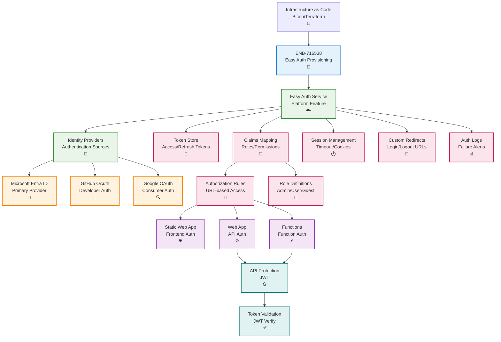

# Azure App Service Authentication Provisioning

## Metadata

- **Name**: Azure App Service Authentication Provisioning
- **Type**: Enabler
- **ID**: ENB-716538
- **Approval**: Approved
- **Capability ID**: CAP-716493
- **Owner**: DevOps Team
- **Status**: Ready for Implementation
- **Priority**: High
- **Analysis Review**: Not Required
- **Code Review**: Not Required

## Technical Overview
### Purpose
Provision and configure Azure App Service Authentication (Easy Auth) for the Static Web App, Web App, and Function App with support for Microsoft Entra ID (Azure AD), social identity providers, token management, and role-based access control. Simplify authentication without code changes.

## Functional Requirements

| ID | Name | Requirement | Priority | Status | Approval |
|----|------|-------------|----------|--------|----------|
| FR-716539 | Infrastructure as Code | Configure Easy Auth using Bicep, ARM templates, or Terraform | Must Have | Ready for Implementation | Approved |
| FR-716540 | Identity Provider | Configure Microsoft Entra ID (Azure AD) as primary identity provider | Must Have | Ready for Implementation | Approved |
| FR-716541 | Multi-Provider Support | Support GitHub, Google, and Facebook as additional providers | Medium | Ready for Implementation | Approved |
| FR-716542 | Token Store | Enable token store for access and refresh token management | Must Have | Ready for Implementation | Approved |
| FR-716543 | Authorization Rules | Define URL-based authorization rules for role-based access | Must Have | Ready for Implementation | Approved |
| FR-716544 | API Authentication | Protect API endpoints with JWT validation | Must Have | Ready for Implementation | Approved |
| FR-716545 | Session Management | Configure session timeout and cookie settings | Must Have | Ready for Implementation | Approved |
| FR-716546 | Custom Login Page | Support custom login/logout redirect URLs | Medium | Ready for Implementation | Approved |
| FR-716547 | Claims Mapping | Map identity provider claims to application roles | Must Have | Ready for Implementation | Approved |
| FR-716548 | Monitoring | Enable authentication logs and failure alerts | Must Have | Ready for Implementation | Approved |

## Non-Functional Requirements

| ID | Name | Type | Requirement | Priority | Status | Approval |
|----|------|------|-------------|----------|--------|----------|
| NFR-716549 | Authentication Latency | Complete authentication flow in under 2 seconds | Must Have | Ready for Implementation | Approved |
| NFR-716550 | Token Validation | Validate tokens in under 50ms | Must Have | Ready for Implementation | Approved |
| NFR-716551 | Availability | Guarantee 99.95% availability for authentication service | Must Have | Ready for Implementation | Approved |
| NFR-716552 | Security | Enforce HTTPS, PKCE for OAuth, secure token storage | Must Have | Ready for Implementation | Approved |
| NFR-716553 | Scalability | Support 10,000 concurrent authenticated users | Must Have | Ready for Implementation | Approved |
| NFR-716554 | Compliance | Meet GDPR and SOC 2 compliance for identity data | High | Ready for Implementation | Approved |

## Dependencies

### Internal Upstream Dependency

| Enabler ID | Description |
|------------|-------------|
| ENB-716494 | Static Web App requires authentication configuration |
| ENB-716518 | Web App requires authentication configuration |
| ENB-716522 | Functions require authentication configuration |

### Internal Downstream Impact

| Enabler ID | Description |
|------------|-------------|
| | All application components consume authentication |

### External Dependencies

**External Upstream Dependencies**: Microsoft Entra ID, OAuth providers (GitHub, Google, Facebook)

**External Downstream Impact**: User authentication, API security, role-based access control

## Technical Specifications

### Enabler Dependency Flow Diagram


### Configuration Examples

#### Bicep Deployment Template (Static Web App)
```bicep
param staticWebAppName string
param aadClientId string
param aadTenantId string

resource staticWebApp 'Microsoft.Web/staticSites@2023-01-01' existing = {
  name: staticWebAppName
}

// Configure Azure AD authentication
resource staticWebAppAuth 'Microsoft.Web/staticSites/config@2023-01-01' = {
  parent: staticWebApp
  name: 'authsettingsV2'
  properties: {
    platform: {
      enabled: true
    }
    globalValidation: {
      requireAuthentication: true
      unauthenticatedClientAction: 'RedirectToLoginPage'
    }
    identityProviders: {
      azureActiveDirectory: {
        enabled: true
        registration: {
          openIdIssuer: 'https://login.microsoftonline.com/${aadTenantId}/v2.0'
          clientIdSettingName: 'AAD_CLIENT_ID'
          clientSecretSettingName: 'AAD_CLIENT_SECRET'
        }
        login: {
          loginParameters: ['scope=openid profile email']
        }
        validation: {
          allowedAudiences: [
            'api://${aadClientId}'
          ]
        }
      }
      github: {
        enabled: true
        registration: {
          clientIdSettingName: 'GITHUB_CLIENT_ID'
          clientSecretSettingName: 'GITHUB_CLIENT_SECRET'
        }
      }
    }
    login: {
      tokenStore: {
        enabled: true
        tokenRefreshExtensionHours: 72
      }
      routes: {
        logoutEndpoint: '/.auth/logout'
      }
    }
    httpSettings: {
      requireHttps: true
      routes: {
        apiPrefix: '/.auth'
      }
    }
  }
}
```

#### Bicep Deployment Template (Web App)
```bicep
param webAppName string
param aadClientId string
param aadTenantId string
param aadClientSecret string

resource webApp 'Microsoft.Web/sites@2023-01-01' existing = {
  name: webAppName
}

// Configure Easy Auth for Web App
resource webAppAuth 'Microsoft.Web/sites/config@2023-01-01' = {
  parent: webApp
  name: 'authsettingsV2'
  properties: {
    platform: {
      enabled: true
    }
    globalValidation: {
      requireAuthentication: true
      unauthenticatedClientAction: 'Return401'
      redirectToProvider: 'azureActiveDirectory'
    }
    identityProviders: {
      azureActiveDirectory: {
        enabled: true
        registration: {
          openIdIssuer: 'https://login.microsoftonline.com/${aadTenantId}/v2.0'
          clientId: aadClientId
          clientSecretSettingName: 'AAD_CLIENT_SECRET'
        }
        login: {
          loginParameters: []
        }
        validation: {
          jwtClaimChecks: {}
          allowedAudiences: [
            'api://${aadClientId}'
          ]
          defaultAuthorizationPolicy: {
            allowedPrincipals: {}
          }
        }
      }
    }
    login: {
      tokenStore: {
        enabled: true
        tokenRefreshExtensionHours: 72
        fileSystem: {}
      }
      preserveUrlFragmentsForLogins: false
      cookieExpiration: {
        convention: 'FixedTime'
        timeToExpiration: '08:00:00'
      }
      nonce: {
        validateNonce: true
        nonceExpirationInterval: '00:05:00'
      }
    }
    httpSettings: {
      requireHttps: true
      forwardProxy: {
        convention: 'NoProxy'
      }
    }
  }
}

// App Settings with client secret
resource webAppSettings 'Microsoft.Web/sites/config@2023-01-01' = {
  parent: webApp
  name: 'appsettings'
  properties: {
    AAD_CLIENT_SECRET: aadClientSecret
    WEBSITE_AUTH_ENABLED: 'true'
  }
}
```

#### staticwebapp.config.json with Route Authorization
```json
{
  "routes": [
    {
      "route": "/admin/*",
      "allowedRoles": ["admin"]
    },
    {
      "route": "/api/*",
      "allowedRoles": ["authenticated"]
    },
    {
      "route": "/public/*",
      "allowedRoles": ["anonymous"]
    }
  ],
  "navigationFallback": {
    "rewrite": "/index.html",
    "exclude": ["/images/*.{png,jpg,gif}", "/css/*"]
  },
  "auth": {
    "identityProviders": {
      "azureActiveDirectory": {
        "userDetailsClaim": "http://schemas.xmlsoap.org/ws/2005/05/identity/claims/name",
        "registration": {
          "openIdIssuer": "https://login.microsoftonline.com/{tenant-id}/v2.0",
          "clientIdSettingName": "AAD_CLIENT_ID",
          "clientSecretSettingName": "AAD_CLIENT_SECRET"
        },
        "login": {
          "loginParameters": ["scope=openid profile email"]
        }
      },
      "github": {
        "registration": {
          "clientIdSettingName": "GITHUB_CLIENT_ID",
          "clientSecretSettingName": "GITHUB_CLIENT_SECRET"
        }
      }
    }
  },
  "responseOverrides": {
    "401": {
      "redirect": "/.auth/login/aad",
      "statusCode": 302
    }
  }
}
```

#### Express.js Middleware for Token Validation
```typescript
// middleware/auth.middleware.ts
import { Request, Response, NextFunction } from 'express';
import jwt from 'jsonwebtoken';
import jwksClient from 'jwks-rsa';

const client = jwksClient({
  jwksUri: `https://login.microsoftonline.com/${process.env.AAD_TENANT_ID}/discovery/v2.0/keys`
});

function getKey(header: any, callback: any) {
  client.getSigningKey(header.kid, (err, key) => {
    const signingKey = key?.getPublicKey();
    callback(null, signingKey);
  });
}

export interface AuthenticatedRequest extends Request {
  user?: {
    oid: string;
    name: string;
    email: string;
    roles: string[];
  };
}

export const authenticateToken = (req: AuthenticatedRequest, res: Response, next: NextFunction) => {
  // Easy Auth injects headers
  const token = req.headers['x-ms-token-aad-access-token'] as string;

  if (!token) {
    return res.status(401).json({ error: 'No token provided' });
  }

  jwt.verify(token, getKey, {
    audience: `api://${process.env.AAD_CLIENT_ID}`,
    issuer: `https://login.microsoftonline.com/${process.env.AAD_TENANT_ID}/v2.0`
  }, (err, decoded: any) => {
    if (err) {
      return res.status(403).json({ error: 'Invalid token' });
    }

    req.user = {
      oid: decoded.oid,
      name: decoded.name,
      email: decoded.email || decoded.preferred_username,
      roles: decoded.roles || []
    };

    next();
  });
};

export const requireRole = (allowedRoles: string[]) => {
  return (req: AuthenticatedRequest, res: Response, next: NextFunction) => {
    if (!req.user) {
      return res.status(401).json({ error: 'Unauthorized' });
    }

    const hasRole = req.user.roles.some(role => allowedRoles.includes(role));

    if (!hasRole) {
      return res.status(403).json({ error: 'Insufficient permissions' });
    }

    next();
  };
};

// Usage in routes
// app.get('/api/admin/users', authenticateToken, requireRole(['admin']), getUsersHandler);
```

#### Azure Function with Easy Auth
```typescript
// functions/ProtectedFunction/index.ts
import { app, HttpRequest, HttpResponseInit, InvocationContext } from '@azure/functions';

interface UserClaims {
  oid: string;
  name: string;
  email: string;
  roles: string[];
}

function getUserFromRequest(request: HttpRequest): UserClaims | null {
  // Easy Auth injects principal information
  const principalId = request.headers.get('x-ms-client-principal-id');
  const principalName = request.headers.get('x-ms-client-principal-name');
  const principalIdp = request.headers.get('x-ms-client-principal-idp');

  if (!principalId) {
    return null;
  }

  // Parse the full principal claims (base64 encoded JSON)
  const principalHeader = request.headers.get('x-ms-client-principal');
  if (principalHeader) {
    const decoded = Buffer.from(principalHeader, 'base64').toString('utf-8');
    const principal = JSON.parse(decoded);
    return {
      oid: principal.userId,
      name: principal.userDetails,
      email: principal.claims.find((c: any) => c.typ === 'emails')?.val || '',
      roles: principal.userRoles || []
    };
  }

  return {
    oid: principalId,
    name: principalName || 'Unknown',
    email: '',
    roles: []
  };
}

export async function protectedHandler(
  request: HttpRequest,
  context: InvocationContext
): Promise<HttpResponseInit> {
  const user = getUserFromRequest(request);

  if (!user) {
    return {
      status: 401,
      jsonBody: { error: 'Unauthorized' }
    };
  }

  context.log(`Authenticated user: ${user.name} (${user.oid})`);

  return {
    status: 200,
    jsonBody: {
      message: 'Protected resource accessed',
      user: {
        name: user.name,
        email: user.email,
        roles: user.roles
      }
    }
  };
}

app.http('ProtectedFunction', {
  methods: ['GET'],
  authLevel: 'anonymous', // Easy Auth handles authentication
  handler: protectedHandler
});
```
