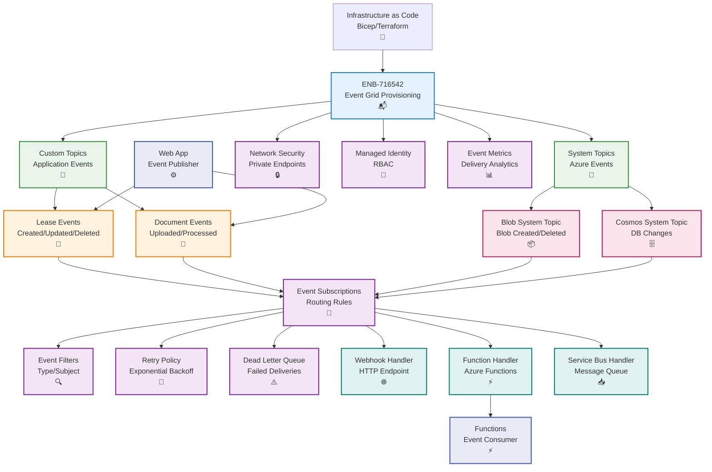

# Azure Event Grid Provisioning

## Metadata

- **Name**: Azure Event Grid Provisioning
- **Type**: Enabler
- **ID**: ENB-716542
- **Approval**: Approved
- **Capability ID**: CAP-716493
- **Owner**: DevOps Team
- **Status**: Ready for Implementation
- **Priority**: High
- **Analysis Review**: Not Required
- **Code Review**: Not Required

## Technical Overview
### Purpose
Provision and configure Azure Event Grid for event-driven architecture with custom topics, system topics, subscriptions, and event filtering. Support reliable message delivery, retry policies, dead-letter queues, and integration with Azure services and custom handlers.

## Functional Requirements

| ID | Name | Requirement | Priority | Status | Approval |
|----|------|-------------|----------|--------|----------|
| FR-716543 | Infrastructure as Code | Deploy Event Grid topics using Bicep, ARM templates, or Terraform | Must Have | Ready for Implementation | Approved |
| FR-716544 | Custom Topics | Create custom topics for application-specific events | Must Have | Ready for Implementation | Approved |
| FR-716545 | System Topics | Configure system topics for Azure service events (Blob, Cosmos DB) | Must Have | Ready for Implementation | Approved |
| FR-716546 | Event Subscriptions | Define subscriptions with event filtering and routing | Must Have | Ready for Implementation | Approved |
| FR-716547 | Event Handlers | Configure webhook, Azure Function, and Service Bus handlers | Must Have | Ready for Implementation | Approved |
| FR-716548 | Retry Policy | Implement exponential backoff retry with configurable attempts | Must Have | Ready for Implementation | Approved |
| FR-716549 | Dead Letter Queue | Configure dead-letter destination for failed deliveries | Must Have | Ready for Implementation | Approved |
| FR-716550 | Event Filtering | Define advanced filters based on event type and subject | Must Have | Ready for Implementation | Approved |
| FR-716551 | Network Security | Configure private endpoints and managed identity authentication | Must Have | Ready for Implementation | Approved |
| FR-716552 | Monitoring | Enable diagnostics, delivery metrics, and failure alerts | Must Have | Ready for Implementation | Approved |

## Non-Functional Requirements

| ID | Name | Type | Requirement | Priority | Status | Approval |
|----|------|------|-------------|----------|--------|----------|
| NFR-716553 | Latency | Deliver events with <100ms latency for 95th percentile | Must Have | Ready for Implementation | Approved |
| NFR-716554 | Throughput | Support 10,000 events per second per topic | Must Have | Ready for Implementation | Approved |
| NFR-716555 | Availability | Guarantee 99.99% availability SLA | Must Have | Ready for Implementation | Approved |
| NFR-716556 | Durability | Ensure at-least-once delivery with retry mechanisms | Must Have | Ready for Implementation | Approved |
| NFR-716557 | Scalability | Auto-scale to handle burst traffic without throttling | Must Have | Ready for Implementation | Approved |
| NFR-716558 | Cost Efficiency | Optimize event operations and filter early to reduce costs | High | Ready for Implementation | Approved |

## Dependencies

### Internal Upstream Dependency

| Enabler ID | Description |
|------------|-------------|
| ENB-716526 | Cosmos DB generates change feed events |
| ENB-716530 | Blob Storage generates blob lifecycle events |

### Internal Downstream Impact

| Enabler ID | Description |
|------------|-------------|
| ENB-716518 | Web App publishes and subscribes to custom events |
| ENB-716522 | Functions consume Event Grid triggers |

### External Dependencies

**External Upstream Dependencies**: Azure services (Blob, Cosmos DB), custom publishers

**External Downstream Impact**: Event consumers, webhooks, downstream services

## Technical Specifications

### Enabler Dependency Flow Diagram


### Configuration Examples

#### Bicep Deployment Template
```bicep
param location string = resourceGroup().location
param topicName string
param storageAccountName string
param cosmosAccountName string

// Custom Topic for Lease Events
resource leaseTopic 'Microsoft.EventGrid/topics@2023-12-15-preview' = {
  name: '${topicName}-lease-events'
  location: location
  identity: {
    type: 'SystemAssigned'
  }
  properties: {
    inputSchema: 'EventGridSchema'
    publicNetworkAccess: 'Enabled'
  }
}

// Custom Topic for Document Events
resource documentTopic 'Microsoft.EventGrid/topics@2023-12-15-preview' = {
  name: '${topicName}-document-events'
  location: location
  identity: {
    type: 'SystemAssigned'
  }
  properties: {
    inputSchema: 'CloudEventSchemaV1_0'
    publicNetworkAccess: 'Enabled'
  }
}

// System Topic for Blob Storage Events
resource blobSystemTopic 'Microsoft.EventGrid/systemTopics@2023-12-15-preview' = {
  name: '${topicName}-blob-events'
  location: location
  identity: {
    type: 'SystemAssigned'
  }
  properties: {
    source: resourceId('Microsoft.Storage/storageAccounts', storageAccountName)
    topicType: 'Microsoft.Storage.StorageAccounts'
  }
}

// System Topic for Cosmos DB Events
resource cosmosSystemTopic 'Microsoft.EventGrid/systemTopics@2023-12-15-preview' = {
  name: '${topicName}-cosmos-events'
  location: location
  identity: {
    type: 'SystemAssigned'
  }
  properties: {
    source: resourceId('Microsoft.DocumentDB/databaseAccounts', cosmosAccountName)
    topicType: 'Microsoft.DocumentDB.DatabaseAccounts'
  }
}

// Dead Letter Storage for failed events
resource deadLetterStorage 'Microsoft.Storage/storageAccounts@2023-01-01' = {
  name: '${replace(topicName, '-', '')}dl'
  location: location
  sku: {
    name: 'Standard_LRS'
  }
  kind: 'StorageV2'
}

resource deadLetterContainer 'Microsoft.Storage/storageAccounts/blobServices/containers@2023-01-01' = {
  name: '${deadLetterStorage.name}/default/deadletter'
  properties: {
    publicAccess: 'None'
  }
}

// Event Subscription for Lease Created Events to Azure Function
resource leaseCreatedSubscription 'Microsoft.EventGrid/topics/eventSubscriptions@2023-12-15-preview' = {
  parent: leaseTopic
  name: 'lease-created-to-function'
  properties: {
    destination: {
      endpointType: 'AzureFunction'
      properties: {
        resourceId: resourceId('Microsoft.Web/sites/functions', 'lease-sentry-functions', 'LeaseCreatedHandler')
        maxEventsPerBatch: 10
        preferredBatchSizeInKilobytes: 64
      }
    }
    filter: {
      includedEventTypes: [
        'LeaseSentry.Lease.Created'
      ]
      advancedFilters: [
        {
          operatorType: 'StringIn'
          key: 'data.status'
          values: ['active', 'pending']
        }
      ]
    }
    retryPolicy: {
      maxDeliveryAttempts: 30
      eventTimeToLiveInMinutes: 1440
    }
    deadLetterDestination: {
      endpointType: 'StorageBlob'
      properties: {
        resourceId: deadLetterStorage.id
        blobContainerName: 'deadletter'
      }
    }
    eventDeliverySchema: 'EventGridSchema'
  }
}

// Event Subscription for Blob Created to Azure Function
resource blobCreatedSubscription 'Microsoft.EventGrid/systemTopics/eventSubscriptions@2023-12-15-preview' = {
  parent: blobSystemTopic
  name: 'blob-created-to-function'
  properties: {
    destination: {
      endpointType: 'AzureFunction'
      properties: {
        resourceId: resourceId('Microsoft.Web/sites/functions', 'lease-sentry-functions', 'BlobProcessorHandler')
      }
    }
    filter: {
      includedEventTypes: [
        'Microsoft.Storage.BlobCreated'
      ]
      subjectBeginsWith: '/blobServices/default/containers/documents/'
      subjectEndsWith: '.pdf'
    }
    retryPolicy: {
      maxDeliveryAttempts: 30
      eventTimeToLiveInMinutes: 1440
    }
    deadLetterDestination: {
      endpointType: 'StorageBlob'
      properties: {
        resourceId: deadLetterStorage.id
        blobContainerName: 'deadletter'
      }
    }
  }
}

// Enable diagnostics
resource diagnostics 'Microsoft.Insights/diagnosticSettings@2021-05-01-preview' = {
  name: '${topicName}-diagnostics'
  scope: leaseTopic
  properties: {
    workspaceId: resourceId('Microsoft.OperationalInsights/workspaces', '${topicName}-workspace')
    logs: [
      {
        category: 'DeliveryFailures'
        enabled: true
        retentionPolicy: {
          enabled: true
          days: 30
        }
      }
      {
        category: 'PublishFailures'
        enabled: true
        retentionPolicy: {
          enabled: true
          days: 30
        }
      }
    ]
    metrics: [
      {
        category: 'AllMetrics'
        enabled: true
        retentionPolicy: {
          enabled: true
          days: 30
        }
      }
    ]
  }
}

output leaseTopicEndpoint string = leaseTopic.properties.endpoint
output leaseTopicId string = leaseTopic.id
output documentTopicEndpoint string = documentTopic.properties.endpoint
output documentTopicId string = documentTopic.id
```

#### Event Publisher Client
```typescript
// event-grid.service.ts
import { EventGridPublisherClient, AzureKeyCredential } from '@azure/eventgrid';
import { DefaultAzureCredential } from '@azure/identity';

interface EventGridConfig {
  endpoint: string;
  apiKey?: string;
  useManagedIdentity: boolean;
}

export interface LeaseEvent {
  id: string;
  eventType: string;
  subject: string;
  eventTime: Date;
  dataVersion: string;
  data: {
    leaseId: string;
    tenantId: string;
    action: string;
    [key: string]: any;
  };
}

export class EventGridService {
  private client: EventGridPublisherClient;

  constructor(config: EventGridConfig) {
    if (config.useManagedIdentity) {
      const credential = new DefaultAzureCredential();
      this.client = new EventGridPublisherClient(config.endpoint, 'EventGrid', credential);
    } else {
      const credential = new AzureKeyCredential(config.apiKey!);
      this.client = new EventGridPublisherClient(config.endpoint, 'EventGrid', credential);
    }
  }

  async publishLeaseCreated(leaseId: string, tenantId: string, leaseData: any): Promise<void> {
    const event: LeaseEvent = {
      id: `${leaseId}-created-${Date.now()}`,
      eventType: 'LeaseSentry.Lease.Created',
      subject: `/leases/${leaseId}`,
      eventTime: new Date(),
      dataVersion: '1.0',
      data: {
        leaseId,
        tenantId,
        action: 'created',
        ...leaseData
      }
    };

    await this.client.send([event]);
  }

  async publishLeaseUpdated(leaseId: string, tenantId: string, changes: any): Promise<void> {
    const event: LeaseEvent = {
      id: `${leaseId}-updated-${Date.now()}`,
      eventType: 'LeaseSentry.Lease.Updated',
      subject: `/leases/${leaseId}`,
      eventTime: new Date(),
      dataVersion: '1.0',
      data: {
        leaseId,
        tenantId,
        action: 'updated',
        changes
      }
    };

    await this.client.send([event]);
  }

  async publishDocumentProcessed(documentId: string, leaseId: string, result: any): Promise<void> {
    const event: LeaseEvent = {
      id: `${documentId}-processed-${Date.now()}`,
      eventType: 'LeaseSentry.Document.Processed',
      subject: `/documents/${documentId}`,
      eventTime: new Date(),
      dataVersion: '1.0',
      data: {
        leaseId,
        tenantId: result.tenantId,
        action: 'processed',
        documentId,
        result
      }
    };

    await this.client.send([event]);
  }

  async publishBatchEvents(events: LeaseEvent[]): Promise<void> {
    // Batch publish for efficiency (max 1MB per batch)
    const batchSize = 100;
    for (let i = 0; i < events.length; i += batchSize) {
      const batch = events.slice(i, i + batchSize);
      await this.client.send(batch);
    }
  }
}
```

#### Event Handler (Azure Function)
```typescript
// functions/LeaseCreatedHandler/index.ts
import { app, EventGridEvent, InvocationContext } from '@azure/functions';

interface LeaseCreatedData {
  leaseId: string;
  tenantId: string;
  action: string;
  [key: string]: any;
}

export async function leaseCreatedHandler(
  event: EventGridEvent,
  context: InvocationContext
): Promise<void> {
  context.log('Event Grid trigger function processed event:', event);

  try {
    const data = event.data as LeaseCreatedData;

    context.log(`Processing lease created event for lease: ${data.leaseId}`);

    // Process the lease creation
    // - Send notifications
    // - Update search index
    // - Trigger workflows
    
    context.log(`Successfully processed lease: ${data.leaseId}`);
  } catch (error) {
    context.error('Error processing lease created event:', error);
    throw error; // Will be retried by Event Grid
  }
}

app.eventGrid('LeaseCreatedHandler', {
  handler: leaseCreatedHandler
});
```
