# Initial Log In Web Component

## Metadata

- **Name**: Initial Log In Web Component
- **Type**: Enabler
- **ID**: ENB-925037
- **Approval**: Approved
- **Capability ID**: CAP-398937
- **Owner**: Product Team
- **Status**: Ready for Implementation
- **Priority**: High
- **Analysis Review**: Required
- **Code Review**: Not Required

## Technical Overview
### Purpose
This web component enables the free subscription express login workflow:
- This page is independently navigable by a unique url (/freelogin).
- Displays the log in options from Azure App Service Authentication (Easy Auth)
- Integrates with Azure App Service Authentication (Easy Auth)

On successful log in:
- Create a subscription request and add the free subscription type
- Create a profile and, if available, pre-populate the email, first name, and last name from the log in response
- Call the Subscription API passing it the subscription and profile request
On successful subscription submission, navigate to the Contracts Page (/contracts)

## Functional Requirements

| ID | Name | Requirement | Priority | Status | Approval |
|----|------|-------------|----------|--------|----------|
| FR-925037-01 | Free Login Page | Display login page at /freelogin | Must Have | Ready for Implementation | Approved |
| FR-925037-02 | Authentication Options | Show login options from Azure Easy Auth | Must Have | Ready for Implementation | Approved |
| FR-925037-03 | Easy Auth Integration | Integrate with Azure App Service Authentication | Must Have | Ready for Implementation | Approved |
| FR-925037-04 | Free Subscription Creation | Create subscription request with free type on login success | Must Have | Ready for Implementation | Approved |
| FR-925037-05 | Profile Request Creation | Create profile request with pre-populated data from login | Must Have | Ready for Implementation | Approved |
| FR-925037-06 | Data Pre-population | Pre-populate email, first name, last name if available from login | Should Have | Ready for Implementation | Approved |
| FR-925037-07 | Subscription API Call | Call Subscription API with subscription and profile requests | Must Have | Ready for Implementation | Approved |
| FR-925037-08 | Success Navigation | Navigate to /contracts on successful submission | Must Have | Ready for Implementation | Approved |
| FR-925037-09 | Error Handling | Handle login failures and display appropriate errors | Must Have | Ready for Implementation | Approved |
| FR-925037-10 | Independent Access | Ensure page is independently navigable | Should Have | Ready for Implementation | Approved |

## Non-Functional Requirements

| ID | Name | Type | Requirement | Priority | Status | Approval |
|----|------|------|-------------|----------|--------|----------|
| NFR-925037-01 | Authentication Security | Security | Secure authentication handling and token management | Must Have | Ready for Implementation | Approved |
| NFR-925037-02 | Responsive Design | Usability | Responsive design for login options on all devices | Must Have | Ready for Implementation | Approved |
| NFR-925037-03 | Accessibility | Usability | Accessible login interface with proper ARIA labels | Must Have | Ready for Implementation | Approved |
| NFR-925037-04 | Page Load Performance | Performance | Login page loads within 2 seconds | Should Have | Ready for Implementation | Approved |
| NFR-925037-05 | Error Resilience | Reliability | Handle authentication failures gracefully | Must Have | Ready for Implementation | Approved |
| NFR-925037-04 |  |  | Page loads within 2 seconds | High | Draft | Not Approved |
| NFR-925037-05 |  |  | Pre-population improves user experience | Medium | Draft | Not Approved |
| NFR-925037-06 |  |  | Compatible with Azure Easy Auth providers | High | Draft | Not Approved |
| NFR-925037-07 |  |  | Error logging for debugging | Medium | Draft | Not Approved |

## Dependencies

### Internal Upstream Dependency

| Enabler ID | Description |
|------------|-------------|
| | |

### Internal Downstream Impact

| Enabler ID | Description |
|------------|-------------|
| | |

### External Dependencies

**External Upstream Dependencies**: None identified.

**External Downstream Impact**: None identified.

## Technical Specifications (Template)

### Enabler Dependency Flow Diagram

```mermaid
flowchart TD
    ENB_XXXXXX["ENB-925037<br/>[Enabler Name]<br/>📡"]

    %% Add your dependency flows here

    classDef enabler fill:#e3f2fd,stroke:#1976d2,stroke-width:2px
    class ENB_XXXXXX enabler
```

### API Technical Specifications (if applicable)

| API Type | Operation | Channel / Endpoint | Description | Request / Publish Payload | Response / Subscribe Data |
|----------|-----------|---------------------|-------------|----------------------------|----------------------------|
| | | | | | |

### Data Models

### Class Diagrams

### Sequence Diagrams

### Dataflow Diagrams

### State Diagrams

