# Logging

## Metadata

- **Name**: Logging
- **Type**: Enabler
- **ID**: ENB-026387
- **Approval**: Approved
- **Capability ID**: CAP-026386
- **Owner**: Development Team
- **Status**: Ready for Implementation
- **Priority**: High
- **Analysis Review**: Not Required
- **Code Review**: Not Required

## Technical Overview
### Purpose
Provide centralized logging capabilities for Azure Functions using context.log to track function executions, errors, and system events with integration to Application Insights for monitoring and diagnostics.

## Functional Requirements

| ID | Name | Requirement | Priority | Status | Approval |
|----|------|-------------|----------|--------|----------|
| FR-026388 | Context Logging | Use context.log for all logging operations within Azure Functions | Must Have | Ready for Implementation | Approved |
| FR-026389 | Log Levels | Support multiple log levels using context.log.verbose, context.log.info, context.log.warn, and context.log.error | Must Have | Ready for Implementation | Approved |
| FR-026390 | Invocation Tracking | Automatically log function invocation ID and execution time for every function call | Must Have | Ready for Implementation | Approved |
| FR-026391 | Error Logging | Capture and log all errors with stack traces using context.log.error | Must Have | Ready for Implementation | Approved |
| FR-026392 | Structured Logging | Output logs in structured format compatible with Application Insights | Must Have | Ready for Implementation | Approved |
| FR-026393 | Custom Properties | Support custom properties and dimensions for enriched logging context | Must Have | Ready for Implementation | Approved |
| FR-026394 | Correlation | Include correlation IDs to track related function invocations across distributed systems | Medium | Ready for Implementation | Approved |

## Non-Functional Requirements

| ID | Name | Type | Requirement | Priority | Status | Approval |
|----|------|------|-------------|----------|--------|----------|
| NFR-026395 | Performance Impact | Performance | Logging operations should not add more than 10ms overhead per function execution | Must Have | Ready for Implementation | Approved |
| NFR-026396 | Application Insights Integration | Integration | All logs must automatically flow to Application Insights for centralized monitoring | Must Have | Ready for Implementation | Approved |
| NFR-026397 | Log Retention | Compliance | Configure log retention policies in Application Insights (default 90 days) | Must Have | Ready for Implementation | Approved |
| NFR-026398 | Query Performance | Performance | Logs must be queryable in Application Insights with sub-second response times | Medium | Ready for Implementation | Approved |
| NFR-026399 | Log Volume | Scalability | Support high-volume logging for functions with thousands of invocations per minute | Must Have | Ready for Implementation | Approved |

## Dependencies

### Internal Upstream Dependency

| Enabler ID | Description |
|------------|-------------|
| ENB-613819 | Azure Function Runtime provides context.log functionality |

### Internal Downstream Impact

| Enabler ID | Description |
|------------|-------------|
| ENB-613840 | HTTP Trigger Handler uses logging for request/response tracking |
| ENB-613860 | Function Bindings uses logging for binding operations |

### External Dependencies

**External Upstream Dependencies**: Application Insights, Azure Monitor

**External Downstream Impact**: Monitoring and alerting systems depend on function logs

## Technical Specifications

### Enabler Dependency Flow Diagram

```mermaid
flowchart TD
    ENB_026387["ENB-026387<br/>Context Logging<br/>📝"]
    
    ENB_613819["ENB-613819<br/>Azure Function Runtime<br/>⚡"]
    CONTEXT["Context Object<br/>context.log<br/>📋"]
    
    ENB_613819 --> CONTEXT
    CONTEXT --> ENB_026387
    
    APP_INSIGHTS["Application Insights<br/>Log Aggregation<br/>☁️"]
    ANALYTICS["Log Analytics<br/>Query & Analysis<br/>📊"]
    ALERTS["Azure Alerts<br/>Monitoring<br/>🚨"]
    
    ENB_026387 --> APP_INSIGHTS
    APP_INSIGHTS --> ANALYTICS
    APP_INSIGHTS --> ALERTS

    classDef enabler fill:#e3f2fd,stroke:#1976d2,stroke-width:2px
    classDef runtime fill:#f3e5f5,stroke:#7b1fa2,stroke-width:2px
    classDef output fill:#e8f5e8,stroke:#388e3c,stroke-width:2px
    
    class ENB_026387,ENB_613819 enabler
    class CONTEXT runtime
    class APP_INSIGHTS,ANALYTICS,ALERTS output
```

### API Technical Specifications

| API Type | Operation | Channel / Endpoint | Description | Request / Publish Payload | Response / Subscribe Data |
|----------|-----------|---------------------|-------------|----------------------------|----------------------------|
| Context | Method | context.log(message) | Log informational message | `string or object` | void |
| Context | Method | context.log.verbose(message) | Log verbose/debug information | `string or object` | void |
| Context | Method | context.log.info(message) | Log informational message (alias) | `string or object` | void |
| Context | Method | context.log.warn(message) | Log warning message | `string or object` | void |
| Context | Method | context.log.error(message, error) | Log error with stack trace | `{message: string, error: Error}` | void |
| Context | Method | context.log.metric(name, value) | Log custom metric | `{name: string, value: number}` | void |
| Query | KQL | Application Insights | Query logs using Kusto Query Language | KQL query string | Query results |

### Data Models

### Class Diagrams

### Sequence Diagrams

### Dataflow Diagrams

### State Diagrams

