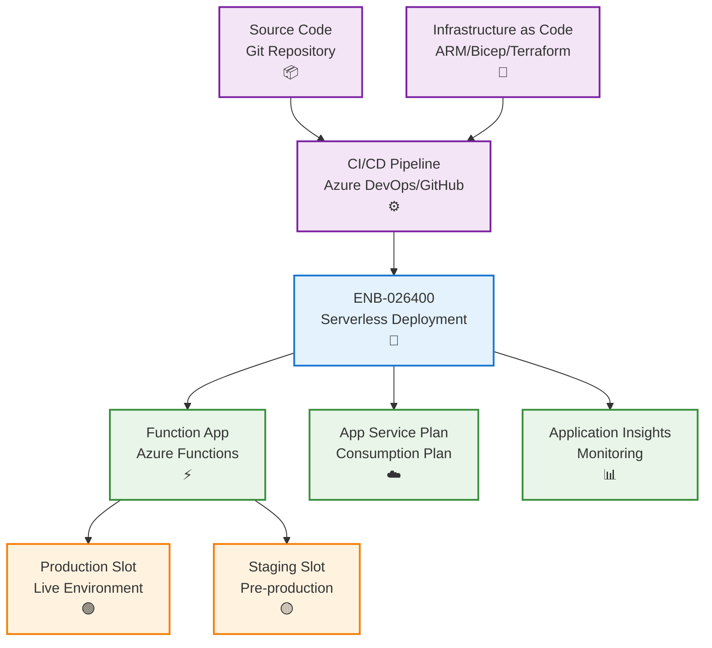
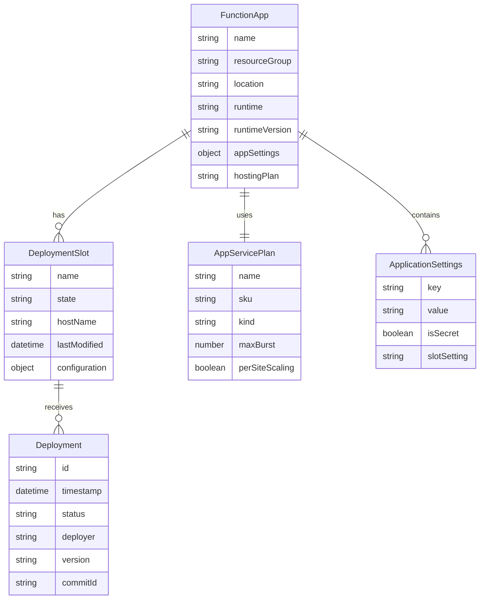
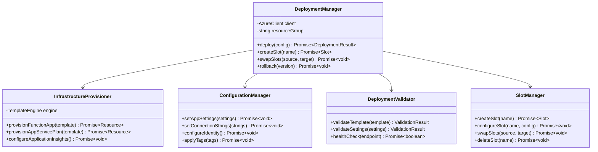
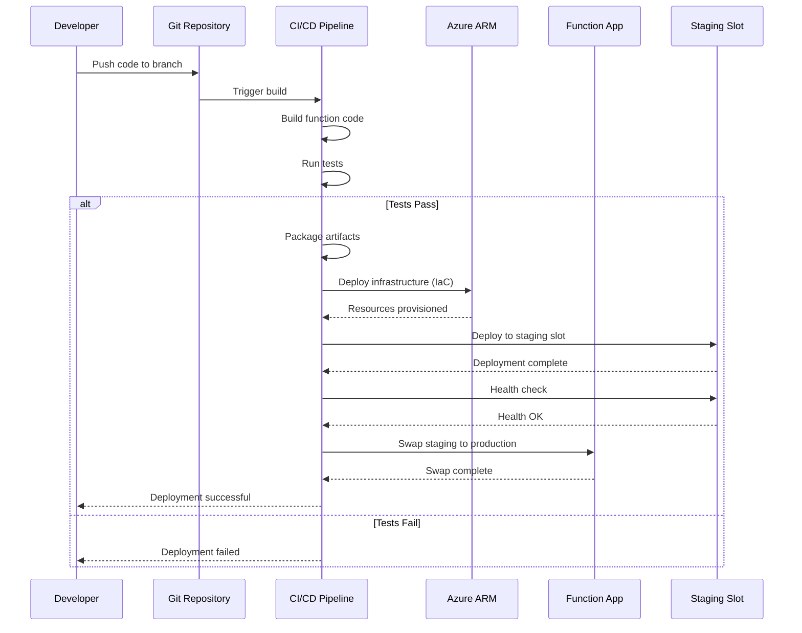
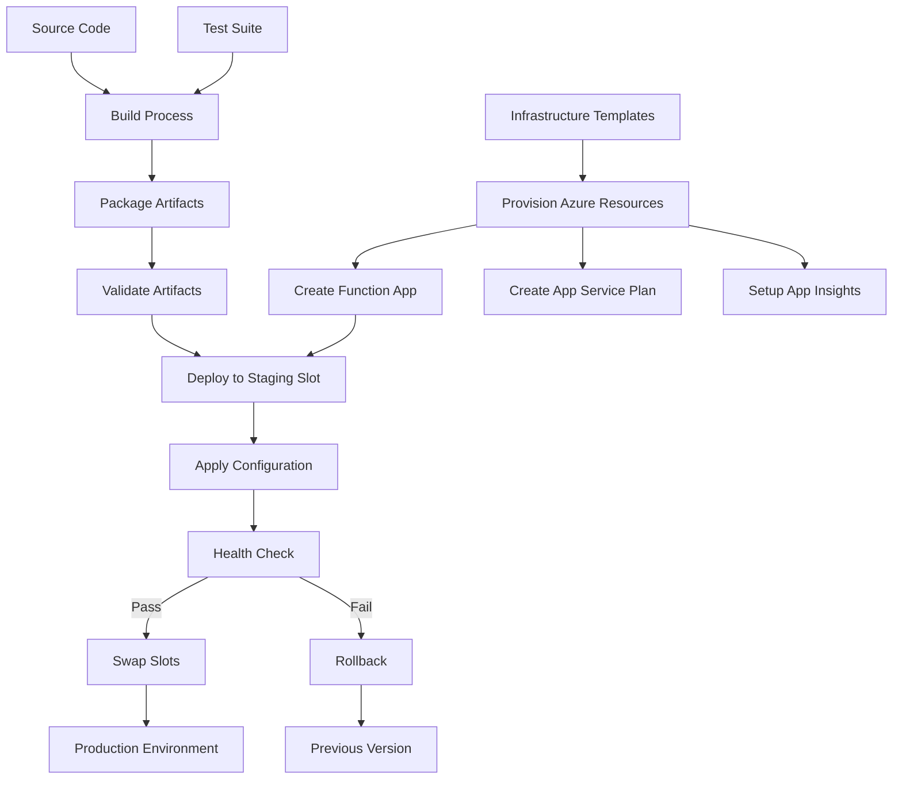
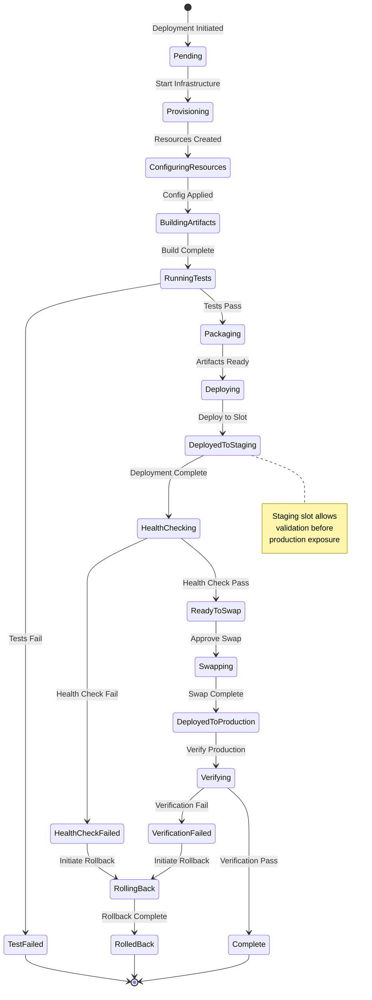

# Serverless Deployment

## Metadata

- **Name**: Serverless Deployment
- **Type**: Enabler
- **ID**: ENB-026400
- **Approval**: Approved
- **Capability ID**: CAP-026386
- **Owner**: DevOps Team
- **Status**: Ready for Implementation
- **Priority**: High
- **Analysis Review**: Not Required
- **Code Review**: Not Required

## Technical Overview
### Purpose
Deploy Azure Functions to Azure cloud infrastructure using serverless deployment patterns with automated CI/CD, infrastructure as code, and environment-specific configurations. Ensure consistent, repeatable deployments across development, test, and production environments.

## Functional Requirements

| ID | Name | Requirement | Priority | Status | Approval |
|----|------|-------------|----------|--------|----------|
| FR-026401 | IaC Deployment | Use Infrastructure as Code (ARM templates, Bicep, or Terraform) for function app deployment | Must Have | Ready for Implementation | Approved |
| FR-026402 | ZIP Deployment | Support ZIP deployment for function code using Azure Functions Core Tools or Azure CLI | Must Have | Ready for Implementation | Approved |
| FR-026403 | Consumption Plan | Deploy to Azure Functions Consumption Plan for automatic scaling and pay-per-execution billing | Must Have | Ready for Implementation | Approved |
| FR-026404 | Application Settings | Configure application settings and connection strings through deployment templates | Must Have | Ready for Implementation | Approved |
| FR-026405 | Deployment Slots | Support deployment slots for staging and production with slot swapping capability | Medium | Ready for Implementation | Approved |
| FR-026406 | Function Keys | Manage function-level and host-level keys for authentication | Must Have | Ready for Implementation | Approved |
| FR-026407 | Continuous Deployment | Integrate with Azure DevOps or GitHub Actions for CI/CD pipeline | Must Have | Ready for Implementation | Approved |

## Non-Functional Requirements

| ID | Name | Type | Requirement | Priority | Status | Approval |
|----|------|------|-------------|----------|--------|----------|
| NFR-026408 | Deployment Time | Complete function deployment in under 5 minutes for code-only updates | Must Have | Ready for Implementation | Approved |
| NFR-026409 | Zero Downtime | Ensure zero downtime deployments using slot swapping or blue-green deployment | High | Ready for Implementation | Approved |
| NFR-026410 | Rollback Capability | Support quick rollback to previous deployment version within 2 minutes | Must Have | Ready for Implementation | Approved |
| NFR-026411 | Deployment Security | Use managed identity and RBAC for deployment authentication, never store credentials in code | Must Have | Ready for Implementation | Approved |
| NFR-026412 | Multi-Region | Support multi-region deployment for high availability and disaster recovery | Medium | Ready for Implementation | Approved |
| NFR-026413 | Resource Tagging | Apply consistent tags to all deployed Azure resources for cost tracking and governance | Must Have | Ready for Implementation | Approved |

## Dependencies

### Internal Upstream Dependency

| Enabler ID | Description |
|------------|-------------|
| ENB-613819 | Azure Function Runtime must be compatible with target Azure Functions version |
| ENB-068592 | Environment Configuration provides deployment-specific settings |

### Internal Downstream Impact

| Enabler ID | Description |
|------------|-------------|
| | |

### External Dependencies

**External Upstream Dependencies**: Azure Functions service, Azure Resource Manager, Azure DevOps/GitHub Actions

**External Downstream Impact**: Deployed functions serve client applications and integrations

## Technical Specifications

### Enabler Dependency Flow Diagram

### API Technical Specifications

| API Type | Operation | Channel / Endpoint | Description | Request / Publish Payload | Response / Subscribe Data |
|----------|-----------|---------------------|-------------|----------------------------|----------------------------|
| CLI | Command | func azure functionapp publish <app-name> | Deploy function to Azure | Function code | Deployment status |
| CLI | Command | az functionapp deployment slot create | Create deployment slot | Slot name | Slot details |
| CLI | Command | az functionapp deployment slot swap | Swap staging to production | Source and target slots | Swap status |
| ARM | API | PUT /subscriptions/{id}/resourceGroups/{rg}/providers/Microsoft.Web/sites/{name} | Create/update function app | ARM template | Deployment result |
| DevOps | Task | AzureFunctionApp@1 | Azure DevOps deployment task | Configuration | Task result |

### Data Models

### Class Diagrams

### Sequence Diagrams

### Dataflow Diagrams

### State Diagrams

