# Package Management

## Metadata

- **Name**: Package Management
- **Type**: Enabler
- **ID**: ENB-026420
- **Approval**: Approved
- **Capability ID**: CAP-026386
- **Owner**: DevOps Team
- **Status**: Ready for Implementation
- **Priority**: High
- **Analysis Review**: Not Required
- **Code Review**: Not Required

## Technical Overview
### Purpose
Manage Node.js and Python package dependencies for Azure Functions, including installation, version control, vulnerability scanning, and optimization for deployment. Support both npm/pnpm for Node.js functions and pip for Python functions with consistent dependency management practices.

## Functional Requirements

| ID | Name | Requirement | Priority | Status | Approval |
|----|------|-------------|----------|--------|----------|
| FR-026421 | NPM Package Management | Use npm or pnpm for Node.js function dependencies with package.json | Must Have | Ready for Implementation | Approved |
| FR-026422 | Python Package Management | Use pip with requirements.txt for Python function dependencies | Must Have | Ready for Implementation | Approved |
| FR-026423 | Dependency Locking | Lock dependency versions using package-lock.json (npm), pnpm-lock.yaml (pnpm), or requirements.txt with pinned versions | Must Have | Ready for Implementation | Approved |
| FR-026424 | Semantic Versioning | Follow semantic versioning for all dependency declarations | Must Have | Ready for Implementation | Approved |
| FR-026425 | Vulnerability Scanning | Integrate npm audit or pip-audit to scan for known security vulnerabilities | Must Have | Ready for Implementation | Approved |
| FR-026426 | Dependency Installation | Install dependencies during build process, not runtime (cold start optimization) | Must Have | Ready for Implementation | Approved |
| FR-026427 | Private Registry | Support private package registries (.npmrc for npm/pnpm, pip.conf for pip) | Medium | Ready for Implementation | Approved |
| FR-026428 | Dependency Pruning | Use production-only dependencies in Azure deployment (npm ci --production, pip install -r requirements.txt) | Must Have | Ready for Implementation | Approved |
| FR-026429 | Azure Functions Extensions | Manage Azure Functions Core Tools extensions (extensions.csproj for bindings) | Must Have | Ready for Implementation | Approved |

## Non-Functional Requirements

| ID | Name | Type | Requirement | Priority | Status | Approval |
|----|------|------|-------------|----------|--------|----------|
| NFR-026430 | Cold Start Optimization | Keep dependency bundle size under 10MB to minimize cold start time | Must Have | Ready for Implementation | Approved |
| NFR-026431 | Deployment Speed | Complete dependency installation in CI/CD pipeline in under 2 minutes | High | Ready for Implementation | Approved |
| NFR-026432 | Security Compliance | Ensure all dependencies pass vulnerability scans with no critical or high vulnerabilities | Must Have | Ready for Implementation | Approved |
| NFR-026433 | Reproducible Builds | Guarantee reproducible builds through locked dependencies across all environments | Must Have | Ready for Implementation | Approved |
| NFR-026434 | Cache Optimization | Use package manager cache in CI/CD to reduce installation time by 50% | Medium | Ready for Implementation | Approved |

## Dependencies

### Internal Upstream Dependency

| Enabler ID | Description |
|------------|-------------|
| ENB-613819 | Azure Function Runtime defines Node.js and Python versions for compatibility |
| ENB-026400 | Serverless Deployment installs dependencies during deployment |

### Internal Downstream Impact

| Enabler ID | Description |
|------------|-------------|
| ENB-613840 | HTTP Trigger Handler depends on installed packages (express, middleware) |
| ENB-613860 | Function Bindings may require additional Azure SDK packages |

### External Dependencies

**External Upstream Dependencies**: npm registry, pnpm registry, PyPI, private package registries, Azure Artifacts

**External Downstream Impact**: Function runtime loads installed packages at execution

## Technical Specifications

### Enabler Dependency Flow Diagram

```mermaid
flowchart TD
    ENB_026420["ENB-026420<br/>Package Management<br/>📦"]
    
    NODEJS["Node.js Functions<br/>package.json<br/>🟢"]
    PYTHON["Python Functions<br/>requirements.txt<br/>🐍"]
    
    NODEJS --> ENB_026420
    PYTHON --> ENB_026420
    
    NPM["npm Registry<br/>npmjs.com<br/>📚"]
    PNPM["pnpm<br/>Fast Package Manager<br/>⚡"]
    PIP["PyPI<br/>Python Package Index<br/>🐍"]
    PRIVATE["Private Registry<br/>Azure Artifacts<br/>🔒"]
    
    NPM --> ENB_026420
    PNPM --> ENB_026420
    PIP --> ENB_026420
    PRIVATE --> ENB_026420
    
    LOCK["Dependency Locking<br/>package-lock.json<br/>🔐"]
    SCAN["Vulnerability Scan<br/>npm audit / pip-audit<br/>🛡️"]
    INSTALL["Installation<br/>CI/CD Pipeline<br/>⚙️"]
    
    ENB_026420 --> LOCK
    ENB_026420 --> SCAN
    ENB_026420 --> INSTALL
    
    DEPLOY["Deployment Package<br/>node_modules / site-packages<br/>📦"]
    AZURE["Azure Functions<br/>Runtime<br/>☁️"]
    
    INSTALL --> DEPLOY
    DEPLOY --> AZURE

    classDef enabler fill:#e3f2fd,stroke:#1976d2,stroke-width:2px
    classDef source fill:#f3e5f5,stroke:#7b1fa2,stroke-width:2px
    classDef registry fill:#fff3e0,stroke:#f57c00,stroke-width:2px
    classDef process fill:#e8f5e8,stroke:#388e3c,stroke-width:2px
    
    class ENB_026420 enabler
    class NODEJS,PYTHON source
    class NPM,PNPM,PIP,PRIVATE registry
    class LOCK,SCAN,INSTALL,DEPLOY,AZURE process
```

### API Technical Specifications

| API Type | Operation | Channel / Endpoint | Description | Request / Publish Payload | Response / Subscribe Data |
|----------|-----------|---------------------|-------------|----------------------------|----------------------------|
| CLI | Command | npm install | Install Node.js dependencies | package.json | Installed packages |
| CLI | Command | npm ci --production | Clean install production deps | package-lock.json | Installed packages |
| CLI | Command | pnpm install --frozen-lockfile | Install with pnpm | pnpm-lock.yaml | Installed packages |
| CLI | Command | pip install -r requirements.txt | Install Python dependencies | requirements.txt | Installed packages |
| CLI | Command | npm audit | Scan for vulnerabilities | package-lock.json | Vulnerability report |
| CLI | Command | pip-audit | Scan Python vulnerabilities | requirements.txt | Vulnerability report |
| CLI | Command | func extensions install | Install Azure Functions extensions | extensions.csproj | Installed extensions |
| File | Config | .npmrc | npm configuration | Registry URL, auth token | - |
| File | Config | pip.conf | pip configuration | Registry URL, auth | - |

### Data Models

### Class Diagrams

### Sequence Diagrams

### Dataflow Diagrams

### State Diagrams

