# Folder Structure

## Metadata

- **Name**: Folder Structure
- **Type**: Enabler
- **ID**: ENB-026440
- **Approval**: Approved
- **Capability ID**: CAP-026386
- **Owner**: DevOps Team
- **Status**: Ready for Implementation
- **Priority**: High
- **Analysis Review**: Not Required
- **Code Review**: Not Required

## Technical Overview
### Purpose
Establish a standardized folder structure for Azure Functions development that separates specifications from implementation, supports multiple function handlers, enables environment-specific configurations, and follows Azure Functions best practices for maintainability and scalability.

## Functional Requirements

| ID | Name | Requirement | Priority | Status | Approval |
|----|------|-------------|----------|--------|----------|
| FR-026441 | Specifications Separation | Create a dedicated subfolder named after the project (e.g., function/) that contains ALL implementation code, dependencies, and build files. The root folder must only contain specifications/, documentation, and project-level files. | Must Have | Ready for Implementation | Approved |
| FR-026442 | Function Handlers | Organize individual function handlers in src/ directory with one folder per function | Must Have | Ready for Implementation | Approved |
| FR-026443 | Shared Code | Use shared/ or lib/ directory for common utilities, models, and helpers used across functions | Must Have | Ready for Implementation | Approved |
| FR-026444 | Configuration Files | Place host.json, local.settings.json, and function.json files in appropriate locations per Azure Functions conventions | Must Have | Ready for Implementation | Approved |
| FR-026445 | Test Organization | Store tests in tests/ or __tests__/ directory mirroring the src/ structure | Must Have | Ready for Implementation | Approved |
| FR-026446 | TypeScript Support | Place tsconfig.json at root with compiled output in dist/ directory | Must Have | Ready for Implementation | Approved |
| FR-026448 | Environment Files | Support .env files for local development with .env.example template (never commit actual .env) | Must Have | Ready for Implementation | Approved |

## Non-Functional Requirements

| ID | Name | Type | Requirement | Priority | Status | Approval |
|----|------|------|-------------|----------|--------|----------|
| NFR-026449 | Maintainability | Structure must support easy addition of new functions without restructuring | Must Have | Ready for Implementation | Approved |
| NFR-026450 | Scalability | Support up to 100 individual function handlers without organizational complexity | High | Ready for Implementation | Approved |
| NFR-026451 | Build Performance | Enable incremental builds and selective function deployment | Medium | Ready for Implementation | Approved |
| NFR-026452 | Developer Experience | Provide clear, intuitive navigation with consistent naming conventions | Must Have | Ready for Implementation | Approved |
| NFR-026453 | CI/CD Integration | Structure must support automated build, test, and deployment pipelines | Must Have | Ready for Implementation | Approved |

## Dependencies

### Internal Upstream Dependency

| Enabler ID | Description |
|------------|-------------|
| ENB-613819 | Azure Function Runtime defines function.json structure and conventions |
| ENB-026420 | Package Management defines location of package.json and node_modules |

### Internal Downstream Impact

| Enabler ID | Description |
|------------|-------------|
| ENB-026400 | Serverless Deployment packages and deploys the folder structure |
| ENB-613840 | HTTP Trigger Handler implements functions within this structure |

### External Dependencies

**External Upstream Dependencies**: Azure Functions Core Tools conventions, TypeScript compiler

**External Downstream Impact**: Developers navigate and contribute code within this structure

## Technical Specifications

### Enabler Dependency Flow Diagram

```mermaid
flowchart TD
    ENB_026440["ENB-026440<br/>Folder Structure<br/>📁"]
    
    ROOT["Repository Root<br/>lease-sentry<br/>📦"]
    SPECS["specifications/<br/>Capability Specs<br/>📄"]
    FUNCTION_ROOT["function/<br/>Function Component<br/>⚡"]
    
    ROOT --> SPECS
    ROOT --> FUNCTION_ROOT
    FUNCTION_ROOT --> ENB_026440
    
    SRC["src/<br/>Function Handlers<br/>🔧"]
    SHARED["shared/<br/>Common Code<br/>📚"]
    TESTS["tests/<br/>Test Suites<br/>✅"]
    CONFIG["Configuration<br/>host.json, tsconfig<br/>⚙️"]
    
    ENB_026440 --> SRC
    ENB_026440 --> SHARED
    ENB_026440 --> TESTS
    ENB_026440 --> CONFIG
    
    FUNC1["Function1/<br/>index.ts, function.json<br/>📝"]
    FUNC2["Function2/<br/>index.ts, function.json<br/>📝"]
    FUNCN["FunctionN/<br/>index.ts, function.json<br/>📝"]
    
    SRC --> FUNC1
    SRC --> FUNC2
    SRC --> FUNCN
    
    UTILS["utils/<br/>Helpers<br/>🛠️"]
    MODELS["models/<br/>Data Models<br/>📊"]
    MIDDLEWARE["middleware/<br/>Express Middleware<br/>🔀"]
    
    SHARED --> UTILS
    SHARED --> MODELS
    SHARED --> MIDDLEWARE

    classDef enabler fill:#e3f2fd,stroke:#1976d2,stroke-width:2px
    classDef root fill:#f3e5f5,stroke:#7b1fa2,stroke-width:2px
    classDef primary fill:#fff3e0,stroke:#f57c00,stroke-width:2px
    classDef secondary fill:#e8f5e8,stroke:#388e3c,stroke-width:2px
    
    class ENB_026440 enabler
    class ROOT,SPECS,FUNCTION_ROOT root
    class SRC,SHARED,TESTS,CONFIG primary
    class FUNC1,FUNC2,FUNCN,UTILS,MODELS,MIDDLEWARE secondary
```


### API Technical Specifications

| API Type | Operation | Channel / Endpoint | Description | Request / Publish Payload | Response / Subscribe Data |
|----------|-----------|---------------------|-------------|----------------------------|----------------------------|
| File | Structure | function/src/{functionName}/index.ts | Function handler entry point | HTTP request | HTTP response |
| File | Structure | function/src/{functionName}/function.json | Function bindings configuration | - | - |
| File | Structure | function/host.json | Global function app settings | - | - |
| File | Structure | function/local.settings.json | Local development settings | - | - |
| File | Structure | function/shared/utils/ | Shared utility functions | - | - |
| File | Structure | function/shared/models/ | TypeScript interfaces and types | - | - |
| File | Structure | function/tests/{functionName}.test.ts | Function unit tests | - | - |
| File | Structure | function/tsconfig.json | TypeScript configuration | - | - |
| File | Structure | function/package.json | Node.js dependencies | - | - |

### Data Models


### Class Diagrams


### Sequence Diagrams


### Dataflow Diagrams
```mermaid
flowchart TD
    Request[HTTP Request] --> Router[Azure Functions Router]
    
    Router --> Function[Function Handler<br/>src/{name}/index.ts]
    
    Function --> Config[Load function.json<br/>Bindings Configuration]
    Function --> Shared[Import Shared Modules<br/>shared/utils, models]
    
    Shared --> Utils[Utility Functions<br/>shared/utils/]
    Shared --> Models[Data Models<br/>shared/models/]
    Shared --> Middleware[Middleware<br/>shared/middleware/]
    
    Function --> Logic[Business Logic]
    Logic --> Response[HTTP Response]
    
    Tests[Test Suite<br/>tests/{name}.test.ts] --> Function
    Tests --> Shared
```

### State Diagrams


