# Environment Configuration

## Metadata

- **Name**: Environment Configuration
- **Type**: Enabler
- **ID**: ENB-068592
- **Approval**: Approved
- **Capability ID**: CAP-068587
- **Owner**: Development Team
- **Status**: Ready for Implementation
- **Priority**: High
- **Analysis Review**: Not Required
- **Code Review**: Not Required

## Technical Overview
### Purpose
Configure and manage environment settings including environment variables, runtime versions, system paths, and platform-specific configurations to ensure consistent serverless function execution across different environments of development, test, and production.

Each environment SHALL have distinct configuration to prevent cross-environment contamination and enable environment-specific optimizations for serverless deployment.

## Functional Requirements

| ID | Name | Requirement | Priority | Status | Approval |
|----|------|-------------|----------|--------|----------|
| FR-068593 | Environment Variables | Support configuration and management of environment variables for different runtime stages. Serverless Deployments: Provide separate configuration for three environments: (1) production configuration with minimal logging and optimized settings, (2) development configuration with verbose logging and debug mode, (3) testing configuration with test endpoints and mock services. Each SHALL define environment-specific variables including log levels, API endpoints, service URLs, authentication keys, and feature flags appropriate to that environment. | Must Have | Ready for Implementation | Approved |
| FR-068594 | Runtime Version Management | Manage and configure specific runtime versions for Node.js serverless functions with their dependencies | Must Have | Ready for Implementation | Approved |
| FR-068595 | Configuration Files | Support .env configuration file format with environment-specific variants (.env.development, .env.test, .env.production) for local development and deployment automation | Must Have | Ready for Implementation | Approved |
| FR-068596 | Environment Isolation | Provide complete isolation between development, testing, and production environments through separate configuration files, deployment stages, and environment variable namespacing to prevent configuration leakage across environments | Must Have | Ready for Implementation | Approved |
| FR-068597 | Serverless Framework Integration | Integrate with serverless deployment frameworks (Azure Functions) to inject environment-specific configuration during deployment | Must Have | Ready for Implementation | Approved |

## Non-Functional Requirements

| ID | Name | Type | Requirement | Priority | Status | Approval |
|----|------|------|-------------|----------|--------|----------|
| NFR-068598 | Configuration Security | Security | Sensitive configuration data must be encrypted or stored securely using cloud provider secrets management (AWS Secrets Manager, Azure Key Vault). Development and test environments MAY use plain-text configuration files with .gitignore protection. Production MUST use managed secrets services. | Must Have | Ready for Implementation | Approved |
| NFR-068599 | Cold Start Optimization | Performance | Configuration loading must add no more than 50ms to cold start time for serverless functions | Must Have | Ready for Implementation | Approved |
| NFR-068600 | Validation | Quality | Validate configuration values against schemas before function execution to fail fast on misconfiguration | Must Have | Ready for Implementation | Approved |
| NFR-068601 | Deployment Standards | Standards | All serverless deployment configurations MUST follow cloud provider best practices with proper IAM roles, resource limits, timeout settings, and memory allocation appropriate to each environment | Must Have | Ready for Implementation | Approved |

## Dependencies

### Internal Upstream Dependency

| Enabler ID | Description |
|------------|-------------|
| | |

### Internal Downstream Impact

| Enabler ID | Description |
|------------|-------------|
| ENB-XXXXXX | Serverless functions use environment configuration |
| ENB-XXXXXX | API Gateway uses environment settings |
| ENB-XXXXXX | Logging service uses environment-specific log levels |

### External Dependencies

**External Upstream Dependencies**: Cloud provider services (AWS/Azure/GCP), secrets management services, serverless deployment frameworks

**External Downstream Impact**: All serverless function components depend on environment configuration

## Technical Specifications

### Enabler Dependency Flow Diagram

```mermaid
flowchart TD
    ENB_068592["ENB-068592<br/>Serverless Environment Config<br/>⚙️"]
    
    ENV_FILES[".env Files<br/>Environment Variables<br/>📄"]
    SERVERLESS_CONFIG["Serverless Config<br/>serverless.yml/template.yaml<br/>📋"]
    SECRETS["Cloud Secrets<br/>AWS Secrets Manager/Key Vault<br/>🔐"]
    VALIDATOR["Config Validator<br/>Schema Validation<br/>✅"]
    
    ENV_FILES --> ENB_068592
    SERVERLESS_CONFIG --> ENB_068592
    SECRETS --> ENB_068592
    ENB_068592 --> VALIDATOR
    
    LAMBDA["Serverless Functions<br/>Lambda/Azure Functions<br/>⚡"]
    API_GW["API Gateway<br/>HTTP Endpoints<br/>🌐"]
    
    ENB_068592 --> LAMBDA
    ENB_068592 --> API_GW

    classDef enabler fill:#e3f2fd,stroke:#1976d2,stroke-width:2px
    classDef source fill:#f3e5f5,stroke:#7b1fa2,stroke-width:2px
    classDef target fill:#e8f5e8,stroke:#388e3c,stroke-width:2px
    
    class ENB_068592 enabler
    class ENV_FILES,SERVERLESS_CONFIG,SECRETS,VALIDATOR source
    class LAMBDA,API_GW target
```


### Serverless Environment Configuration

**Required Configuration Files:**

| File | Environment | Purpose | Key Settings |
|------|-------------|---------|--------------|
| `serverless.yml` or `template.yaml` | All | Infrastructure as Code | Function definitions, API Gateway routes, IAM roles, resource limits |
| `.env.production` | Production | Production deployment | Minimal logging (warn/error), production endpoints, secrets via cloud services, optimized memory/timeout |
| `.env.development` | Development | Local development | Verbose logging (debug), local/mock endpoints, development API keys, generous timeouts |
| `.env.test` | Test | CI/CD testing | Structured logging, test endpoints, mock services, short timeouts for fast feedback |

**AWS SAM Example:**
```yaml
# template.yaml
Parameters:
  Environment:
    Type: String
    Default: dev
    AllowedValues: [dev, test, prod]

Resources:
  MyFunction:
    Type: AWS::Serverless::Function
    Properties:
      Environment:
        Variables:
          LOG_LEVEL: !If [IsProd, 'warn', 'debug']
          STAGE: !Ref Environment
```

**Serverless Framework Example:**
```yaml
# serverless.yml
provider:
  environment:
    LOG_LEVEL: ${env:LOG_LEVEL, 'info'}
    API_ENDPOINT: ${env:API_ENDPOINT}
    
functions:
  myFunction:
    handler: handler.main
    environment:
      FUNCTION_ENV: ${opt:stage, 'dev'}
```

**Environment Variable Strategy:**
- `.env` - Default/shared variables (gitignored)
- `.env.example` - Template with placeholder values (committed)
- `.env.development` - Development overrides (gitignored, optional)
- `.env.test` - Test environment values (committed, non-sensitive)
- `.env.production` - Production values (NEVER committed, use cloud secrets)

### API Technical Specifications

| API Type | Operation | Channel / Endpoint | Description | Request / Publish Payload | Response / Subscribe Data |
|----------|-----------|---------------------|-------------|----------------------------|----------------------------|
| Internal | Method | config.get(key) | Retrieve configuration value with caching for performance | `{key: string}` | `any` |
| Internal | Method | config.getSecret(key) | Retrieve secret from cloud provider secrets manager | `{key: string}` | `Promise<string>` |
| Internal | Method | config.validate(schema) | Validate configuration against schema at startup | `{schema: object}` | `{valid: boolean, errors: array}` |
| Internal | Method | process.env[KEY] | Direct environment variable access (standard Node.js/Python) | None | `string | undefined` |
| Cloud | Service | AWS Secrets Manager | Retrieve encrypted secrets for production | `{SecretId: string}` | `{SecretString: string}` |
| Cloud | Service | Azure Key Vault | Retrieve secrets for Azure Functions | `{vaultName: string, secretName: string}` | `{value: string}` |

### Data Models


### Class Diagrams


### Sequence Diagrams


### Dataflow Diagrams


### State Diagrams


