# Function Unit Testing

## Metadata

- **Name**: Function Unit Testing
- **Type**: Enabler
- **ID**: ENB-457158
- **Approval**: Approved
- **Capability ID**: CAP-457157
- **Owner**: Development Team
- **Status**: Ready for Implementation
- **Priority**: High
- **Analysis Review**: Not Required
- **Code Review**: Not Required

## Technical Overview
### Purpose
Implement comprehensive unit tests for all functions defined in the specifications function context validation, bindings, response formatting, error handling, and edge cases to ensure function reliability and prevent regressions.

## Functional Requirements

| ID | Name | Requirement | Priority | Status | Approval |
|----|------|-------------|----------|--------|----------|
| FR-457159 | HTTP Trigger Tests | Unit tests for all triggered functions including success, validation, and error scenarios | Must Have | Ready for Implementation | Approved |
| FR-457163 | Context Object Tests | Tests for function context including logging, bindings, invocationId, and execution metadata | Must Have | Ready for Implementation | Approved |
| FR-457166 | Error Handling Tests | Tests for all error scenarios including retries, poison queues, and error logging | Must Have | Ready for Implementation | Approved |
| FR-457167 | Edge Case Tests | Tests for boundary conditions, null values, empty triggers, and malformed data | Must Have | Ready for Implementation | Approved |

## Non-Functional Requirements

| ID | Name | Type | Requirement | Priority | Status | Approval |
|----|------|------|-------------|----------|--------|----------|
| NFR-457168 | Test Coverage | Quality | Achieve minimum 90% code coverage for all function handlers | Must Have | Ready for Implementation | Approved |
| NFR-457169 | Test Execution Speed | Performance | All unit tests should complete within 10 seconds | Must Have | Ready for Implementation | Approved |
| NFR-457170 | Test Isolation | Quality | Each test should be independent with mocked dependencies (Azure services, bindings) | Must Have | Ready for Implementation | Approved |
| NFR-457171 | Test Maintainability | Maintainability | Tests should be clear, well-documented, and easy to update when function specs change | Must Have | Ready for Implementation | Approved |
| NFR-457172 | Automated Execution | Automation | Tests should run automatically on every code commit via CI/CD pipeline | Must Have | Ready for Implementation | Approved |

## Dependencies

### Internal Upstream Dependency

| Enabler ID | Description |
|------------|-------------|
| ENB-613819 | Azure Function Runtime provides function signature and context object for testing |
| ENB-613840 | HTTP Trigger Handler functions being tested |
| ENB-613860 | Function Bindings being tested |

### Internal Downstream Impact

| Enabler ID | Description |
|------------|-------------|
| | |

### External Dependencies

**External Upstream Dependencies**: Jest or Mocha testing frameworks, @azure/functions testing utilities, sinon for mocking

**External Downstream Impact**: CI/CD pipeline quality gates, deployment validation

## Technical Specifications

### Enabler Dependency Flow Diagram

### API Technical Specifications

| API Type | Operation | Channel / Endpoint | Description | Request / Publish Payload | Response / Subscribe Data |
|----------|-----------|---------------------|-------------|----------------------------|----------------------------|
| Test | Function Call | jest.fn() | Mock Azure Function execution | Context, trigger data | Function result |
| Test | Mock | sinon.stub() | Mock Azure services (Blob, Queue, Cosmos) | Service calls | Stubbed responses |
| Test | Assertion | expect() | Verify function behavior | Function output | Pass/Fail |
| Test | Coverage | jest --coverage | Generate coverage report | Test execution | Coverage metrics |
| Test | Context Mock | createContext() | Create mock function context | Context properties | Mock context object |

### Data Models

### Class Diagrams

### Sequence Diagrams

```mermaid
sequenceDiagram
    participant Dev as Developer
    participant Test as Test Suite
    participant Mock as Mock Factory
    participant Function as Azure Function
    participant Assert as Assertion
    
    Dev->>Test: Run test suite
    Test->>Mock: Create mock context
    Mock-->>Test: Mock context object
    
    Test->>Mock: Create mock request/trigger
    Mock-->>Test: Mock trigger data
    
    Test->>Function: Execute function(context, trigger)
    Function->>Function: Process logic
    Function->>Function: Write to bindings
    Function-->>Test: Return result
    
    Test->>Assert: Verify result
    Assert->>Assert: Check status code
    Assert->>Assert: Check response body
    Assert->>Assert: Check bindings
    
    alt Test Passes
        Assert-->>Test: Assertion success
        Test-->>Dev: Test passed ✅
    else Test Fails
        Assert-->>Test: Assertion failure
        Test-->>Dev: Test failed ❌ with details
    end
    
    Test->>Test: Generate coverage report
    Test-->>Dev: Coverage metrics
```

### Dataflow Diagrams

```mermaid
flowchart TD
    TestFile[Test File<br/>*.test.ts] --> TestRunner[Test Runner<br/>Jest/Mocha]
    
    TestRunner --> MockFactory[Mock Factory]
    MockFactory --> MockContext[Mock Context Object]
    MockFactory --> MockTrigger[Mock Trigger Data]
    MockFactory --> MockServices[Mock Azure Services]
    
    TestRunner --> FunctionExecution[Execute Function]
    MockContext --> FunctionExecution
    MockTrigger --> FunctionExecution
    
    FunctionExecution --> FunctionCode[Function Implementation]
    FunctionCode --> BusinessLogic[Business Logic]
    
    BusinessLogic --> Bindings[Output Bindings]
    BusinessLogic --> Response[Function Response]
    
    Response --> Assertions[Assertions]
    Bindings --> Assertions
    
    Assertions --> Pass{All Pass?}
    Pass -->|Yes| CoverageCheck[Coverage Analysis]
    Pass -->|No| FailReport[Failure Report]
    
    CoverageCheck --> Threshold{>= 90%?}
    Threshold -->|Yes| Success[Test Success ✅]
    Threshold -->|No| LowCoverage[Low Coverage Warning ⚠️]
    
    Success --> Pipeline[CI/CD Pipeline]
    LowCoverage --> Pipeline
    FailReport --> Pipeline
```

### State Diagrams

