# Azure Function Runtime

## Metadata

- **Name**: Azure Function Runtime
- **Type**: Enabler
- **ID**: ENB-613819
- **Approval**: Approved
- **Capability ID**: CAP-613818
- **Owner**: Development Team
- **Status**: Ready for Implementation
- **Priority**: High
- **Analysis Review**: Not Required
- **Code Review**: Not Required

## Technical Overview
### Purpose
Implement Azure Functions using Node.js runtime with the standard serverless function pattern: `module.exports = async function (context, req)`. Provide the foundational runtime environment, execution context, and lifecycle management for serverless function execution on Azure.

## Functional Requirements

| ID | Name | Requirement | Priority | Status | Approval |
|----|------|-------------|----------|--------|----------|
| FR-613820 | Node.js Runtime | Use Node.js LTS version (v20.x or later) as the Azure Functions runtime | High | Ready for Implementation | Approved |
| FR-613821 | Function Signature | Implement standard Azure Function signature: `module.exports = async function (context, req)` for all HTTP-triggered functions | High | Ready for Implementation | Approved |
| FR-613822 | Context Object | Provide context object with logging, bindings, execution metadata, and invocation tracking | High | Ready for Implementation | Approved |
| FR-613823 | Async/Await Support | Support async/await pattern for all function handlers with proper promise resolution | High | Ready for Implementation | Approved |
| FR-613824 | Function Configuration | Support function.json configuration files for triggers, bindings, and runtime settings | High | Ready for Implementation | Approved |
| FR-613825 | Local Development | Enable local development using Azure Functions Core Tools with hot reload | High | Ready for Implementation | Approved |
| FR-613826 | Error Handling | Implement standardized error handling with proper context.log error tracking | High | Ready for Implementation | Approved |
| FR-613827 | Environment Variables | Access environment variables and app settings through process.env | High | Ready for Implementation | Approved |
| FR-613828 | Response Formatting | Support Azure Function response format with status, body, and headers | High | Ready for Implementation | Approved |
| FR-613829 | Lifecycle Hooks | Provide lifecycle hooks for function initialization and cleanup | Medium | Ready for Implementation | Approved |

## Non-Functional Requirements

| ID | Name | Type | Requirement | Priority | Status | Approval |
|----|------|------|-------------|----------|--------|----------|
| NFR-613830 | Cold Start Time | Minimize cold start time to under 2 seconds for Node.js functions | High | Ready for Implementation | Approved |
| NFR-613831 | Memory Efficiency | Optimize memory usage to stay within 512MB allocation for typical workloads | High | Ready for Implementation | Approved |
| NFR-613832 | Execution Timeout | Support configurable timeout with maximum 10 minutes for long-running operations | Medium | Ready for Implementation | Approved |
| NFR-613833 | Concurrent Execution | Support concurrent function invocations with proper isolation | High | Ready for Implementation | Approved |
| NFR-613834 | Logging Performance | Context logging must not impact function performance by more than 5% | Medium | Ready for Implementation | Approved |
| NFR-613835 | Runtime Stability | Maintain 99.9% runtime availability excluding Azure platform issues | High | Ready for Implementation | Approved |
| NFR-613836 | Module Loading | Optimize npm module loading to minimize cold start impact | Medium | Ready for Implementation | Approved |
| NFR-613837 | Resource Cleanup | Ensure proper cleanup of resources after function execution | High | Ready for Implementation | Approved |

## Dependencies

### Internal Upstream Dependency

| Enabler ID | Description |
|------------|-------------|
| ENB-068592 | Environment Configuration provides runtime settings |

### Internal Downstream Impact

| Enabler ID | Description |
|------------|-------------|
| ENB-613840 | HTTP Trigger Handler uses runtime context |
| ENB-613860 | Function Bindings uses runtime context |

### External Dependencies

**External Upstream Dependencies**: Azure Functions Runtime, Node.js runtime, Azure Functions Core Tools

**External Downstream Impact**: All Azure Function handlers depend on this runtime implementation

## Technical Specifications

### Enabler Dependency Flow Diagram

```mermaid
flowchart TD
    ENB_613819["ENB-613819<br/>Azure Function Runtime<br/>⚡"]
    
    NODE_RUNTIME["Node.js Runtime<br/>v20.x LTS<br/>🔧"]
    AZURE_RUNTIME["Azure Functions Runtime<br/>v4.x<br/>☁️"]
    CORE_TOOLS["Azure Functions Core Tools<br/>Local Development<br/>🛠️"]
    
    NODE_RUNTIME --> ENB_613819
    AZURE_RUNTIME --> ENB_613819
    CORE_TOOLS --> ENB_613819
    
    ENB_068592["ENB-068592<br/>Environment Config<br/>⚙️"]
    ENB_068592 --> ENB_613819
    
    ENB_613840["ENB-613840<br/>HTTP Trigger<br/>🌐"]
    ENB_613860["ENB-613860<br/>Function Bindings<br/>🔗"]
    
    ENB_613819 --> ENB_613840
    ENB_613819 --> ENB_613860

    classDef enabler fill:#e3f2fd,stroke:#1976d2,stroke-width:2px
    classDef runtime fill:#f3e5f5,stroke:#7b1fa2,stroke-width:2px
    classDef downstream fill:#e8f5e8,stroke:#388e3c,stroke-width:2px
    
    class ENB_613819,ENB_068592 enabler
    class NODE_RUNTIME,AZURE_RUNTIME,CORE_TOOLS runtime
    class ENB_613840,ENB_613860 downstream
```

### API Technical Specifications

| API Type | Operation | Channel / Endpoint | Description | Request / Publish Payload | Response / Subscribe Data |
|----------|-----------|---------------------|-------------|----------------------------|----------------------------|
| Function | Handler | module.exports | Main function export for Azure Functions | `async function(context, req)` | Promise resolving to response |
| Context | Method | context.log(message) | Log messages to Application Insights | `{message: string}` | void |
| Context | Method | context.log.error(error) | Log error messages | `{error: Error}` | void |
| Context | Method | context.log.warn(message) | Log warning messages | `{message: string}` | void |
| Context | Method | context.done() | Complete function execution (legacy) | None | void |
| Context | Property | context.executionContext | Access execution metadata | None | `{invocationId: string, functionName: string}` |
| Context | Property | context.bindings | Access input/output bindings | None | `object` |
| CLI | Command | func start | Start local development server | None | Server running on localhost:7071 |
| CLI | Command | func new | Create new function from template | Template name | Generated function files |

### Data Models

### Class Diagrams

### Sequence Diagrams

### Dataflow Diagrams

### State Diagrams

