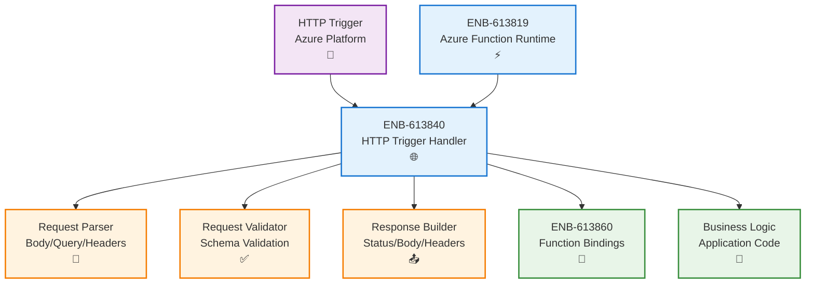
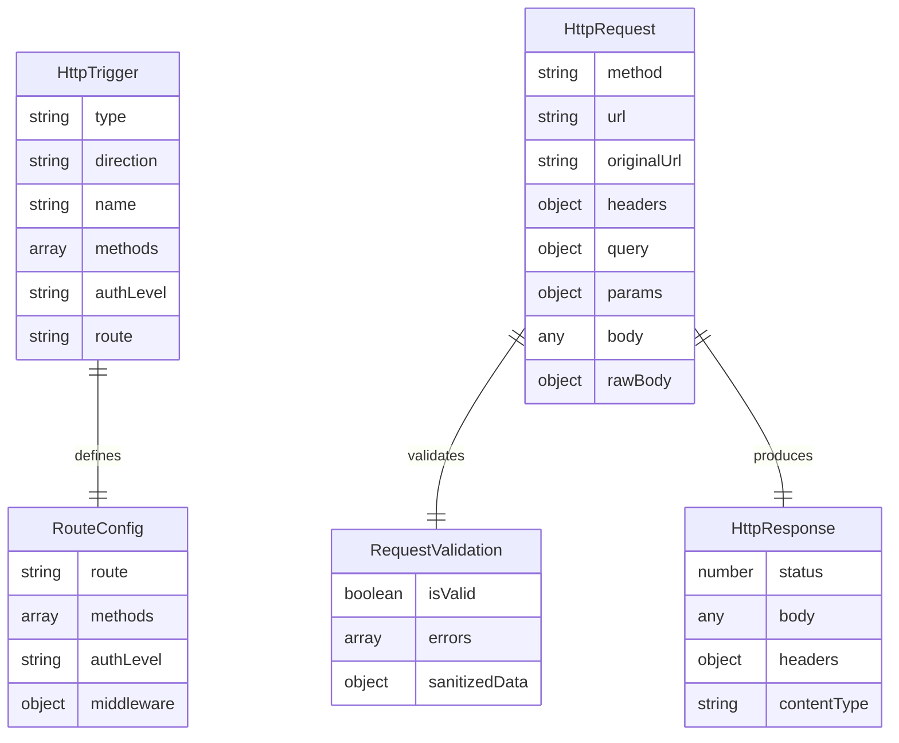
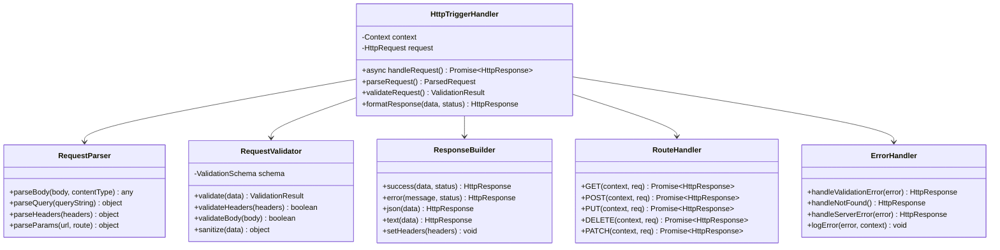
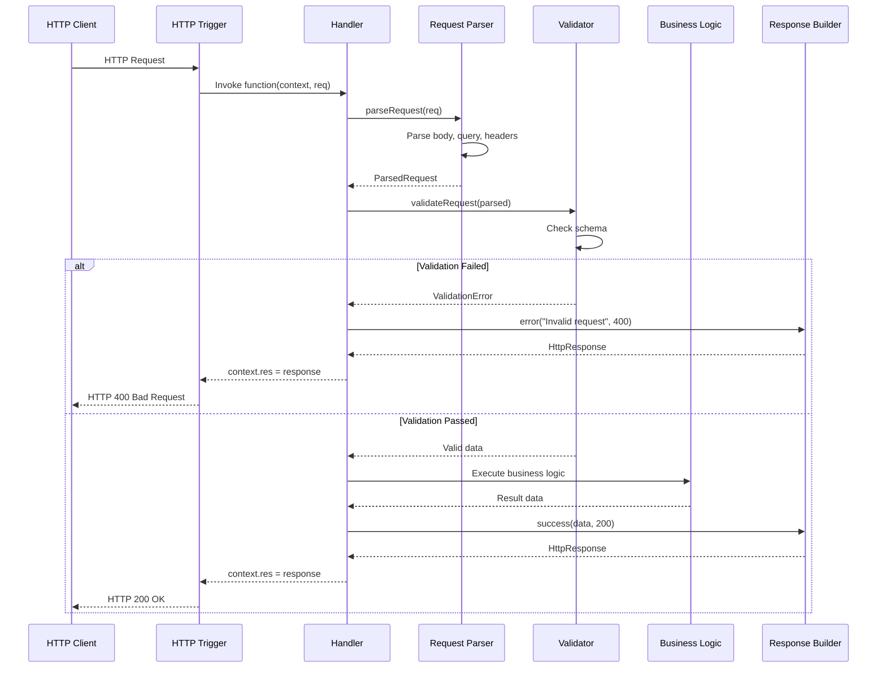
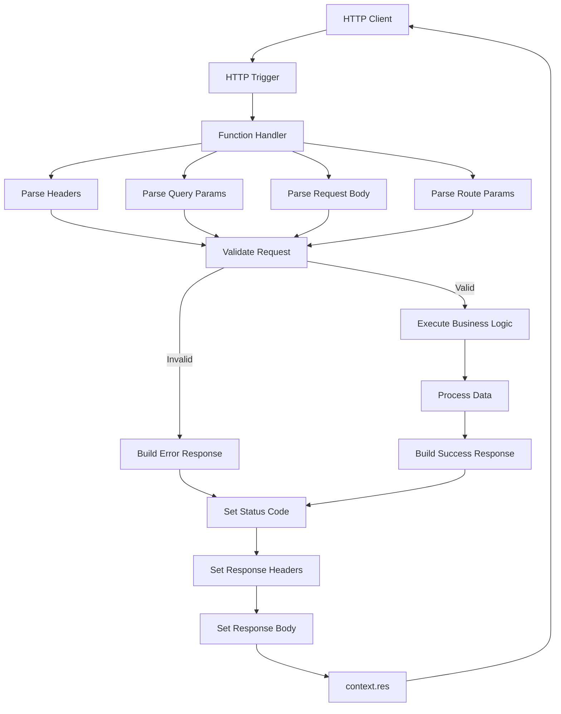
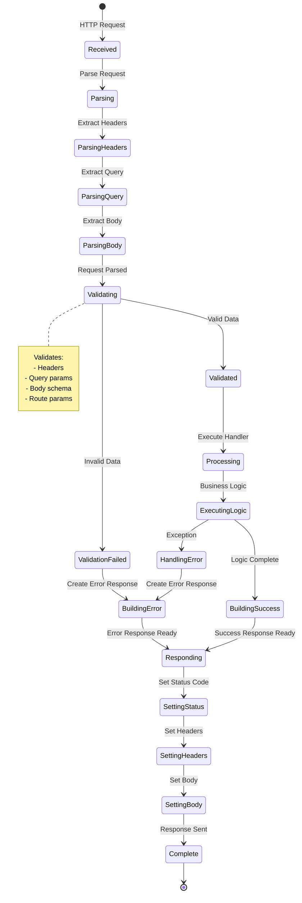

# HTTP Trigger Handler

## Metadata

- **Name**: HTTP Trigger Handler
- **Type**: Enabler
- **ID**: ENB-613840
- **Approval**: Approved
- **Capability ID**: CAP-613818
- **Owner**: Development Team
- **Status**: Ready for Implementation
- **Priority**: High
- **Analysis Review**: Not Required
- **Code Review**: Not Required

## Technical Overview
### Purpose
Implement HTTP-triggered Azure Functions that handle incoming HTTP requests, process them through business logic, and return HTTP responses. Support all HTTP methods (GET, POST, PUT, DELETE, PATCH) with proper request parsing, validation, and response formatting.

## Functional Requirements

| ID | Name | Requirement | Priority | Status | Approval |
|----|------|-------------|----------|--------|----------|
| FR-613841 | HTTP Methods Support | Support all standard HTTP methods: GET, POST, PUT, DELETE, PATCH, OPTIONS | High | Ready for Implementation | Approved |
| FR-613842 | Request Parsing | Automatically parse request body (JSON, form data, text) based on Content-Type header | High | Ready for Implementation | Approved |
| FR-613843 | Query Parameters | Extract and validate query string parameters from req.query | High | Ready for Implementation | Approved |
| FR-613844 | Route Parameters | Support route parameters extraction from req.params for RESTful APIs | High | Ready for Implementation | Approved |
| FR-613845 | Request Headers | Access and validate HTTP headers from req.headers | High | Ready for Implementation | Approved |
| FR-613846 | Response Formatting | Format responses with proper status codes, body, and headers through context.res | High | Ready for Implementation | Approved |
| FR-613847 | Content Negotiation | Support content negotiation for JSON, XML, and plain text responses | Medium | Ready for Implementation | Approved |
| FR-613848 | CORS Support | Configure CORS settings for cross-origin requests in host.json | High | Ready for Implementation | Approved |
| FR-613849 | Request Validation | Validate incoming request data against schemas before processing | High | Ready for Implementation | Approved |
| FR-613850 | Error Responses | Return standardized error responses with appropriate status codes (400, 404, 500) | High | Ready for Implementation | Approved |

## Non-Functional Requirements

| ID | Name | Type | Requirement | Priority | Status | Approval |
|----|------|------|-------------|----------|--------|----------|
| NFR-613851 | Response Time | Process HTTP requests and return responses within 200ms for simple operations | High | Ready for Implementation | Approved |
| NFR-613852 | Request Size Limit | Support request payloads up to 100MB (configurable in host.json) | Medium | Ready for Implementation | Approved |
| NFR-613853 | Concurrent Requests | Handle up to 200 concurrent HTTP requests per function instance | High | Ready for Implementation | Approved |
| NFR-613854 | Error Handling | Catch and log all unhandled errors without crashing the function | High | Ready for Implementation | Approved |
| NFR-613855 | Status Code Accuracy | Return appropriate HTTP status codes aligned with REST API standards | High | Ready for Implementation | Approved |
| NFR-613856 | Header Validation | Validate required headers and reject requests missing mandatory headers | Medium | Ready for Implementation | Approved |
| NFR-613857 | Security Headers | Include security headers (X-Content-Type-Options, X-Frame-Options) in responses | High | Ready for Implementation | Approved |

## Dependencies

### Internal Upstream Dependency

| Enabler ID | Description |
|------------|-------------|
| ENB-613819 | Azure Function Runtime provides execution context and lifecycle |

### Internal Downstream Impact

| Enabler ID | Description |
|------------|-------------|
| ENB-613860 | Function Bindings may use HTTP trigger data for input bindings |

### External Dependencies

**External Upstream Dependencies**: Azure Functions HTTP Trigger, Azure API Management (optional)

**External Downstream Impact**: All HTTP-based integrations depend on trigger handler implementation

## Technical Specifications

### Enabler Dependency Flow Diagram

### API Technical Specifications

| API Type | Operation | Channel / Endpoint | Description | Request / Publish Payload | Response / Subscribe Data |
|----------|-----------|---------------------|-------------|----------------------------|----------------------------|
| HTTP | GET | /api/{route} | Retrieve resource data | Query parameters | `{status: 200, body: data}` |
| HTTP | POST | /api/{route} | Create new resource | `{body: object}` | `{status: 201, body: created}` |
| HTTP | PUT | /api/{route}/{id} | Update existing resource | `{body: object}` | `{status: 200, body: updated}` |
| HTTP | DELETE | /api/{route}/{id} | Delete resource | None | `{status: 204}` |
| HTTP | PATCH | /api/{route}/{id} | Partially update resource | `{body: object}` | `{status: 200, body: updated}` |
| HTTP | OPTIONS | /api/{route} | CORS preflight | None | `{status: 204, headers: CORS}` |
| Internal | Method | parseRequest(req) | Parse incoming request | HttpRequest | ParsedRequest |
| Internal | Method | validateRequest(data) | Validate request data | object | ValidationResult |
| Internal | Method | formatResponse(data, status) | Format HTTP response | any, number | HttpResponse |

### Data Models

### Class Diagrams

### Sequence Diagrams

### Dataflow Diagrams

### State Diagrams

