# Function Bindings

## Metadata

- **Name**: Function Bindings
- **Type**: Enabler
- **ID**: ENB-613860
- **Approval**: Approved
- **Capability ID**: CAP-613818
- **Owner**: Development Team
- **Status**: Ready for Implementation
- **Priority**: High
- **Analysis Review**: Not Required
- **Code Review**: Not Required

## Technical Overview
### Purpose
Implement Azure Functions input and output bindings to integrate with Azure services (Storage, Cosmos DB, Service Bus, etc.) without writing custom integration code. Provide declarative configuration through function.json for seamless data flow between functions and Azure resources.

## Functional Requirements

| ID | Name | Requirement | Priority | Status | Approval |
|----|------|-------------|----------|--------|----------|
| FR-613861 | Input Bindings | Support input bindings for Azure Blob Storage, Queue Storage, Cosmos DB, and Service Bus | High | Ready for Implementation | Approved |
| FR-613862 | Output Bindings | Support output bindings for writing to Azure Storage, Cosmos DB, Service Bus, and Event Hubs | High | Ready for Implementation | Approved |
| FR-613863 | Binding Configuration | Configure bindings declaratively in function.json with connection strings and paths | High | Ready for Implementation | Approved |
| FR-613864 | Binding Context | Access input bindings through context.bindings object with typed data | High | Ready for Implementation | Approved |
| FR-613865 | Multiple Bindings | Support multiple input and output bindings in a single function | High | Ready for Implementation | Approved |
| FR-613866 | Blob Storage Binding | Read and write blobs with automatic deserialization based on content type | High | Ready for Implementation | Approved |
| FR-613867 | Queue Binding | Trigger on queue messages and write to output queues | High | Ready for Implementation | Approved |
| FR-613868 | Cosmos DB Binding | Read documents by ID and write/update documents with automatic serialization | Medium | Ready for Implementation | Approved |
| FR-613869 | Service Bus Binding | Send and receive messages from Service Bus queues and topics | Medium | Ready for Implementation | Approved |
| FR-613870 | Binding Expressions | Support binding expressions for dynamic paths and connection strings | Medium | Ready for Implementation | Approved |

## Non-Functional Requirements

| ID | Name | Type | Requirement | Priority | Status | Approval |
|----|------|------|-------------|----------|--------|----------|
| NFR-613871 | Binding Performance | Bindings should add less than 50ms overhead to function execution | High | Ready for Implementation | Approved |
| NFR-613872 | Connection Pooling | Reuse connections to Azure services across function invocations | High | Ready for Implementation | Approved |
| NFR-613873 | Automatic Retry | Implement exponential backoff retry for transient binding failures | High | Ready for Implementation | Approved |
| NFR-613874 | Data Serialization | Automatically serialize/deserialize JSON, XML, and binary data | Medium | Ready for Implementation | Approved |
| NFR-613875 | Error Handling | Catch and log binding errors without crashing function execution | High | Ready for Implementation | Approved |
| NFR-613876 | Connection Security | Use managed identity or connection strings from Azure Key Vault | High | Ready for Implementation | Approved |
| NFR-613877 | Binding Validation | Validate binding configuration at function startup | Medium | Ready for Implementation | Approved |

## Dependencies

### Internal Upstream Dependency

| Enabler ID | Description |
|------------|-------------|
| ENB-613819 | Azure Function Runtime provides binding context and lifecycle |
| ENB-613840 | HTTP Trigger Handler may provide data for output bindings |

### Internal Downstream Impact

| Enabler ID | Description |
|------------|-------------|
| | |

### External Dependencies

**External Upstream Dependencies**: Azure Storage SDK, Azure Cosmos DB SDK, Azure Service Bus SDK, Azure Event Hubs SDK

**External Downstream Impact**: Business logic depends on input data from bindings; external systems depend on output bindings

## Technical Specifications

### Enabler Dependency Flow Diagram

```mermaid
flowchart TD
    ENB_613860["ENB-613860<br/>Function Bindings<br/>🔗"]
    
    ENB_613819["ENB-613819<br/>Azure Function Runtime<br/>⚡"]
    ENB_613840["ENB-613840<br/>HTTP Trigger<br/>🌐"]
    
    ENB_613819 --> ENB_613860
    ENB_613840 --> ENB_613860
    
    BLOB_STORAGE["Azure Blob Storage<br/>File Storage<br/>📦"]
    COSMOS_DB["Azure Cosmos DB<br/>NoSQL Database<br/>🗄️"]
    QUEUE_STORAGE["Azure Queue Storage<br/>Message Queue<br/>📬"]
    SERVICE_BUS["Azure Service Bus<br/>Message Broker<br/>🚌"]
    EVENT_HUBS["Azure Event Hubs<br/>Event Streaming<br/>📊"]
    
    BLOB_STORAGE --> ENB_613860
    COSMOS_DB --> ENB_613860
    QUEUE_STORAGE --> ENB_613860
    SERVICE_BUS --> ENB_613860
    
    ENB_613860 --> BLOB_STORAGE
    ENB_613860 --> COSMOS_DB
    ENB_613860 --> QUEUE_STORAGE
    ENB_613860 --> SERVICE_BUS
    ENB_613860 --> EVENT_HUBS
    
    BUSINESS_LOGIC["Business Logic<br/>Function Code<br/>🔧"]
    ENB_613860 --> BUSINESS_LOGIC
    BUSINESS_LOGIC --> ENB_613860

    classDef enabler fill:#e3f2fd,stroke:#1976d2,stroke-width:2px
    classDef services fill:#f3e5f5,stroke:#7b1fa2,stroke-width:2px
    classDef logic fill:#e8f5e8,stroke:#388e3c,stroke-width:2px
    
    class ENB_613860,ENB_613819,ENB_613840 enabler
    class BLOB_STORAGE,COSMOS_DB,QUEUE_STORAGE,SERVICE_BUS,EVENT_HUBS services
    class BUSINESS_LOGIC logic
```


### API Technical Specifications

| API Type | Operation | Channel / Endpoint | Description | Request / Publish Payload | Response / Subscribe Data |
|----------|-----------|---------------------|-------------|----------------------------|----------------------------|
| Binding | Input | context.bindings.{name} | Access input binding data | None | Deserialized data |
| Binding | Output | context.bindings.{name} = data | Set output binding data | Serializable data | void |
| Blob | Read | Blob input binding | Read blob content | Blob path | Blob content |
| Blob | Write | Blob output binding | Write blob content | Data + path | void |
| Queue | Trigger | Queue trigger binding | Process queue message | None | Message object |
| Queue | Output | Queue output binding | Send queue message | Message data | void |
| Cosmos DB | Read | Cosmos DB input binding | Read document by ID | Document ID | Document object |
| Cosmos DB | Write | Cosmos DB output binding | Write/update document | Document data | void |
| Service Bus | Receive | Service Bus trigger | Receive message from queue/topic | None | Message object |
| Service Bus | Send | Service Bus output binding | Send message to queue/topic | Message data | void |

### Data Models
```mermaid
erDiagram
    FunctionBinding {
        string type
        string direction
        string name
        string connection
        string path
        object properties
    }
    
    BlobBinding {
        string type
        string direction
        string name
        string path
        string connection
        string dataType
    }
    
    QueueBinding {
        string type
        string direction
        string name
        string queueName
        string connection
    }
    
    CosmosDBBinding {
        string type
        string direction
        string name
        string databaseName
        string collectionName
        string id
        string connection
    }
    
    ServiceBusBinding {
        string type
        string direction
        string name
        string queueName
        string topicName
        string connection
    }
    
    BindingContext {
        object inputBindings
        object outputBindings
        object bindingData
    }
    
    FunctionBinding <|-- BlobBinding
    FunctionBinding <|-- QueueBinding
    FunctionBinding <|-- CosmosDBBinding
    FunctionBinding <|-- ServiceBusBinding
    BindingContext ||--o{ FunctionBinding : contains
```

### Class Diagrams


### Sequence Diagrams


### Dataflow Diagrams


### State Diagrams

