# Analyze Operation

## Metadata

- **Name**: Analyze Operation
- **Type**: Enabler
- **ID**: ENB-800535
- **Approval**: Approved
- **Capability ID**: CAP-951236
- **Owner**: Product Team
- **Status**: Ready for Implementation
- **Priority**: High
- **Analysis Review**: Required
- **Code Review**: Not Required

## Technical Overview
### Purpose
A function that will be hosted as a serverless function in Azure that:
- Accepts an analyze bus message from Event Grid with a contract id and user id

Performs the following operations:
Gets the contract by contract id from the "contract" container in cosmos db
Gets the file from blob storage using the storage from the contract document
TODO - loads the document in azure ai search
A failure in any function does not fail the operation, rather is logged and appended to the analysis document
Creates an analysis document
- appends the contract id from the bus message
- appends the user id from the bus message
- appends the results from the Critical Clause sub function
- appends the results from the Report Card sub function
- appends the results from the Deal Cheat Sheet sub function
- appends the results from the State Specific sub function
Adds the analysis document in the "analysis" container in cosmos db
Updates the contract document status to processed
Updates the contract in the "contract" container in cosmos db
Gets the notification from the "notification" container in cosmos db by the user id
Appends an item in the notifications array with a status of "processed", type of "analysis", contract id of the contract id, title of the contract title
Find all the items in the notifications array that match the contract id and mark their status as "processed"
Updates the notification in the "notification" container

## Functional Requirements

| ID | Name | Requirement | Priority | Status | Approval |
|----|------|-------------|----------|--------|----------|
| FR-XXXXXX | [Name] | [Requirement Description] | [Priority] | [Status] | [Approval] |

## Non-Functional Requirements

| ID | Name | Type | Requirement | Priority | Status | Approval |
|----|------|------|-------------|----------|--------|----------|
| NFR-XXXXXX | [Name] | [Type] | [Requirement Description] | [Priority] | [Status] | [Approval] |

## Dependencies

### Internal Upstream Dependency

| Enabler ID | Description |
|------------|-------------|
| | |

### Internal Downstream Impact

| Enabler ID | Description |
|------------|-------------|
| | |

### External Dependencies

**External Upstream Dependencies**: None identified.

**External Downstream Impact**: None identified.

## Technical Specifications (Template)

### Enabler Dependency Flow Diagram

```mermaid
flowchart TD
    ENB_XXXXXX["ENB-800535<br/>[Enabler Name]<br/>📡"]

    %% Add your dependency flows here

    classDef enabler fill:#e3f2fd,stroke:#1976d2,stroke-width:2px
    class ENB_XXXXXX enabler
```

### API Technical Specifications (if applicable)

| API Type | Operation | Channel / Endpoint | Description | Request / Publish Payload | Response / Subscribe Data |
|----------|-----------|---------------------|-------------|----------------------------|----------------------------|
| | | | | | |

### Data Models

### Class Diagrams

### Sequence Diagrams

### Dataflow Diagrams

### State Diagrams

