# Configurable Resources

## Metadata

- **Name**: Configurable Resources
- **Type**: Capability
- **System**: ls
- **Component**: function
- **ID**: CAP-833610
- **Approval**: Approved
- **Owner**: Product Team
- **Status**: Ready for Implementation
- **Priority**: High
- **Analysis Review**: Required

## Technical Overview
### Purpose
The Azure Functions will have access to the following resources:
- Azure Event Grid for bus messages
- Azure Blob Storage for file storage
- Azure Cosmos DB for json document storage
- Azure AI Search for document vector storage

The connection information will be configurable by environment.

## Enablers

| Enabler ID |
|------------|
| ENB-833611 |
| ENB-833631 |
| ENB-833651 |
| ENB-833671 |

## Dependencies

### Internal Upstream Dependency

| Capability ID | Description |
|---------------|-------------|
| CAP-068587 | Runtime Configuration provides environment-specific settings |

### Internal Downstream Impact

| Capability ID | Description |
|---------------|-------------|
| CAP-613818 | Azure Function Runtime uses these resources for function execution |

### External Dependencies

**External Upstream Dependencies**: Azure Event Grid, Azure Blob Storage, Azure Cosmos DB, Azure AI Search

**External Downstream Impact**: None identified.

## Technical Specifications (Template)

### Capability Dependency Flow Diagram
> **Note for AI**: When designing this section, show the direct relationships and dependencies between capabilities (NOT enablers). Focus on capability-to-capability interactions, business value flows, and how capabilities work together to deliver end-to-end business outcomes. Include:
> - **Current Capability**: The capability being defined and its role in the business value chain
> - **Internal Dependencies**: Dependencies on other capabilities within the same organizational boundary/domain
> - **External Dependencies**: Dependencies on capabilities across organizational boundaries.
> - **Business Flow**: How business value and data flows between capabilities
> - **Exclude**: Enabler-level details, technical implementation specifics, infrastructure components

```mermaid
flowchart TD
    %% Current Capability
    CURRENT["CAP-833610<br/>Configurable Resources<br/>Azure Service Integration<br/>🎯"]

    %% Internal Capabilities (Same Organization)
    INT1["CAP-068587<br/>Runtime Configuration<br/>Environment Settings<br/>⚙️"]
    INT2["CAP-613818<br/>Azure Function Runtime<br/>Function Execution<br/>⚡"]

    %% External Capabilities (Different Organization)
    EXT1["Azure Event Grid<br/>Event Bus Service<br/>🌐"]
    EXT2["Azure Blob Storage<br/>File Storage Service<br/>📦"]
    EXT3["Azure Cosmos DB<br/>Document Database<br/>🗄️"]
    EXT4["Azure AI Search<br/>Search Service<br/>🔍"]

    %% Internal Dependencies Flow
    INT1 --> CURRENT
    CURRENT --> INT2

    %% External Dependencies Flow
    EXT1 --> CURRENT
    EXT2 --> CURRENT
    EXT3 --> CURRENT
    EXT4 --> CURRENT

    %% Styling
    classDef current fill:#e3f2fd,stroke:#1976d2,stroke-width:3px
    classDef internal fill:#e8f5e8,stroke:#388e3c,stroke-width:2px
    classDef external fill:#f3e5f5,stroke:#7b1fa2,stroke-width:2px

    class CURRENT current
    class INT1,INT2 internal
    class EXT1,EXT2,EXT3,EXT4 external

    %% Capability Grouping
    subgraph ORG1 ["Internal Organization - Lease Sentry"]
        subgraph DOMAIN1 ["Current Domain - Function Resources"]
            CURRENT
        end
        subgraph DOMAIN2 ["Supporting Domain - Function Infrastructure"]
            INT1
            INT2
        end
    end

    subgraph ORG2 ["External Organization - Azure Platform"]
        EXT1
        EXT2
        EXT3
        EXT4
    end
```

