# Azure Event Grid Integration for Functions

## Metadata

- **Name**: Azure Event Grid Integration for Functions
- **Type**: Enabler
- **ID**: ENB-833611
- **Approval**: Approved
- **Capability ID**: CAP-833610
- **Owner**: Development Team
- **Status**: Ready for Implementation
- **Priority**: High
- **Analysis Review**: Not Required
- **Code Review**: Not Required

## Technical Overview
### Purpose
Integrate Azure Event Grid with Azure Functions for event-driven serverless processing. Support Event Grid triggers for automatic function invocation, event publishing from functions, event filtering, and retry policies with environment-specific configuration optimized for serverless cold start performance.

## Functional Requirements

| ID | Name | Requirement | Priority | Status | Approval |
|----|------|-------------|----------|--------|----------|
| FR-833612 | Event Grid Trigger | Trigger Azure Functions automatically on Event Grid events with webhook subscription | Must Have | Ready for Implementation | Approved |
| FR-833613 | Event Publishing | Publish events to Event Grid topics from within function execution context | Must Have | Ready for Implementation | Approved |
| FR-833614 | Event Filtering | Filter incoming events by subject, event type, and data properties in trigger bindings | Must Have | Ready for Implementation | Approved |
| FR-833615 | Event Schema Support | Support both Event Grid schema and CloudEvents schema for interoperability | Must Have | Ready for Implementation | Approved |
| FR-833616 | Output Binding | Use Event Grid output binding to publish events without explicit SDK calls | Must Have | Ready for Implementation | Approved |
| FR-833617 | Subscription Management | Configure event subscriptions in function.json or infrastructure as code | Must Have | Ready for Implementation | Approved |
| FR-833618 | Retry Configuration | Configure retry policies at subscription level for failed function executions | Must Have | Ready for Implementation | Approved |
| FR-833619 | Dead-Letter Handling | Route failed events to dead-letter destination after max retries | Must Have | Ready for Implementation | Approved |
| FR-833620 | Environment Configuration | Configure Event Grid endpoints and topics per environment using application settings | Must Have | Ready for Implementation | Approved |
| FR-833621 | Webhook Validation | Automatically validate Event Grid webhook subscriptions during function deployment | Must Have | Ready for Implementation | Approved |

## Non-Functional Requirements

| ID | Name | Type | Requirement | Priority | Status | Approval |
|----|------|------|-------------|----------|--------|----------|
| NFR-833622 | Cold Start Optimization | Minimize cold start impact for Event Grid triggers under 2 seconds | Must Have | Ready for Implementation | Approved |
| NFR-833623 | Processing Latency | Process Event Grid events within 3 seconds from trigger to completion | Must Have | Ready for Implementation | Approved |
| NFR-833624 | Reliability | Guarantee at-least-once delivery with automatic retry on function failures | Must Have | Ready for Implementation | Approved |
| NFR-833625 | Scalability | Auto-scale function instances to handle event bursts up to 1,000 events/minute | High | Ready for Implementation | Approved |
| NFR-833626 | Cost Efficiency | Use consumption plan billing with pay-per-execution for Event Grid triggers | Must Have | Ready for Implementation | Approved |
| NFR-833627 | Monitoring | Track event processing metrics in Application Insights with correlation IDs | Must Have | Ready for Implementation | Approved |

## Dependencies

### Internal Upstream Dependency

| Enabler ID | Description |
|------------|-------------|
| ENB-068592 | Environment Configuration provides Event Grid connection settings for functions |
| ENB-613819 | Azure Function Runtime executes functions triggered by Event Grid |

### Internal Downstream Impact

| Enabler ID | Description |
|------------|-------------|
| ENB-613840 | HTTP Trigger Handler may publish events via Event Grid output binding |

### External Dependencies

**External Upstream Dependencies**: Azure Event Grid service, Azure Functions Event Grid extension

**External Downstream Impact**: Downstream services and functions subscribed to published events

## Technical Specifications

### Enabler Dependency Flow Diagram

```mermaid
flowchart TD
    ENB_833611["ENB-833611<br/>Event Grid Integration<br/>📡"]
    
    CONFIG["Environment Config<br/>Application Settings<br/>⚙️"]
    RUNTIME["Function Runtime<br/>Event Grid Extension<br/>⚡"]
    
    CONFIG --> ENB_833611
    RUNTIME --> ENB_833611
    
    TRIGGER["Event Grid Trigger<br/>Webhook Subscription<br/>📥"]
    OUTPUT["Output Binding<br/>Event Publishing<br/>📤"]
    
    ENB_833611 --> TRIGGER
    ENB_833611 --> OUTPUT
    
    EVENTGRID["Azure Event Grid<br/>Topic/Subscription<br/>☁️"]
    
    EVENTGRID --> TRIGGER
    OUTPUT --> EVENTGRID
    
    FILTER["Event Filtering<br/>Subject/Type<br/>🔍"]
    VALIDATION["Webhook Validation<br/>Subscription Confirm<br/>✅"]
    RETRY["Retry Policy<br/>Exponential Backoff<br/>🔄"]
    
    TRIGGER --> FILTER
    TRIGGER --> VALIDATION
    TRIGGER --> RETRY
    
    FUNCTION["Function Execution<br/>Event Processing<br/>⚙️"]
    DEADLETTER["Dead-Letter Queue<br/>Failed Events<br/>💀"]
    
    FILTER --> FUNCTION
    RETRY --> DEADLETTER
    
    MONITORING["Application Insights<br/>Event Metrics<br/>📊"]
    ENB_833611 --> MONITORING

    classDef enabler fill:#e3f2fd,stroke:#1976d2,stroke-width:2px
    classDef config fill:#fff3e0,stroke:#f57c00,stroke-width:2px
    classDef core fill:#e8f5e8,stroke:#388e3c,stroke-width:2px
    classDef azure fill:#f3e5f5,stroke:#7b1fa2,stroke-width:2px
    
    class ENB_833611 enabler
    class CONFIG,RUNTIME config
    class TRIGGER,OUTPUT,FILTER,VALIDATION,RETRY,FUNCTION,DEADLETTER core
    class EVENTGRID,MONITORING azure
```


### API Technical Specifications

| API Type | Operation | Channel / Endpoint | Description | Request / Publish Payload | Response / Subscribe Data |
|----------|-----------|---------------------|-------------|----------------------------|----------------------------|
| Trigger | Input | Event Grid webhook | Trigger function on Event Grid events | Event Grid event | Function execution |
| Binding | Output | context.bindings.outputEvent | Publish event via output binding | Event object | - |
| SDK | Method | eventGridClient.send() | Publish using SDK in function code | Event array | Promise<void> |
| Config | File | function.json | Configure trigger and bindings | Binding definition | - |

### Data Models


### Class Diagrams


### Sequence Diagrams


### Dataflow Diagrams


### State Diagrams


## Configuration Examples

### function.json - Event Grid Trigger
```json
{
  "bindings": [
    {
      "type": "eventGridTrigger",
      "name": "eventGridEvent",
      "direction": "in"
    },
    {
      "type": "eventGrid",
      "name": "outputEvent",
      "topicEndpointUri": "EventGridTopicEndpoint",
      "topicKeySetting": "EventGridTopicKey",
      "direction": "out"
    }
  ],
  "retry": {
    "strategy": "exponentialBackoff",
    "maxRetryCount": 5,
    "minimumInterval": "00:00:30",
    "maximumInterval": "00:15:00"
  }
}
```

### local.settings.json
```json
{
  "IsEncrypted": false,
  "Values": {
    "AzureWebJobsStorage": "UseDevelopmentStorage=true",
    "FUNCTIONS_WORKER_RUNTIME": "node",
    "EventGridTopicEndpoint": "https://lease-sentry-dev.eastus-1.eventgrid.azure.net/api/events",
    "EventGridTopicKey": "<dev-topic-key>"
  }
}
```

### Function Implementation
```typescript
import { AzureFunction, Context } from "@azure/functions";

interface EventGridEvent {
  id: string;
  eventType: string;
  subject: string;
  eventTime: string;
  data: any;
  dataVersion: string;
}

const eventGridTrigger: AzureFunction = async (
  context: Context,
  eventGridEvent: EventGridEvent
): Promise<void> {
  context.log('Event Grid trigger function processing event', {
    eventId: eventGridEvent.id,
    eventType: eventGridEvent.eventType,
    subject: eventGridEvent.subject
  });

  // Handle Event Grid subscription validation
  if (eventGridEvent.eventType === 'Microsoft.EventGrid.SubscriptionValidationEvent') {
    context.log('Validating Event Grid subscription');
    context.res = {
      status: 200,
      body: {
        validationResponse: eventGridEvent.data.validationCode
      }
    };
    return;
  }

  try {
    // Process the event
    await processEvent(context, eventGridEvent);

    // Publish result via output binding
    context.bindings.outputEvent = {
      id: context.executionContext.invocationId,
      eventType: 'LeaseSentry.ProcessingComplete',
      subject: eventGridEvent.subject,
      eventTime: new Date().toISOString(),
      dataVersion: '1.0',
      data: {
        originalEventId: eventGridEvent.id,
        processedAt: new Date().toISOString(),
        status: 'success'
      }
    };

    context.log('Event processed successfully');
  } catch (error) {
    context.log.error('Error processing event', error);
    throw error; // Trigger retry
  }
};

async function processEvent(
  context: Context,
  event: EventGridEvent
): Promise<void> {
  // Business logic here
  context.log('Processing event data:', event.data);
  
  // Example: Handle lease created event
  if (event.eventType === 'LeaseSentry.Lease.Created') {
    const leaseData = event.data;
    context.log(`New lease created: ${leaseData.leaseId}`);
    // Process lease...
  }
}

export default eventGridTrigger;
```

### Infrastructure as Code - Event Grid Subscription
```typescript
// Using Pulumi or similar IaC tool
import * as eventgrid from "@pulumi/azure-native/eventgrid";

const subscription = new eventgrid.EventSubscription("lease-event-subscription", {
  scope: eventGridTopicId,
  destination: {
    endpointType: "WebHook",
    properties: {
      endpointUrl: `https://${functionAppName}.azurewebsites.net/runtime/webhooks/eventgrid?functionName=ProcessLeaseEvent&code=${functionKey}`
    }
  },
  filter: {
    subjectBeginsWith: "/leases/",
    includedEventTypes: [
      "LeaseSentry.Lease.Created",
      "LeaseSentry.Lease.Updated",
      "LeaseSentry.Lease.Deleted"
    ]
  },
  retryPolicy: {
    maxDeliveryAttempts: 5,
    eventTimeToLiveInMinutes: 1440
  },
  deadLetterDestination: {
    endpointType: "StorageBlob",
    properties: {
      resourceId: deadLetterStorageId,
      blobContainerName: "event-grid-dead-letters"
    }
  }
});
```
