# Azure Blob Storage Integration for Functions

## Metadata

- **Name**: Azure Blob Storage Integration for Functions
- **Type**: Enabler
- **ID**: ENB-833631
- **Approval**: Approved
- **Capability ID**: CAP-833610
- **Owner**: Development Team
- **Status**: Ready for Implementation
- **Priority**: High
- **Analysis Review**: Not Required
- **Code Review**: Not Required

## Technical Overview
### Purpose
Integrate Azure Blob Storage with Azure Functions for serverless file processing. Support Blob triggers for automatic function invocation on blob creation/modification, blob input/output bindings for efficient file access, and environment-specific configuration optimized for serverless execution patterns.

## Functional Requirements

| ID | Name | Requirement | Priority | Status | Approval |
|----|------|-------------|----------|--------|----------|
| FR-833632 | Blob Trigger | Trigger Azure Functions automatically when blobs are created or updated in containers | Must Have | Ready for Implementation | Approved |
| FR-833633 | Blob Input Binding | Read blob content directly in function parameters without explicit SDK calls | Must Have | Ready for Implementation | Approved |
| FR-833634 | Blob Output Binding | Write blob content through output bindings with automatic upload | Must Have | Ready for Implementation | Approved |
| FR-833635 | Container Filtering | Filter blob triggers by container path patterns and file extensions | Must Have | Ready for Implementation | Approved |
| FR-833636 | Blob Metadata Access | Read and write blob metadata through binding properties | Must Have | Ready for Implementation | Approved |
| FR-833637 | Streaming Support | Support streaming for large file processing to minimize memory usage | Must Have | Ready for Implementation | Approved |
| FR-833638 | SAS Token Generation | Generate time-limited SAS tokens for secure blob access from functions | Must Have | Ready for Implementation | Approved |
| FR-833639 | Environment Configuration | Configure storage accounts per environment using connection strings in app settings | Must Have | Ready for Implementation | Approved |
| FR-833640 | Blob Versioning | Access specific blob versions when versioning is enabled | Medium | Ready for Implementation | Approved |
| FR-833641 | Poison Blob Handling | Automatically move poison blobs to dead-letter container after max trigger failures | Must Have | Ready for Implementation | Approved |

## Non-Functional Requirements

| ID | Name | Type | Requirement | Priority | Status | Approval |
|----|------|------|-------------|----------|--------|----------|
| NFR-833642 | Cold Start Performance | Minimize cold start impact for blob triggers under 3 seconds | Must Have | Ready for Implementation | Approved |
| NFR-833643 | Processing Speed | Process blobs up to 50MB within 30 seconds on consumption plan | Must Have | Ready for Implementation | Approved |
| NFR-833644 | Scalability | Auto-scale function instances to process 100 concurrent blob uploads | High | Ready for Implementation | Approved |
| NFR-833645 | Cost Efficiency | Use consumption plan billing with minimal storage transactions | Must Have | Ready for Implementation | Approved |
| NFR-833646 | Reliability | Guarantee at-least-once blob processing with automatic retries | Must Have | Ready for Implementation | Approved |
| NFR-833647 | Monitoring | Track blob processing metrics and failures in Application Insights | Must Have | Ready for Implementation | Approved |

## Dependencies

### Internal Upstream Dependency

| Enabler ID | Description |
|------------|-------------|
| ENB-068592 | Environment Configuration provides blob storage connection strings |
| ENB-613819 | Azure Function Runtime executes blob-triggered functions |

### Internal Downstream Impact

| Enabler ID | Description |
|------------|-------------|
| ENB-613840 | HTTP Trigger Handler may read/write blobs via bindings |

### External Dependencies

**External Upstream Dependencies**: Azure Blob Storage service, Azure Functions Blob extension

**External Downstream Impact**: Processed files available for downstream consumers

## Technical Specifications

### Enabler Dependency Flow Diagram

```mermaid
flowchart TD
    ENB_833631["ENB-833631<br/>Blob Storage Integration<br/>📦"]
    
    CONFIG["Environment Config<br/>Storage Connection<br/>⚙️"]
    RUNTIME["Function Runtime<br/>Blob Extension<br/>⚡"]
    
    CONFIG --> ENB_833631
    RUNTIME --> ENB_833631
    
    TRIGGER["Blob Trigger<br/>Auto-Invoke on Upload<br/>📥"]
    INPUT["Input Binding<br/>Read Blob<br/>📖"]
    OUTPUT["Output Binding<br/>Write Blob<br/>📝"]
    
    ENB_833631 --> TRIGGER
    ENB_833631 --> INPUT
    ENB_833631 --> OUTPUT
    
    STORAGE["Azure Blob Storage<br/>Container/Blobs<br/>☁️"]
    
    STORAGE --> TRIGGER
    STORAGE --> INPUT
    OUTPUT --> STORAGE
    
    FILTER["Path Filtering<br/>Extension Match<br/>🔍"]
    METADATA["Blob Metadata<br/>Properties<br/>🏷️"]
    STREAM["Streaming<br/>Large Files<br/>🌊"]
    
    TRIGGER --> FILTER
    INPUT --> METADATA
    INPUT --> STREAM
    
    POISON["Poison Blob Handler<br/>Dead-Letter Container<br/>💀"]
    SAS["SAS Token Generator<br/>Secure Access<br/>🎫"]
    
    TRIGGER --> POISON
    ENB_833631 --> SAS
    
    MONITORING["Application Insights<br/>Blob Metrics<br/>📊"]
    ENB_833631 --> MONITORING

    classDef enabler fill:#e3f2fd,stroke:#1976d2,stroke-width:2px
    classDef config fill:#fff3e0,stroke:#f57c00,stroke-width:2px
    classDef core fill:#e8f5e8,stroke:#388e3c,stroke-width:2px
    classDef azure fill:#f3e5f5,stroke:#7b1fa2,stroke-width:2px
    
    class ENB_833631 enabler
    class CONFIG,RUNTIME config
    class TRIGGER,INPUT,OUTPUT,FILTER,METADATA,STREAM,POISON,SAS core
    class STORAGE,MONITORING azure
```


### API Technical Specifications

| API Type | Operation | Channel / Endpoint | Description | Request / Publish Payload | Response / Subscribe Data |
|----------|-----------|---------------------|-------------|----------------------------|----------------------------|
| Trigger | Input | Blob container path | Trigger function on blob create/update | Blob content | Function execution |
| Binding | Input | Blob path with bindings | Read blob as function parameter | - | Blob content/stream |
| Binding | Output | context.bindings.outputBlob | Write blob via output binding | Blob data | - |
| Config | File | function.json | Configure trigger and bindings | Binding definition | - |

### Data Models


### Class Diagrams


### Sequence Diagrams


### Dataflow Diagrams


### State Diagrams


## Configuration Examples

### function.json - Blob Trigger with Input/Output
```json
{
  "bindings": [
    {
      "type": "blobTrigger",
      "direction": "in",
      "name": "inputBlob",
      "path": "lease-documents/{name}",
      "connection": "AzureWebJobsStorage"
    },
    {
      "type": "blob",
      "direction": "in",
      "name": "metadataBlob",
      "path": "lease-metadata/{name}.json",
      "connection": "AzureWebJobsStorage"
    },
    {
      "type": "blob",
      "direction": "out",
      "name": "outputBlob",
      "path": "processed-documents/{name}",
      "connection": "AzureWebJobsStorage"
    }
  ],
  "retry": {
    "strategy": "fixedDelay",
    "maxRetryCount": 3,
    "delayInterval": "00:00:10"
  }
}
```

### Function Implementation - Blob Trigger
```typescript
import { AzureFunction, Context } from "@azure/functions";

const blobTrigger: AzureFunction = async (
  context: Context,
  inputBlob: Buffer
): Promise<void> {
  const blobName = context.bindingData.name;
  const blobUri = context.bindingData.uri;
  
  context.log('Blob trigger function processing blob', {
    name: blobName,
    size: inputBlob.length,
    uri: blobUri
  });

  try {
    // Access blob metadata
    const metadata = context.bindingData.metadata || {};
    context.log('Blob metadata:', metadata);

    // Process the blob content
    const processedContent = await processDocument(inputBlob, blobName);

    // Write to output blob via binding
    context.bindings.outputBlob = processedContent;

    context.log(`Successfully processed blob: ${blobName}`);
  } catch (error) {
    context.log.error('Error processing blob', error);
    throw error; // Trigger retry
  }
};

async function processDocument(
  content: Buffer,
  fileName: string
): Promise<Buffer> {
  // Process document based on type
  const ext = fileName.split('.').pop()?.toLowerCase();
  
  switch (ext) {
    case 'pdf':
      return await processPDF(content);
    case 'docx':
      return await processWord(content);
    case 'jpg':
    case 'png':
      return await processImage(content);
    default:
      return content;
  }
}

async function processPDF(content: Buffer): Promise<Buffer> {
  // PDF processing logic
  return content;
}

async function processWord(content: Buffer): Promise<Buffer> {
  // Word document processing logic
  return content;
}

async function processImage(content: Buffer): Promise<Buffer> {
  // Image processing logic
  return content;
}

export default blobTrigger;
```

### Streaming Large Files
```typescript
import { AzureFunction, Context } from "@azure/functions";
import { BlobServiceClient } from "@azure/storage-blob";
import { Readable } from "stream";

const blobTriggerStream: AzureFunction = async (
  context: Context
): Promise<void> {
  const blobName = context.bindingData.name;
  const connectionString = process.env.AzureWebJobsStorage!;
  
  context.log(`Processing large blob: ${blobName}`);

  try {
    // Create blob client for streaming
    const blobServiceClient = BlobServiceClient.fromConnectionString(connectionString);
    const containerClient = blobServiceClient.getContainerClient('lease-documents');
    const blobClient = containerClient.getBlobClient(blobName);
    
    // Download as stream
    const downloadResponse = await blobClient.download();
    const readStream = downloadResponse.readableStreamBody as Readable;

    // Process stream in chunks
    let totalSize = 0;
    for await (const chunk of readStream) {
      totalSize += chunk.length;
      // Process chunk
      await processChunk(chunk);
    }

    context.log(`Processed ${totalSize} bytes from blob: ${blobName}`);

    // Write output stream
    const outputBlobClient = containerClient.getBlockBlobClient(`processed-${blobName}`);
    // Upload processed data...

  } catch (error) {
    context.log.error('Error streaming blob', error);
    throw error;
  }
};

async function processChunk(chunk: Buffer): Promise<void> {
  // Process individual chunk
  // This keeps memory usage low for large files
}

export default blobTriggerStream;
```

### SAS Token Generation
```typescript
import { BlobServiceClient, BlobSASPermissions, generateBlobSASQueryParameters, StorageSharedKeyCredential } from "@azure/storage-blob";

async function generateBlobSASToken(
  blobName: string,
  containerName: string,
  expiryMinutes: number = 60
): Promise<string> {
  const accountName = process.env.STORAGE_ACCOUNT_NAME!;
  const accountKey = process.env.STORAGE_ACCOUNT_KEY!;
  
  const sharedKeyCredential = new StorageSharedKeyCredential(accountName, accountKey);
  const blobServiceClient = new BlobServiceClient(
    `https://${accountName}.blob.core.windows.net`,
    sharedKeyCredential
  );

  const containerClient = blobServiceClient.getContainerClient(containerName);
  const blobClient = containerClient.getBlobClient(blobName);

  const sasToken = generateBlobSASQueryParameters({
    containerName,
    blobName,
    permissions: BlobSASPermissions.parse("r"), // Read only
    startsOn: new Date(),
    expiresOn: new Date(Date.now() + expiryMinutes * 60 * 1000)
  }, sharedKeyCredential).toString();

  return `${blobClient.url}?${sasToken}`;
}
```

### Poison Blob Configuration
```json
{
  "extensions": {
    "blobs": {
      "maxDequeueCount": 5,
      "poisonBlobContainer": "poison-blobs"
    }
  }
}
```
