# Azure Cosmos DB Integration for Functions

## Metadata

- **Name**: Azure Cosmos DB Integration for Functions
- **Type**: Enabler
- **ID**: ENB-833651
- **Approval**: Approved
- **Capability ID**: CAP-833610
- **Owner**: Development Team
- **Status**: Ready for Implementation
- **Priority**: High
- **Analysis Review**: Not Required
- **Code Review**: Not Required

## Technical Overview
### Purpose
Integrate Azure Cosmos DB with Azure Functions for serverless document database operations. Support Cosmos DB triggers for change feed processing, input bindings for efficient document reads, output bindings for writes, and environment-specific configuration optimized for serverless execution with minimal RU consumption.

## Functional Requirements

| ID | Name | Requirement | Priority | Status | Approval |
|----|------|-------------|----------|--------|----------|
| FR-833652 | Cosmos DB Trigger | Trigger Azure Functions automatically on document changes via change feed | Must Have | Ready for Implementation | Approved |
| FR-833653 | Input Binding | Read Cosmos DB documents directly in function parameters with SQL queries | Must Have | Ready for Implementation | Approved |
| FR-833654 | Output Binding | Write/update Cosmos DB documents through output bindings | Must Have | Ready for Implementation | Approved |
| FR-833655 | Change Feed Processing | Process change feed with lease management and checkpoint tracking | Must Have | Ready for Implementation | Approved |
| FR-833656 | Partition Key Support | Specify partition keys in bindings for efficient single-partition operations | Must Have | Ready for Implementation | Approved |
| FR-833657 | Batch Operations | Support batch document writes via output binding arrays | Must Have | Ready for Implementation | Approved |
| FR-833658 | SQL Query Support | Execute Cosmos DB SQL queries in input bindings | Must Have | Ready for Implementation | Approved |
| FR-833659 | Environment Configuration | Configure Cosmos DB connections per environment using connection strings | Must Have | Ready for Implementation | Approved |
| FR-833660 | Lease Container Management | Automatically manage lease container for change feed coordination | Must Have | Ready for Implementation | Approved |
| FR-833661 | RU Optimization | Minimize Request Units (RU) consumption in serverless functions | Must Have | Ready for Implementation | Approved |

## Non-Functional Requirements

| ID | Name | Type | Requirement | Priority | Status | Approval |
|----|------|------|-------------|----------|--------|----------|
| NFR-833662 | Cold Start Performance | Minimize cold start impact for Cosmos DB triggers under 3 seconds | Must Have | Ready for Implementation | Approved |
| NFR-833663 | Read Latency | Read documents via input binding in under 10ms for single partition queries | Must Have | Ready for Implementation | Approved |
| NFR-833664 | RU Efficiency | Consume less than 10 RU per function execution for simple read operations | Must Have | Ready for Implementation | Approved |
| NFR-833665 | Scalability | Auto-scale function instances to process 1,000 document changes per minute | High | Ready for Implementation | Approved |
| NFR-833666 | Cost Efficiency | Use consumption plan with optimized RU usage to minimize Cosmos DB costs | Must Have | Ready for Implementation | Approved |
| NFR-833667 | Monitoring | Track RU consumption and document operations in Application Insights | Must Have | Ready for Implementation | Approved |

## Dependencies

### Internal Upstream Dependency

| Enabler ID | Description |
|------------|-------------|
| ENB-068592 | Environment Configuration provides Cosmos DB connection strings |
| ENB-613819 | Azure Function Runtime executes Cosmos DB-triggered functions |

### Internal Downstream Impact

| Enabler ID | Description |
|------------|-------------|
| ENB-613840 | HTTP Trigger Handler may read/write Cosmos DB via bindings |
| ENB-833611 | Event Grid Integration may publish events on document changes |

### External Dependencies

**External Upstream Dependencies**: Azure Cosmos DB service, Azure Functions Cosmos DB extension

**External Downstream Impact**: Processed documents available for downstream applications

## Technical Specifications

### Enabler Dependency Flow Diagram

```mermaid
flowchart TD
    ENB_833651["ENB-833651<br/>Cosmos DB Integration<br/>🗄️"]
    
    CONFIG["Environment Config<br/>Connection String<br/>⚙️"]
    RUNTIME["Function Runtime<br/>Cosmos Extension<br/>⚡"]
    
    CONFIG --> ENB_833651
    RUNTIME --> ENB_833651
    
    TRIGGER["Cosmos DB Trigger<br/>Change Feed<br/>🔄"]
    INPUT["Input Binding<br/>Read Documents<br/>📖"]
    OUTPUT["Output Binding<br/>Write Documents<br/>📝"]
    
    ENB_833651 --> TRIGGER
    ENB_833651 --> INPUT
    ENB_833651 --> OUTPUT
    
    COSMOSDB["Azure Cosmos DB<br/>Database/Container<br/>☁️"]
    
    COSMOSDB --> TRIGGER
    COSMOSDB --> INPUT
    OUTPUT --> COSMOSDB
    
    CHANGEFEED["Change Feed<br/>Document Changes<br/>📋"]
    LEASE["Lease Container<br/>Coordination<br/>🔐"]
    QUERY["SQL Query<br/>Filtering<br/>🔍"]
    
    TRIGGER --> CHANGEFEED
    TRIGGER --> LEASE
    INPUT --> QUERY
    
    PARTITION["Partition Key<br/>Efficient Routing<br/>🔑"]
    BATCH["Batch Operations<br/>Multiple Docs<br/>📦"]
    
    INPUT --> PARTITION
    OUTPUT --> PARTITION
    OUTPUT --> BATCH
    
    MONITORING["Application Insights<br/>RU Metrics<br/>📊"]
    ENB_833651 --> MONITORING

    classDef enabler fill:#e3f2fd,stroke:#1976d2,stroke-width:2px
    classDef config fill:#fff3e0,stroke:#f57c00,stroke-width:2px
    classDef core fill:#e8f5e8,stroke:#388e3c,stroke-width:2px
    classDef azure fill:#f3e5f5,stroke:#7b1fa2,stroke-width:2px
    
    class ENB_833651 enabler
    class CONFIG,RUNTIME config
    class TRIGGER,INPUT,OUTPUT,CHANGEFEED,LEASE,QUERY,PARTITION,BATCH core
    class COSMOSDB,MONITORING azure
```


### API Technical Specifications

| API Type | Operation | Channel / Endpoint | Description | Request / Publish Payload | Response / Subscribe Data |
|----------|-----------|---------------------|-------------|----------------------------|----------------------------|
| Trigger | Input | Change feed | Trigger function on document changes | Changed documents array | Function execution |
| Binding | Input | Document query | Read documents via SQL query | - | Document array |
| Binding | Output | context.bindings.outputDocument | Write/update document | Document object/array | - |
| Config | File | function.json | Configure trigger and bindings | Binding definition | - |

### Data Models


### Class Diagrams


### Sequence Diagrams


### Dataflow Diagrams


### State Diagrams


## Configuration Examples

### function.json - Cosmos DB Trigger and Bindings
```json
{
  "bindings": [
    {
      "type": "cosmosDBTrigger",
      "name": "documents",
      "direction": "in",
      "databaseName": "LeaseSentry",
      "collectionName": "leases",
      "connectionStringSetting": "CosmosDBConnection",
      "leaseCollectionName": "leases-leases",
      "createLeaseCollectionIfNotExists": true,
      "leasesCollectionThroughput": 400,
      "feedPollDelay": 5000,
      "maxItemsPerInvocation": 100
    },
    {
      "type": "cosmosDB",
      "name": "inputDocument",
      "direction": "in",
      "databaseName": "LeaseSentry",
      "collectionName": "tenants",
      "connectionStringSetting": "CosmosDBConnection",
      "id": "{tenantId}",
      "partitionKey": "{tenantId}"
    },
    {
      "type": "cosmosDB",
      "name": "outputDocuments",
      "direction": "out",
      "databaseName": "LeaseSentry",
      "collectionName": "lease-events",
      "connectionStringSetting": "CosmosDBConnection",
      "createIfNotExists": true,
      "partitionKey": "/eventType"
    }
  ],
  "retry": {
    "strategy": "exponentialBackoff",
    "maxRetryCount": 5,
    "minimumInterval": "00:00:05",
    "maximumInterval": "00:05:00"
  }
}
```

### Function Implementation - Change Feed Trigger
```typescript
import { AzureFunction, Context } from "@azure/functions";

interface LeaseDocument {
  id: string;
  propertyId: string;
  tenantId: string;
  startDate: string;
  endDate: string;
  monthlyRent: number;
  status: string;
}

const cosmosDBTrigger: AzureFunction = async (
  context: Context,
  documents: LeaseDocument[]
): Promise<void> {
  context.log(`Cosmos DB trigger processing ${documents.length} documents`);

  if (!documents || documents.length === 0) {
    return;
  }

  const outputEvents = [];

  for (const doc of documents) {
    context.log('Processing document:', {
      id: doc.id,
      status: doc.status,
      tenantId: doc.tenantId
    });

    try {
      // Process the document change
      const event = await processLeaseChange(context, doc);
      outputEvents.push(event);
    } catch (error) {
      context.log.error(`Error processing document ${doc.id}`, error);
      // Continue processing other documents
    }
  }

  // Write all events via output binding (batch operation)
  context.bindings.outputDocuments = outputEvents;

  context.log(`Successfully processed ${outputEvents.length} lease changes`);
};

async function processLeaseChange(
  context: Context,
  lease: LeaseDocument
): Promise<any> {
  // Create event document for the change
  return {
    id: `${lease.id}-${Date.now()}`,
    eventType: 'LeaseChanged',
    leaseId: lease.id,
    propertyId: lease.propertyId,
    tenantId: lease.tenantId,
    changeType: determineChangeType(lease),
    timestamp: new Date().toISOString(),
    data: lease
  };
}

function determineChangeType(lease: LeaseDocument): string {
  // Logic to determine if this is a new lease, update, or status change
  return lease.status === 'active' ? 'ACTIVATED' : 'UPDATED';
}

export default cosmosDBTrigger;
```

### Input Binding with SQL Query
```typescript
import { AzureFunction, Context, HttpRequest } from "@azure/functions";

const httpTrigger: AzureFunction = async (
  context: Context,
  req: HttpRequest,
  leasesByProperty: any[] // Input binding result
): Promise<void> {
  context.log('HTTP trigger with Cosmos DB input binding');

  const propertyId = req.query.propertyId || req.body?.propertyId;

  if (!propertyId) {
    context.res = {
      status: 400,
      body: 'Please provide a propertyId'
    };
    return;
  }

  // leasesByProperty is populated by input binding with SQL query
  context.log(`Found ${leasesByProperty.length} leases for property ${propertyId}`);

  context.res = {
    status: 200,
    body: {
      propertyId,
      leaseCount: leasesByProperty.length,
      leases: leasesByProperty
    }
  };
};

export default httpTrigger;
```

### function.json for SQL Query Input
```json
{
  "bindings": [
    {
      "authLevel": "function",
      "type": "httpTrigger",
      "direction": "in",
      "name": "req",
      "methods": ["get"]
    },
    {
      "type": "cosmosDB",
      "name": "leasesByProperty",
      "direction": "in",
      "databaseName": "LeaseSentry",
      "collectionName": "leases",
      "connectionStringSetting": "CosmosDBConnection",
      "sqlQuery": "SELECT * FROM c WHERE c.propertyId = {propertyId} AND c.status = 'active'",
      "partitionKey": "{propertyId}"
    },
    {
      "type": "http",
      "direction": "out",
      "name": "res"
    }
  ]
}
```

### Optimized Point Read (1 RU)
```typescript
import { AzureFunction, Context, HttpRequest } from "@azure/functions";

const httpTriggerPointRead: AzureFunction = async (
  context: Context,
  req: HttpRequest,
  lease: any // Input binding with id + partitionKey
): Promise<void> {
  // This only costs 1 RU because we use both id and partitionKey
  
  if (!lease) {
    context.res = {
      status: 404,
      body: 'Lease not found'
    };
    return;
  }

  context.log(`Retrieved lease ${lease.id} with 1 RU`);

  context.res = {
    status: 200,
    body: lease,
    headers: {
      'X-RU-Charge': '1' // Approximate
    }
  };
};

export default httpTriggerPointRead;
```

### function.json for Point Read
```json
{
  "bindings": [
    {
      "authLevel": "function",
      "type": "httpTrigger",
      "direction": "in",
      "name": "req",
      "methods": ["get"]
    },
    {
      "type": "cosmosDB",
      "name": "lease",
      "direction": "in",
      "databaseName": "LeaseSentry",
      "collectionName": "leases",
      "connectionStringSetting": "CosmosDBConnection",
      "id": "{leaseId}",
      "partitionKey": "{propertyId}"
    },
    {
      "type": "http",
      "direction": "out",
      "name": "res"
    }
  ]
}
```
